# SOFTWARE REQUIREMENTS SPECIFICATION

Prepared in accordance with ISO/IEC/IEEE 29148:2018

**Product:** Kaarobar — Unified POS, Accounting & Workforce Management Platform for Multi-Business, Multi-Branch Owners

| Field | Value |
|-------|-------|
| Document No. | KRB-SRS-002 |
| Version | 2.0 (Draft for Review — PostgreSQL Architecture) |
| Date | July 20, 2026 |
| Supersedes | KRB-SRS-001 v1.0 (MongoDB Atlas architecture, July 3, 2026) |
| Classification | Confidential — Internal Planning Document |
| Prepared By | Hamza AI — Founder & Lead Engineer |
| Standard Reference | ISO/IEC/IEEE 29148:2018, ISO/IEC 25010:2011 |

> **Status:** ARCHIVED — Do not use for new work. Authoritative production SRS is [KRB-SRS-003](./KRB-SRS-003.md) **v3.1**.

**ARCHIVED** — Superseded by KRB-SRS-003 v3.1 (Production Baseline, July 22, 2026). Kept for Document Control traceability only.

This document is a working engineering artifact. "Kaarobar" is a working product name and may be changed prior to release.

---

# Document Control

## Revision History

| Version | Date | Author | Description of Change |
|---------|------|--------|----------------------|
| 1.0 | 2026-07-03 | Hamza AI | First complete draft. MongoDB Atlas architecture, per initial product requirement. |
| 2.0 | 2026-07-20 | Hamza AI | Database architecture changed from MongoDB Atlas to PostgreSQL. Data model (Section 6) fully redesigned as a normalized relational schema; architecture (Section 3), security (Section 9.5), and risk register (Section 12) updated accordingly. Rationale in this Document Control section below. All other sections (use cases, functional requirements, UML behavioral diagrams) are materially unchanged, since they describe system behavior rather than storage mechanics. |

## Why the Database Changed

Version 1.0 specified MongoDB Atlas per the founder's initial product constraint. On review, the founder asked directly which database was better suited to the product and requested a recommendation. The analysis that follows is why this version moves to PostgreSQL; it is recorded here rather than silently applied, since it reverses an earlier documented decision.

- **Financial integrity.** Kaarobar's core promise (Goal G2, Section 1.4.2) is a correct double-entry ledger, not a cash log. The invariant "every journal entry's debits equal its credits" can be enforced by the database itself in PostgreSQL (a deferred constraint trigger on `journal_lines`); in the v1.0 MongoDB design it could only be enforced in application code.
- **Tenant isolation.** The shared-cluster multi-tenancy model (Section 3.2.2) depends on every query correctly filtering by tenant. PostgreSQL's Row-Level Security enforces this at the database layer as a second line of defense; MongoDB has no equivalent mechanism. This directly mitigates the highest-severity item in the Risk Register (Section 12).
- **Referential integrity.** A schema this interconnected (38 tables) benefits materially from database-enforced foreign keys, which MongoDB does not provide.
- **Relational reporting.** Trial balance, P&L, and balance sheet generation are naturally expressed as SQL aggregation; PostgreSQL is a more direct fit than MongoDB's aggregation pipeline for this workload.
- **Trade-off acknowledged (JSONB).** MongoDB's schema flexibility and natural document embedding remain genuinely better suited to fast-iterating, loosely-structured data. Kaarobar retains this flexibility for the fields that need it (Section 3.2.3) via PostgreSQL's native JSONB columns, while keeping relational guarantees where money is involved. At the product's target scale (Section 9.1), horizontal scalability is not a differentiating factor between the two options.

## Approval

| Role | Name | Signature | Date |
|------|------|-----------|------|
| Product Owner | Hamza AI | | |
| Technical Lead | Hamza AI | | |
| Accounting / Tax Advisor (external) | TBD | | |

## Referenced Standards

- ISO/IEC/IEEE 29148:2018 — Systems and software engineering — Life cycle processes — Requirements engineering.
- ISO/IEC 25010:2011 — Systems and software Quality Requirements and Evaluation (SQuaRE) — product quality model.
- ISO/IEC/IEEE 42010:2011 — Systems and software engineering — Architecture description.

---

# 1 Introduction

## 1.1 Purpose

This Software Requirements Specification (SRS) defines the functional and non-functional requirements for Kaarobar, a cloud-based Point-of-Sale (POS), Accounting, and Human Resource (HR) management platform designed for owners who operate multiple businesses, each with multiple branches. The document is written to the structure and content guidance of ISO/IEC/IEEE 29148:2018 and is intended to serve as the authoritative reference for design, implementation, testing, and stakeholder sign-off.

This is a living document. As a solo-founder-led project moving through discovery, section headings and requirement identifiers are stable, but requirement detail is expected to be refined as the accounting and HR modules are validated against real business workflows and, ideally, a practicing Chartered Accountant.

## 1.2 Document Conventions

- Requirements are uniquely identified using the pattern `[MODULE]-[TYPE]-[NUMBER]`, e.g. `POS-FR-012` (Functional Requirement 12 of the POS module) or `ACC-NFR-004` (Non-Functional Requirement 4 of the Accounting module).
- Requirement priority follows the MoSCoW method: **Must** (required for MVP launch), **Should** (important but not launch-blocking), **Could** (desirable, later phase).
- The keywords **shall** and **must** indicate a mandatory requirement; **should** indicates a recommendation; **may** indicates optional behavior, consistent with RFC-2119 usage adopted for requirements writing.
- All monetary examples are illustrative; currency handling itself is jurisdiction-configurable (Section 5.5).
- Table/column names shown in monospace, using SQL `snake_case`, reflect the proposed PostgreSQL schema (Section 6) and are illustrative of structure, not a final implementation contract.

## 1.3 Intended Audience and Reading Suggestions

| Audience | Suggested sections |
|----------|-------------------|
| Founder / Product Owner | Sections 1–2 (scope and positioning), Section 12 (risk register), and roadmap implications throughout |
| Backend / Full-Stack Engineers | Sections 3 (architecture), 5 (functional requirements), 6 (data model), 7 (UML), 8 (interfaces), 10 (offline sync) |
| Frontend / Mobile Engineers | Sections 4 (use cases), 5 (functional requirements), 8.1 (UI requirements) |
| QA / Test Engineers | Sections 5, 9 (non-functional requirements), 11 (traceability matrix) |
| Accounting / Tax Advisor | Section 5.5 (Accounting & Finance) and Section 8.3.4 (tax & regulatory interfaces); a full read is recommended given how deeply accounting logic is woven through POS and HR |

## 1.4 Project Scope

### 1.4.1 Product Perspective

Kaarobar is a new, greenfield, multi-tenant SaaS product. It is not a replacement for an existing internal system. Its central premise is that a single business owner in Pakistan (and, over time, other markets) commonly runs more than one business — for example, a retail shop, a small manufacturing unit, and a services company — and each of those businesses may operate from more than one physical branch. Existing POS products in the market are typically single-business, single-branch-first tools that treat multi-branch or multi-business support as an afterthought. Kaarobar is designed the opposite way: the owner-to-business-to-branch hierarchy is the foundational data model, not a bolt-on.

The three pillars of the product are:

1. **Point of Sale** — fast, offline-tolerant sales, returns, and inventory management at the branch level.
2. **Accounting** — proper double-entry bookkeeping underneath the POS, so that every sale, purchase, and payroll run automatically produces correct, auditable financial statements, run the way a Chartered Accountant would expect them to be run — not a simplified "profit estimate."
3. **HR & Payroll** — employee records, attendance, leave, and payroll processing that ties directly back into the accounting ledger.

### 1.4.2 Goals and Objectives

| ID | Goal |
|----|------|
| **G1** | **Reduce owner hustle:** Give an owner who cannot be physically present at every branch a single, trustworthy, consolidated view of sales, cash, stock, and staff across every business they own. |
| **G2** | **Real accounting, not a cash log:** Every POS transaction, purchase, and payroll run must post correctly to a double-entry ledger automatically, so financial statements are always audit-ready without manual re-entry by an accountant. As of v2.0, this invariant is enforced at the database layer (Section 6), not just in application code. |
| **G3** | **Branch-level operational autonomy with central oversight:** Branch staff should be able to operate normally (including offline) without needing owner intervention for routine transactions, while the owner retains approval authority over exceptions (large discounts, refunds, payroll). |
| **G4** | **Regulatory readiness for Pakistan:** Support FBR Tier-1 retailer POS integration and standard Pakistani sales tax handling out of the box, while keeping the tax engine generic enough to extend to other countries later. |
| **G5** | **Low operating cost at low-to-medium scale:** Architecture choices (managed PostgreSQL, managed services, serverless-friendly job queue) should keep infrastructure cost proportional to actual tenant activity, appropriate for a bootstrapped, non-venture-funded product. |

### 1.4.3 In Scope (Release 1.0 / MVP)

- Owner, Business, and Branch management (create/edit/deactivate; owner can hold multiple businesses, each business can hold multiple branches).
- Role-based user management for Branch Managers, Cashiers, Accountants, HR Managers, Inventory Managers, and Employees.
- POS sales, discounts, returns/refunds, till/shift management, and receipt printing, usable online and offline (desktop POS).
- Inventory management per branch, stock transfer between branches, purchase orders, and goods receipt.
- Double-entry accounting: chart of accounts, journal entries (manual and auto-posted, database-enforced balance), general ledger, trial balance, Profit & Loss, Balance Sheet, and a basic Cash Flow Statement.
- Accounts Receivable / Accounts Payable tracking and bank/cash reconciliation.
- Pakistan sales tax configuration and FBR Tier-1 POS integration hooks (Section 8.3.4).
- HR: employee records, attendance (including POS/mobile clock-in), leave management, and payroll runs that post automatically to the ledger.
- Owner-level consolidated dashboards and reports across all businesses and branches.
- Platform subscription billing for the owner's use of Kaarobar itself (distinct from the owner's own customers' payments).

### 1.4.4 Out of Scope (Release 1.0)

- E-commerce storefront / online ordering for the owner's end customers (may be a future integration, not a build target now).
- Manufacturing / Bill-of-Materials production planning beyond simple stock-in/stock-out.
- Biometric attendance hardware integration (attendance is software-based — POS/mobile clock-in — in v1; hardware biometric integration is a candidate for a later phase).
- Multi-currency consolidated reporting (single operating currency per business in v1; per-transaction foreign currency capture may be a Phase 2 item).
- Payroll statutory filing automation for jurisdictions outside Pakistan (configurable tax fields will exist, but automated e-filing is Pakistan-first).
- **Native loyalty/CRM marketing automation** (basic customer records and loyalty points balance only).

### 1.4.5 Assumptions and Dependencies

- Managed PostgreSQL (e.g. Amazon RDS/Aurora, Supabase, or Neon), Cloudflare R2, and the chosen payment/subscription providers remain available and within their published SLAs; the product does not attempt to run its own database infrastructure.
- Branches have intermittent, not permanently absent, internet connectivity; the offline mode (Section 10) is designed for hours-to-a-day outages, not indefinite offline operation.
- Regulatory detail in Section 8.3.4 reflects FBR guidance publicly available as of mid-2026 and must be re-verified with a tax professional before being treated as compliance advice; this SRS is an engineering document, not legal or tax counsel.
- The initial target scale (Section 9.1) assumes a small-to-medium number of tenants during the first 12–18 months, consistent with an organically-grown, non-VC-funded go-to-market, and is well within a single well-tuned PostgreSQL instance's comfortable operating range.

## 1.5 Definitions, Acronyms, and Abbreviations

| Term | Definition |
|------|------------|
| Owner | The top-level tenant account holder; a person who owns one or more Businesses on the platform. |
| Business | A distinct legal or operational business entity owned by an Owner (e.g. "Al-Falah Traders"); has its own Chart of Accounts. |
| Branch | A physical or operational location belonging to a Business (e.g. "Al-Falah Traders — Shahkot Outlet"). |
| Tenant | Used interchangeably with Owner in the data-isolation context; all data belonging to one Owner and its Businesses/Branches. |
| RLS | Row-Level Security — a PostgreSQL feature that restricts which rows a database query can see or modify, based on a policy evaluated per-row; the primary tenant-isolation mechanism in this design (Section 3.2.2). |
| COA | Chart of Accounts — the structured list of financial accounts (Assets, Liabilities, Equity, Revenue, Expenses) used for bookkeeping. |
| Journal Entry | A balanced double-entry accounting record where total debits equal total credits. |
| FBR | Federal Board of Revenue — Pakistan's federal tax authority. |
| Tier-1 Retailer | A retailer classification under Pakistan's Sales Tax Act, 1990 that is legally required to integrate its POS with FBR's real-time reporting system (Section 8.3.4). |
| RBAC | Role-Based Access Control. |
| GRN | Goods Receipt Note — record confirming receipt of goods against a Purchase Order. |
| EOBI | Employees' Old-Age Benefits Institution — Pakistan's statutory social-security-style contribution scheme. |
| ESS | Employee Self-Service (portal). |
| AP / AR | Accounts Payable / Accounts Receivable. |
| SaaS | Software as a Service. |
| SRS | Software Requirements Specification (this document). |

## 1.6 References

1. ISO/IEC/IEEE 29148:2018 — Systems and software engineering — Life cycle processes — Requirements engineering.
2. ISO/IEC 25010:2011 — Systems and software Quality Requirements and Evaluation (SQuaRE) — System and software quality models.
3. ISO/IEC/IEEE 42010:2011 — Systems and software engineering — Architecture description.
4. Federal Board of Revenue, Government of Pakistan — Sales Tax Rules, 2006, Chapter XIV-A (POS Integration) and Sales Tax Act, 1990, Section 2(43A) (Tier-1 Retailer definition), consulted July 2026.
5. Federal Board of Revenue — POS Integration FAQs and Sales Tax General Order on Tier-1 Retailer Integration with FBR's POS System.
6. PostgreSQL Global Development Group — PostgreSQL 16 Documentation, Chapter 5.9 (Row Security Policies) and Chapter 5.4 (Constraints).

---

# 2 Overall Description

## 2.1 Product Functions Overview

At the highest level, the system is an Owner-level tenant containing multiple Businesses, each with multiple Branches, all served by one multi-tenant platform; this hierarchy is shown concretely in the Entity-Relationship Diagrams of Section 6. The detailed functional breakdown is in Section 5; the table below summarizes the major function groups referenced throughout this document.

| Function Group | Summary |
|----------------|---------|
| Tenancy & Identity | Owner/Business/Branch hierarchy, business verticals, user accounts, roles and permissions. |
| POS & Sales | Cart, checkout, discounts, returns, till/shift management, receipts & bill printing, dine-in/service order support. |
| Catalog & Inventory | Products, services, and recipes in one unified catalog; stock, variants, batches/expiry, transfers, purchase orders, GRN. |
| Scheduling | Appointment booking for service-based businesses (salon and similar). |
| Accounting & Finance | Chart of accounts, journal entries, ledgers, financial statements, AP/AR, bank reconciliation, tax. |
| HR & Payroll | Employee records, attendance, leave, payroll runs, payslips, employee self-service, service commissions. |
| Reporting & Analytics | Branch-level and owner-level consolidated dashboards and exports. |
| Platform Administration | Subscription/billing for the owner's use of Kaarobar, platform-level tenant support. |

*Table 2.1: Major function groups*

## 2.2 Multi-Vertical Design Principle

Kaarobar was originally scoped around general retail. This version generalizes the product to serve any of the businesses a single owner in Pakistan is realistically likely to run side by side — for example, the founder's own portfolio spans a pest-control/agrochemical distribution business alongside various digital ventures, and it is common for one owner to mix retail, food, and service businesses under one umbrella. Rather than building a separate product per industry, Kaarobar generalizes its core catalog and transaction model so that one schema serves all of them, with industry-specific behavior switched on per business.

### 2.2.1 Supported Business Verticals (Release 1.0)

| Vertical | Example | What's Different About It |
|----------|---------|---------------------------|
| Retail | General store, hardware shop | The baseline case: physical goods, simple stock, no variants required. |
| Clothing / Apparel | Garment or shoe shop | Products need variants (size × color), each with its own barcode and stock count. |
| Agrochemical / Pesticides | e.g. Bilal Zarai Corporation | Products are regulated: need batch/lot numbers, expiry dates, and compliance metadata (registration number, hazard class, active ingredient). Expiry alerts matter for both safety and stock valuation (FEFO). |
| Animal Feed | Poultry/livestock feed dealer | Similar to agrochemicals: batch/expiry tracking, bulk units of measure (kg, 50kg bags), often sold by weight rather than piece count. |
| Food / Restaurant | Restaurant, bakery, cafe | Menu items are often recipe items composed of raw ingredients (a Bill of Materials); selling a dish decrements ingredient stock, not a stocked "dish" count. Also needs dine-in table management and order types (dine-in/takeaway/delivery). |
| Salon / Services | Barber shop, beauty salon | Sells services, not goods: no stock to decrement, but needs appointment scheduling, staff assignment, service duration, and stylist commission. |
| General / Other | Anything not covered above | The unconfigured fallback; all modules available, none forced on. |

*Table 2.2: Business verticals supported at launch*

### 2.2.2 How This Is Modeled (Summary)

The full schema is in Section 6; the key architectural moves are summarized here since they cut across many later sections:

- **`business_types` is a lookup table, not a hard-coded enum.** A new vertical is a row insert, not a schema migration or redeploy — important for a solo founder who will encounter a "wait, what about X business?" request from a real customer sooner or later.
- **One universal catalog (`items`), not one table per vertical.** A haircut, a bag of pesticide, and a plate of biryani are all rows in the same `items` table, distinguished by an `item_type` (`physical_good` / `service` / `recipe_item` / `bundle`). This is deliberately the same pattern used by Square and Shopify's own multi-vertical catalogs, not a Kaarobar-specific invention.
- **Cross-vertical concepts are first-class relational tables:** product variants (`item_variants`), batch/expiry tracking (`inventory_batches`), recipes/BOM (`item_ingredients`), and appointments (`appointments`) are real tables with real foreign keys and real queries against them — not an afterthought bolted on with free-text fields.
- **Vertical-specific one-off metadata lives in a JSONB column** (`items.compliance`), not as dozens of mostly-empty columns on the `items` table. A pesticide's hazard classification and a salon service's "requires patch test" flag both fit here without polluting the schema for businesses that don't need them.
- **A business only sees the modules relevant to it.** `business_types.enabled_modules` (e.g. `appointments`, `recipes`, `batchTracking`, `dineIn`) drives which UI screens and functional capabilities are surfaced — a salon owner is never shown "Manage Recipes," and a retail shop is never shown "Book Appointment."

### 2.2.3 A Note on Scope Discipline

Supporting many verticals is a genuine scope-management risk for a single-engineer build, not just a modeling exercise — this is tracked explicitly as a risk in Section 12. The mitigation is architectural, not aspirational: because verticals are additive configuration on a shared core (Section 2.2.2), adding vertical #7 later should mean writing seed data and a handful of conditional UI panels, not forking the codebase. Release 1.0 should still launch with one or two verticals fully polished (retail and the founder's own agrochemical business are the natural first two) rather than seven verticals half-finished.

## 2.3 User Classes and Characteristics

Table 2.3 defines the actors used consistently across the use case model (Section 4), functional requirements (Section 5), and data model (Section 6). Two actors are new in this version, reflecting the service/appointment vertical.

| Actor | Description | Technical Characteristics |
|-------|-------------|---------------------------|
| Business Owner | Owns one or more Businesses; the platform's paying customer. | Infrequent but high-privilege use; primarily mobile/web dashboard; low tolerance for data-entry friction, high need for trustworthy summaries. |
| Branch Manager | Runs day-to-day operations of one branch; approves exceptions. | Daily web/desktop use; needs fast approval workflows (Section 7.4). |
| Cashier / POS Operator | Processes sales and returns at the till; in service/appointment businesses, also checks customers in for bookings. | Highest-frequency, lowest technical-skill actor; needs a touch-friendly, largely offline-tolerant UI (Section 10). |
| Inventory Manager | Manages stock, suppliers, purchase orders, and (where relevant) batch/expiry tracking and recipes; may be the same person as the Branch Manager in smaller businesses. | Periodic, task-based web use. |
| Service Staff *(new)* | A stylist, technician, or similar staff member who delivers a booked service and may earn commission on it. | Mobile-first: views their own schedule, marks appointments in-progress/complete. Salon/service verticals only. |
| Accountant / Finance Manager | Manages the chart of accounts, journal entries, financial statements, AP/AR, reconciliation, and tax filing prep. | Power-user of the web dashboard; needs precise, auditable, non-destructive editing (journal reversals, not deletions). |
| HR Manager | Manages employees, attendance, leave, and payroll runs, including service-commission payouts. | Periodic (monthly payroll) but high-stakes use; needs a clear approval trail. |
| Employee | General staff member; not necessarily POS/finance staff. | Mobile-first, self-service only: attendance, leave, payslips. |
| Platform Admin | Kaarobar's own internal staff (i.e. the founder, and later support staff); manages tenants, subscriptions, business-vertical configuration, and platform health. | Not a tenant-scoped role; operates at the platform layer, outside any single Owner's data. |

*Table 2.3: Actor definitions*

## 2.4 Operating Environment

- **Web Dashboard:** Modern evergreen browsers (Chrome, Edge, Safari, Firefox — last two major versions), responsive down to tablet width for manager/owner use.
- **POS Terminal:** Electron desktop application (Windows 10/11 primary target, macOS secondary) wrapping the same React component library as the web dashboard, plus a browser-based POS mode for lighter hardware.
- **Mobile App:** React Native, targeting current and previous major Android and iOS releases; used by Owners, Branch Managers, Employees (self-service), and Service Staff (schedule view).
- **Backend:** Node.js (LTS) services deployed behind an API gateway, connecting to managed PostgreSQL, Redis (managed), and Cloudflare R2 for object storage. *(Archive note: this SRS v2.0 specifies NestJS; the implementation repository may use Elixir/Phoenix — the archive reflects the document as written.)*
- **Hardware peripherals:** Thermal receipt printers (ESC/POS over USB or network) for bills/receipts, standard A4/letter printers for formal invoices and product labels, 2D-imager barcode/QR scanners (USB-HID), and cash drawers (RJ11 trigger via printer) at POS terminals (Section 8.2).

## 2.5 Design and Implementation Constraints

- **Database:** PostgreSQL (managed) per Document Control's rationale. All data modeling in Section 6 uses proper normalization (foreign keys, child tables for line items) rather than document embedding.
- **Multi-tenancy:** Enforced primarily via PostgreSQL Row-Level Security (Section 3.2.2), with tenant-scoping columns (`owner_id`/`business_id`/`branch_id`) as the policy basis — a defense-in-depth model, not application-layer-only.
- **Financial integrity:** Posted journal entries are immutable, and the debit-equals-credit invariant is enforced by a database trigger, not application code alone (ACC-FR-010).
- **Offline-first POS:** The desktop POS must remain functional (sales, returns within cached data limits, till operations) without connectivity, per Section 10.
- **Regulatory:** Pakistan FBR POS integration requirements (Section 8.3.4) constrain invoice numbering, required printed invoice fields, and real-time reporting behavior for tenants classified as Tier-1 retailers.
- **Vertical extensibility:** New business verticals must be addable via configuration (seed data in `business_types`) without a schema migration, per Section 2.2.
- **Team size:** The initial engineering team is a single full-stack founder-engineer; the architecture favors a modular monolith (NestJS, module boundaries mirroring Section 5) over a distributed microservices deployment.

## 2.6 Apportioning of Requirements

Deferred beyond Release 1.0:

- Multi-currency consolidated reporting across businesses.
- Automated statutory e-filing beyond Pakistan.
- Biometric attendance hardware integration.
- Customer-facing e-commerce / online ordering, and customer-facing online appointment booking (staff/owner-initiated booking only in v1).
- Advanced BI (predictive analytics, demand forecasting) beyond the standard report set in Section 5.7.
- Verticals beyond Table 2.2 (e.g. pharmacy, automotive) — the schema supports adding them, but seed data/UI polish for them is not a v1 commitment (Section 2.2.3).

---
# 3 System Architecture

## 3.1 Architectural Style

Kaarobar is built as a **modular monolith**: a single NestJS backend application organized into clearly bounded modules (Section 3.3) that mirror the functional groups of Section 5. This avoids the operational overhead of distributed microservices for a single-engineer team while keeping module boundaries clean enough to extract a service later if a specific module needs independent scaling.

> **Archive note:** This SRS v2.0 specifies NestJS + Prisma. The implementation repository may use Elixir/Phoenix; this archive preserves the architecture as documented in v2.0.

## 3.2 Deployment / Logical View

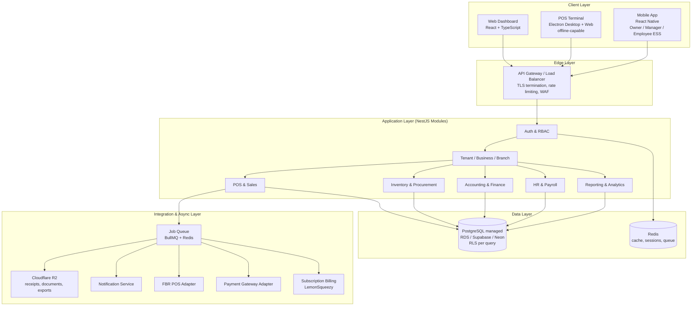

*Figure 3.1: High-level deployment and logical architecture*

### 3.2.1 Technology Stack

| Layer | Technology | Rationale |
|-------|------------|-----------|
| Web Dashboard | React + TypeScript, Zustand, TailwindCSS | Consistent with existing tooling and component patterns already in use for other products. |
| POS Terminal | Electron (desktop) wrapping the React POS UI, with a lighter browser-only fallback mode | Enables offline capability (Section 10) while reusing the same UI codebase as the web dashboard. |
| Mobile App | React Native | Single codebase for Android/iOS; owner dashboards, employee self-service, service-staff schedules. |
| Backend API | Node.js (LTS) + NestJS, REST (OpenAPI-documented); WebSocket (Socket.IO) for real-time updates | NestJS's module/DI structure maps cleanly onto the bounded modules in Figure 3.2. |
| Database | PostgreSQL 16 (managed — RDS/Aurora, Supabase, or Neon), accessed via Prisma ORM | Chosen per Document Control's rationale: native transactions, foreign keys, CHECK/trigger constraints, and Row-Level Security. |
| Cache / Queue Backend | Redis (managed) | Session storage, rate limiting, and backing store for the job queue. |
| Job Queue | BullMQ | Async processing for journal posting, payroll runs, notifications, and third-party integration retries (FBR, payment gateway). |
| Object Storage | Cloudflare R2 | Receipts, exported reports, payslip PDFs, printable product labels. |
| Subscription Billing | LemonSqueezy | Bills the Owner for their Kaarobar subscription (Merchant of Record). |
| Local Offline Store (Desktop POS) | SQLite (via better-sqlite3) inside the Electron app | Durable local outbox and catalog cache for offline sales (Section 10). |

*Table 3.1: Technology stack summary*

### 3.2.2 Multi-Tenancy Model

Kaarobar uses a **shared-database, shared-schema** multi-tenancy model with PostgreSQL Row-Level Security (RLS) as the primary isolation mechanism:

1. Every tenant-scoped table carries `owner_id` (and, where applicable, `business_id` / `branch_id`).
2. On each authenticated request, the application sets a session variable (e.g. `SET LOCAL app.owner_id = '…'`) before executing queries.
3. RLS policies on every tenant table restrict `SELECT`/`INSERT`/`UPDATE`/`DELETE` to rows matching `current_setting('app.owner_id')`.
4. Application-layer authorization (RBAC) remains mandatory; RLS is defense-in-depth against a missed `WHERE` clause or a compromised query path — the highest-severity risk in Section 12.

Platform Admin operations that must cross tenant boundaries use a separate database role that bypasses RLS (or uses `SET ROLE`), audited and never exposed to tenant JWT credentials.

### 3.2.3 JSONB Usage Policy

JSONB is used **sparingly and deliberately**, never as a substitute for relational modeling of money or inventory:

| Allowed in JSONB | Must remain relational columns/tables |
|------------------|--------------------------------------|
| Vertical-specific compliance metadata (`items.compliance`) | Prices, quantities, tax amounts, journal lines |
| Soft UI/settings blobs (`businesses.settings`) | Foreign keys, statuses that drive workflows |
| Integration payload snapshots for audit | Stock quantities, appointment slots, COA structure |

Fields that participate in reporting, constraints, or joins must be first-class columns (Section 6), precisely so that reporting queries and constraints work correctly against them.

## 3.3 Component / Module View

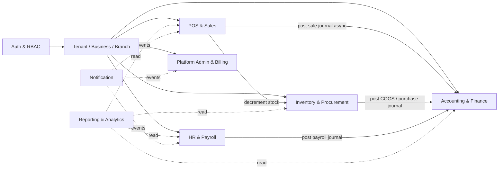

*Figure 3.2: Backend module dependencies*

- **Auth & RBAC** and **Tenant/Business/Branch** are foundational modules depended on by every other module.
- **POS & Sales** and **Inventory & Procurement** both post into **Accounting & Finance** asynchronously (via the job queue), so a temporary Accounting-module slowdown never blocks a checkout.
- **HR & Payroll** depends on Accounting & Finance for payroll and service-commission journal posting.
- **Reporting & Analytics** is read-only against every other module and owns no primary data of its own.

## 3.4 Integration Points Summary

- **FBR POS Integration Adapter** — real-time sales reporting for Tier-1 retailer tenants (Section 8.3.4).
- **Payment Gateway Adapter** — card/wallet payment capture at the POS.
- **Subscription Billing Adapter (LemonSqueezy)** — Owner's payment for their Kaarobar subscription.
- **Notification Service** — email, SMS, and WhatsApp Business API delivery for receipts, approvals, appointment reminders, and payslip availability.

---

# 4 Use Case Model

## 4.1 Actors

Actors are defined in Section 2.3 (Table 2.3). They are reused without redefinition in this section.

## 4.2 Use Case Diagram

```mermaid
flowchart TB
  Cashier((Cashier))
  BM((Branch Manager))
  InvMgr((Inventory Manager))
  Acct((Accountant))
  HRM((HR Manager))
  Emp((Employee))
  Owner((Business Owner))
  Admin((Platform Admin))
  Staff((Service Staff))

  Cashier --> UC01[UC-01 Process Sale]
  Cashier --> UC02[UC-02 Return/Refund]
  Cashier --> UC03[UC-03 Apply Discount]
  Cashier --> UC04[UC-04 Manage Till]
  Cashier --> UC23[UC-23 Appointments]
  Cashier --> UC27[UC-27 Dining Tables]

  BM --> UC02
  BM --> UC04
  BM --> UC16[UC-16 Approve Leave]

  InvMgr --> UC05[UC-05 Manage Catalog]
  InvMgr --> UC06[UC-06 Stock Transfer]
  InvMgr --> UC07[UC-07 Purchase Order]
  InvMgr --> UC08[UC-08 GRN]
  InvMgr --> UC24[UC-24 Recipes BOM]
  InvMgr --> UC26[UC-26 Batch & Expiry]

  Acct --> UC09[UC-09 Journal Entry]
  Acct --> UC10[UC-10 Financial Statements]
  Acct --> UC11[UC-11 AP/AR]
  Acct --> UC12[UC-12 Bank Reconcile]
  Acct --> UC13[UC-13 FBR/Tax Report]

  HRM --> UC14[UC-14 Employee Records]
  HRM --> UC15[UC-15 Process Payroll]

  Emp --> UC17[UC-17 Attendance]
  Emp --> UC18[UC-18 ESS]

  Owner --> UC19[UC-19 Businesses & Branches]
  Owner --> UC20[UC-20 Subscription]
  Owner --> UC21[UC-21 Users & Roles]
  Owner --> UC22[UC-22 Dashboard]
  Admin --> UC19
  Admin --> UC20
  Admin --> UC21
  Staff --> UC23
```

*Figure 4.1: System-wide use case diagram — core, cross-vertical use cases*

Figure 4.1 shows the core use cases common to every vertical. Table 4.2 lists the additional use cases that apply only when a business's vertical enables the corresponding modules.

## 4.3 Use Case Summary Table — Core (All Verticals)

| ID | Use Case | Primary Actor(s) | Module |
|----|----------|------------------|--------|
| UC-01 | Process Sale | Cashier | POS & Sales |
| UC-02 | Process Return / Refund | Cashier, Branch Manager | POS & Sales |
| UC-03 | Apply Discount | Cashier | POS & Sales |
| UC-04 | Manage Till & Shift | Cashier, Branch Manager | POS & Sales |
| UC-05 | Manage Catalog (Items) | Inventory Manager, Branch Manager | Catalog & Inventory |
| UC-06 | Stock Transfer Between Branches | Inventory Manager, Branch Manager | Catalog & Inventory |
| UC-07 | Create Purchase Order | Inventory Manager | Catalog & Inventory |
| UC-08 | Receive Goods (GRN) | Inventory Manager | Catalog & Inventory |
| UC-09 | Record Journal Entry | Accountant | Accounting |
| UC-10 | Generate Financial Statements | Accountant, Business Owner | Accounting |
| UC-11 | Manage AP / AR | Accountant | Accounting |
| UC-12 | Reconcile Bank Statement | Accountant | Accounting |
| UC-13 | File FBR / Tax Report | Accountant | Accounting |
| UC-14 | Manage Employee Records | HR Manager | HR & Payroll |
| UC-15 | Process Payroll | HR Manager, Business Owner (approval) | HR & Payroll |
| UC-16 | Approve Leave Request | Branch Manager, HR Manager | HR & Payroll |
| UC-17 | Mark Attendance | Employee, HR Manager | HR & Payroll |
| UC-18 | Employee Self-Service | Employee | HR & Payroll |
| UC-19 | Manage Businesses & Branches | Business Owner, Platform Admin | Administration |
| UC-20 | Manage Subscription & Billing | Business Owner, Platform Admin | Administration |
| UC-21 | Manage Users & Roles | Business Owner, Platform Admin | Administration |
| UC-22 | View Consolidated Dashboard | Business Owner | Administration |

*Table 4.1: Core use case list (unchanged in spirit from v1.0; UC-05 generalized from "Manage Products")*

## 4.4 Use Case Summary Table — Vertical-Specific

| ID | Use Case | Primary Actor(s) | Applies To |
|----|----------|------------------|------------|
| UC-23 | Book / Manage Appointment | Cashier, Service Staff, Business Owner | Salon / Service verticals |
| UC-24 | Manage Recipes (BOM) | Inventory Manager | Food / Restaurant vertical |
| UC-25 | Print Product / Shelf Label | Inventory Manager | Retail, Clothing, Agrochemical, Animal Feed |
| UC-26 | Track Batch & Expiry | Inventory Manager | Agrochemical, Animal Feed, Food |
| UC-27 | Manage Dining Tables & Order Type | Cashier, Branch Manager | Food / Restaurant vertical |

*Table 4.2: Vertical-specific use case list*

## 4.5 Detailed Use Case Descriptions

Fully-dressed descriptions are provided for the use cases with the highest implementation risk or the most cross-module impact, including the new vertical-specific ones. Remaining use cases follow the same template and are detailed during sprint planning.

### UC-01: Process Sale

| Field | Detail |
|-------|--------|
| **Actor** | Cashier |
| **Preconditions** | Cashier is authenticated and has an open till/shift at the branch. |
| **Main Flow** | 1. Cashier scans a barcode or QR code, searches by name/SKU, or selects a service/table, building a cart (POS-FR-001).<br>2. System looks up branch-specific pricing, applicable tax, and current stock (for physical goods) or staff/duration (for services) for each item.<br>3. Cashier optionally applies a discount (UC-03), attaches a customer, and/or sets an order type (retail / dine-in / takeaway / delivery / service).<br>4. Cashier selects payment method(s) and confirms.<br>5. System atomically decrements stock for physical-good and recipe-ingredient items, records the sale, and finalizes payment.<br>6. System asynchronously posts a balanced journal entry (Revenue / Tax Payable / COGS) to Accounting.<br>7. System prints or digitally shares the bill/receipt (POS-FR-014–POS-FR-017), including the FBR invoice number and QR code if the business is a registered Tier-1 retailer (Section 8.3.4). |
| **Alternate Flows** | **3a.** Discount exceeds cashier's auto-approval limit → routed to Branch Manager for approval.<br>**5a.** Device is offline → sale is queued locally and synced when connectivity resumes (Section 10).<br>**5b.** Item is a `recipe_item` → system decrements each ingredient's stock per `item_ingredients` instead of the sold item's own stock. |
| **Postconditions** | Sale is recorded with status Completed; stock and ledger are updated. |
| **Related Requirements** | POS-FR-001 through POS-FR-017; sequence detail in Figure 7.4. |

### UC-23: Book / Manage Appointment *(new)*

| Field | Detail |
|-------|--------|
| **Actors** | Cashier or Business Owner (books on behalf of a walk-in/phone customer), Service Staff (views/updates their own schedule) |
| **Preconditions** | The business's vertical has the `appointments` module enabled (`business_types.enabled_modules`); the service item and staff member exist. |
| **Main Flow** | 1. Cashier selects a service item, a staff member, and an available time slot; optionally attaches a customer.<br>2. System creates an `appointments` record with status `Booked`.<br>3. On the day, staff marks the appointment `CheckedIn` then `InProgress`.<br>4. On completion, staff or cashier marks it `Completed`, which prompts conversion to a sale (UC-01) with `appointment_id` set, applying the service's price and any staff commission rate. |
| **Alternate Flows** | **1a.** Slot conflict for that staff member → system rejects the booking.<br>**3a.** Customer does not show → staff marks `NoShow`, no sale is generated. |
| **Postconditions** | Appointment reaches a terminal status (`Completed`, `Cancelled`, or `NoShow`); if completed, a linked `sales` record exists. |
| **Related Requirements** | SCH-FR-001 through SCH-FR-006. |

### UC-24: Manage Recipes / Bill of Materials *(new)*

| Field | Detail |
|-------|--------|
| **Actor** | Inventory Manager |
| **Preconditions** | The business's vertical has the `recipes` module enabled; raw-ingredient items already exist in the catalog. |
| **Main Flow** | 1. Inventory Manager creates or edits an item with `item_type = recipe_item` (e.g. "Chicken Biryani").<br>2. Inventory Manager adds one or more ingredient lines, each referencing a raw-stock item and a quantity required per unit sold.<br>3. System validates that every referenced ingredient is itself a `physical_good` with `track_inventory = true` (a recipe cannot consume another recipe in v1, to avoid unbounded nesting). |
| **Postconditions** | The recipe item can now be sold (UC-01); each sale decrements ingredient stock per the recipe. |
| **Related Requirements** | INV-FR-011, INV-FR-012. |

### UC-19: Manage Businesses & Branches

| Field | Detail |
|-------|--------|
| **Actor** | Business Owner |
| **Preconditions** | Owner is authenticated; subscription plan permits the number of businesses/branches being created (Section 5.8). |
| **Main Flow** | 1. Owner creates a new Business, selecting a business vertical (Section 2.2) and a tax jurisdiction template (Pakistan default or generic).<br>2. System provisions a default Chart of Accounts and enabled-module set appropriate to the selected vertical.<br>3. Owner adds one or more Branches to the Business, each with its own address, timezone, and operating settings.<br>4. Owner invites/assigns staff to specific branches with defined roles. |
| **Alternate Flows** | **1a.** Plan limit reached → owner is prompted to upgrade subscription (UC-20). |
| **Postconditions** | New Business/Branch is available across all enabled modules, scoped correctly by `owner_id`/`business_id` and protected by Row-Level Security (Section 3.2.2). |
| **Related Requirements** | ADM-FR-001 through ADM-FR-004. |

---
# 5 Functional Requirements

## 5.1 Tenancy, Identity & Access Management

| ID | Requirement | Priority |
|----|-------------|----------|
| TEN-FR-001 | The system shall allow an Owner to create and manage multiple Business entities under a single account, each assigned a business vertical (Section 2.2). | **Must** |
| TEN-FR-002 | The system shall allow each Business to contain multiple Branch entities. | **Must** |
| TEN-FR-003 | The system shall support assigning one or more roles (Owner, Branch Manager, Cashier, Inventory Manager, Service Staff, Accountant, HR Manager, Employee) to a user, scoped to specific branches or business-wide. | **Must** |
| TEN-FR-004 | The system shall restrict a user's data access to only the businesses/branches they are explicitly assigned to, enforced by PostgreSQL Row-Level Security (Section 3.2.2) in addition to application-layer checks; the Owner implicitly has access to all businesses they own. | **Must** |
| TEN-FR-005 | The system shall support custom roles with a configurable permission set beyond the default roles. | **Could** |
| TEN-FR-006 | The system shall provide authentication via email/password with optional TOTP multi-factor authentication, required by default for Owner and Accountant roles. | **Must** |
| TEN-FR-007 | The system shall support configurable auto-logout after inactivity on POS terminals. | **Should** |
| TEN-FR-008 | The system shall maintain an immutable audit log of all create/update/delete actions, capturing user, timestamp, action type, and affected entity, via an INSERT-only database role with no UPDATE/DELETE grant on the audit table. | **Must** |
| TEN-FR-009 | The system shall allow an Owner to deactivate (not hard-delete) a Business or Branch, preserving historical data. | **Must** |
| TEN-FR-010 | The system shall support bulk user invitation via email with role pre-assignment. | **Could** |
| TEN-FR-011 | The system shall support adding new business verticals via configuration (a new `business_types` row) without requiring a schema migration or application redeploy. | **Should** |

*Table 5.1: Tenancy, Identity & Access Management requirements*

## 5.2 POS & Sales

| ID | Requirement | Priority |
|----|-------------|----------|
| POS-FR-001 | The cashier shall be able to build a sale cart by scanning a 1D barcode or a 2D QR code, by SKU/name search, or by manual entry; both symbologies shall resolve to the same item lookup (`items.barcode` or a variant-level override). | **Must** |
| POS-FR-002 | The system shall calculate line-item and cart totals in real time, applying branch-specific pricing and applicable tax rates. | **Must** |
| POS-FR-003 | The system shall support split payments across multiple methods (cash, card, mobile wallet) within one sale. | **Must** |
| POS-FR-004 | The cashier shall be able to hold/park a sale and resume it later. | **Should** |
| POS-FR-005 | The system shall atomically decrement inventory on sale completion using a single-statement `UPDATE ... SET quantity_on_hand = quantity_on_hand - $qty` to prevent race conditions between concurrent sales, wrapped in the same database transaction as the sale insert. | **Must** |
| POS-FR-006 | The system shall generate a sequential per-branch invoice number and, for FBR-registered Tier-1 businesses, embed the FBR invoice number and QR code on the receipt (Section 8.3.4). | **Must** |
| POS-FR-007 | The system shall support full and partial returns against an original sale, validated against a configurable return window. | **Must** |
| POS-FR-008 | The system shall require Branch Manager approval for returns/refunds exceeding a configurable per-branch auto-approval threshold. | **Must** |
| POS-FR-009 | The system shall support item- and cart-level discounts, with a configurable cashier auto-approval limit above which Branch Manager approval is required. | **Must** |
| POS-FR-010 | The system shall support till/shift open and close operations with expected-vs-counted cash reconciliation and over/short reporting. | **Must** |
| POS-FR-011 | The system shall queue sales locally when offline and sync automatically upon reconnection using idempotent, client-generated transaction IDs (Section 10). | **Must** |
| POS-FR-012 | The system shall support optional customer lookup/attachment to a sale and accrue loyalty points where configured. | **Could** |
| POS-FR-013 | The system shall support quotations/proforma invoices that do not affect stock or the ledger until converted to a sale. | **Could** |
| POS-FR-014 | The system shall print thermal receipts to ESC/POS-compatible printers and support reprinting any historical receipt, incrementing `sales.bill_print_count` on each print for audit purposes. | **Must** |
| POS-FR-015 | The system shall support printing a formal A4/letter-size bill/invoice (distinct from the thermal receipt) to a standard printer or as a downloadable PDF, for wholesale/B2B customers or any business preferring full-page invoices. | **Should** |
| POS-FR-016 | The system shall support sharing a digital copy of the bill/receipt via WhatsApp or email directly from the POS, in addition to or instead of printing. | **Should** |
| POS-FR-017 | The system shall prevent a sale from completing if requested quantity exceeds available stock for stock-tracked items, unless negative-stock selling is explicitly enabled for that branch; this check does not apply to service items or `track_inventory = false` items. | **Should** |
| POS-FR-018 | The system shall support an `order_type` on each sale (`retail`, `dine_in`, `takeaway`, `delivery`, `service`), and, where `dine_in`, an associated table (Section 5.3) and number of covers. | **Should** |

*Table 5.2: POS & Sales requirements*

## 5.3 Catalog & Inventory

Generalized in this version to cover physical goods, services, and recipe/BOM items in one catalog (Section 2.2).

| ID | Requirement | Priority |
|----|-------------|----------|
| INV-FR-001 | The system shall maintain a unified catalog (`items`) scoped to a Business and shared across its Branches, with an `item_type` of physical good, service, recipe item, or bundle, and branch-specific price overrides. | **Must** |
| INV-FR-002 | The system shall maintain a separate stock quantity record per item (and, where applicable, per variant) per branch, for items with `track_inventory = true`. | **Must** |
| INV-FR-003 | The system shall support stock transfer requests between branches of the same business, crediting stock to the receiving branch only after confirmation. | **Must** |
| INV-FR-004 | The system shall support creation of Purchase Orders to suppliers, including expected delivery date and line items. | **Must** |
| INV-FR-005 | The system shall support Goods Receipt Notes (GRN) against a Purchase Order, including partial receipt. | **Must** |
| INV-FR-006 | Upon GRN confirmation, the system shall increment stock and post a purchase/COGS journal entry using the business's configured stock valuation method. | **Must** |
| INV-FR-007 | The system shall support a configurable stock valuation method per business: FIFO, Weighted Average, or FEFO (First-Expired-First-Out, for batch-tracked items). | **Should** |
| INV-FR-008 | The system shall raise low-stock alerts based on a configurable reorder level per item (and variant) per branch. | **Should** |
| INV-FR-009 | The system shall support stock adjustments (wastage, damage, shrinkage) requiring a mandatory reason code and audit trail entry. | **Must** |
| INV-FR-010 | The system shall maintain supplier records including contact details and payment terms, linked to Accounts Payable (Section 5.5). | **Should** |
| INV-FR-011 | The system shall support item variants (e.g. size × color for clothing), each with its own SKU, barcode, and stock record, under a single parent item. | **Must** |
| INV-FR-012 | The system shall support recipe/Bill-of-Materials items: an item of type `recipe_item` may declare one or more raw-material ingredient items and a quantity required per unit sold; selling it decrements ingredient stock rather than the recipe item's own stock (which is not tracked). | **Must** |
| INV-FR-013 | The system shall support batch/lot tracking with expiry dates for items flagged `is_batch_tracked`, recorded at goods-receipt time and consumed FEFO where that valuation method is configured. | **Must** |
| INV-FR-014 | The system shall alert the Inventory Manager when a batch is within a configurable number of days of its expiry date, and shall flag (but not block, pending Owner policy) sale of expired batch stock. | **Must** |
| INV-FR-015 | The system shall support a vertical-specific compliance metadata field on an item (e.g. pesticide registration number, hazard classification, active ingredient) stored as structured JSON, displayed on the item detail screen and optionally on printed labels. | **Should** |
| INV-FR-016 | The system shall generate and print barcode or QR-code labels for an item (or variant), suitable for shelf/product labeling on a standard or thermal label printer, encoding the item's SKU or barcode value. | **Should** |
| INV-FR-017 | For the Food/Restaurant vertical, the system shall support dining tables per branch (`dining_tables`: number, capacity, status) and associate a sale with a table when `order_type = dine_in`. | **Should** |

*Table 5.3: Catalog & Inventory requirements*

## 5.4 Scheduling & Appointments

New module, applicable to the Salon/Service vertical (and any future service-based vertical). Not shown to businesses without the `appointments` module enabled (Section 2.2.2).

| ID | Requirement | Priority |
|----|-------------|----------|
| SCH-FR-001 | The system shall allow booking an appointment for a service item, a specific staff member, and a time slot, optionally attached to a customer. | **Must** |
| SCH-FR-002 | The system shall reject a booking that conflicts with the selected staff member's existing appointment at an overlapping time. | **Must** |
| SCH-FR-003 | The system shall allow staff to view their own daily/weekly schedule via the mobile app. | **Must** |
| SCH-FR-004 | The system shall support appointment status transitions: Booked → CheckedIn → InProgress → Completed, or Cancelled/NoShow from Booked. | **Must** |
| SCH-FR-005 | On marking an appointment Completed, the system shall generate a linked sale (UC-01) pre-filled with the service item, price, and assigned staff member for commission attribution. | **Must** |
| SCH-FR-006 | The system shall send a reminder notification (SMS/WhatsApp/push) to the customer and/or staff member ahead of a scheduled appointment, where contact details are available. | **Could** |

*Table 5.4: Scheduling & Appointments requirements*

## 5.5 Accounting & Finance

This is the module that most clearly distinguishes Kaarobar from a conventional POS product: it must behave the way a Chartered Accountant would expect a proper ledger to behave, not merely provide a running cash tally. As of v2.0, the central invariant below is enforced by the database itself, not application code alone.

### Tax Configuration Approach

Each Business selects a tax jurisdiction template at creation time. The Pakistan template pre-configures federal and provincial sales tax rates (e.g. standard-rate goods, the concessionary textile/leather rate, and services tax rates administered provincially by PRA/SRB/KPRA/BRA depending on province) and enables the FBR integration hooks in Section 8.3.4 for businesses that meet the Tier-1 retailer definition. A generic template exposes the same tax-rule data structures (rate, applicability, rounding rule) with no jurisdiction-specific defaults.

| ID | Requirement | Priority |
|----|-------------|----------|
| ACC-FR-001 | The system shall provision a default Chart of Accounts template for each new Business, selected according to its business vertical (Section 2.2) and editable by the Accountant/Owner. | **Must** |
| ACC-FR-002 | The system shall support hierarchical (parent/child) accounts within the Chart of Accounts. | **Should** |
| ACC-FR-003 | Every Journal Entry shall be balanced (total debits equal total credits), enforced by a PostgreSQL deferred constraint trigger on `journal_lines` that runs at transaction commit and rolls back the entire transaction if the sums do not match — not merely an application-layer check. | **Must** |
| ACC-FR-004 | The system shall automatically generate and post journal entries for completed sales (including service and recipe-item sales), processed returns, purchase/GRN transactions, and approved payroll runs (including staff commissions), without manual accountant intervention. | **Must** |
| ACC-FR-005 | The system shall allow manual journal entries for adjustments not covered by automated postings. | **Must** |
| ACC-FR-006 | The system shall generate a General Ledger view per account showing chronological entries and running balance. | **Must** |
| ACC-FR-007 | The system shall generate a Trial Balance for any given period. | **Must** |
| ACC-FR-008 | The system shall generate a Profit & Loss Statement and a Balance Sheet for any given period, at branch level and consolidated business level. | **Must** |
| ACC-FR-009 | The system shall generate a basic Cash Flow Statement (indirect method) for a given period. | **Should** |
| ACC-FR-010 | Posted journal entries shall be immutable (no UPDATE/DELETE database privilege granted on `journal_entries` or `journal_lines` to the application role); corrections shall be made via a linked reversing entry. | **Must** |
| ACC-FR-011 | The system shall support an accounting period lock (e.g. monthly close) after which new postings to that period require an explicit unlock by the Owner/Accountant. | **Should** |
| ACC-FR-012 | The system shall maintain Accounts Receivable per customer, including invoice aging (current, 30/60/90+ days). | **Must** |
| ACC-FR-013 | The system shall maintain Accounts Payable per supplier, including bill aging and payment scheduling. | **Must** |
| ACC-FR-014 | The system shall support bank/cash account reconciliation via manual matching or CSV/OFX statement import against recorded transactions. | **Should** |
| ACC-FR-015 | The Owner shall be able to view consolidated financial statements across all Businesses/Branches they own, in addition to per-business and per-branch views. | **Must** |
| ACC-FR-016 | The system shall support configurable tax rates per jurisdiction, with Pakistani sales tax (federal and provincial) as the default template. | **Must** |
| ACC-FR-017 | For businesses classified as FBR Tier-1 retailers, the system shall report each sale to FBR's system in real time and embed the returned FBR invoice number and QR code on the receipt (Section 8.3.4). | **Must** |
| ACC-FR-018 | The system shall support debit/credit note recording for returns/exchanges that must be reflected in FBR sales tax filing annexures. | **Should** |
| ACC-FR-019 | The system shall export financial statements and reports to PDF and Excel formats. | **Must** |
| ACC-FR-020 | The system shall support a configurable fiscal year start month per business. | **Could** |

*Table 5.5: Accounting & Finance requirements*

## 5.6 HR & Payroll

| ID | Requirement | Priority |
|----|-------------|----------|
| HR-FR-001 | The system shall maintain employee master records: personal details, employment details (position, branch assignment, join date), and compensation structure. | **Must** |
| HR-FR-002 | The system shall support clock-in/clock-out attendance capture from the POS terminal and/or mobile app. | **Must** |
| HR-FR-003 | The system shall allow manual attendance entry/correction by a Branch Manager or HR Manager, recorded in the audit log. | **Should** |
| HR-FR-004 | The system shall support configurable leave types (annual, sick, casual, etc.) with accrual rules and per-employee balances. | **Should** |
| HR-FR-005 | The system shall support a leave request and approval workflow: Employee requests, Branch Manager or HR Manager approves. | **Must** |
| HR-FR-006 | The system shall calculate gross pay from a configurable salary structure (basic + allowances) plus attendance/overtime data for a payroll period. | **Must** |
| HR-FR-007 | The system shall calculate commission for both sales-performance (retail/POS staff) and service-performance (salon/service staff), driven by `items.default_commission_pct` and the staff member attributed on each `sale_item` or completed appointment. | **Should** |
| HR-FR-008 | The system shall calculate statutory deductions (Pakistan income tax withholding slabs, EOBI contribution) with a configurable deduction engine for other jurisdictions. | **Must** |
| HR-FR-009 | The system shall require an approval step (Owner or delegated Accountant) before a payroll run is disbursed. | **Must** |
| HR-FR-010 | Upon approval, the system shall post one consolidated payroll journal entry (including commission payouts) and generate individual payslips per employee. | **Must** |
| HR-FR-011 | The system shall provide an Employee Self-Service view for payslip history, leave balance/requests, and attendance history. | **Must** |
| HR-FR-012 | Payroll corrections shall be made via a new adjustment run rather than editing a disbursed run. | **Should** |

*Table 5.6: HR & Payroll requirements*

## 5.7 Reporting & Analytics

| ID | Requirement | Priority |
|----|-------------|----------|
| RPT-FR-001 | The system shall provide an Owner-level dashboard showing consolidated sales, cash position, and stock alerts across all businesses/branches. | **Must** |
| RPT-FR-002 | The system shall provide branch-level daily sales and shift reconciliation reports. | **Must** |
| RPT-FR-003 | The system shall provide inventory valuation, stock movement, and batch-expiry reports. | **Should** |
| RPT-FR-004 | The system shall provide the standard accounting reports (Section 5.5) in exportable PDF/Excel form. | **Must** |
| RPT-FR-005 | The system shall provide payroll cost summaries by branch and business, including commission payouts. | **Should** |
| RPT-FR-006 | The system shall support scheduled email delivery of key reports (e.g. daily sales summary) to the Owner. | **Could** |
| RPT-FR-007 | For service-based businesses, the system shall provide appointment utilization and staff-booking reports. | **Could** |

*Table 5.7: Reporting & Analytics requirements*

## 5.8 Platform Administration & Subscription Billing

| ID | Requirement | Priority |
|----|-------------|----------|
| ADM-FR-001 | Platform Admin shall be able to view and manage all tenants (Owners) for support purposes, without exposing tenant financial data by default. | **Must** |
| ADM-FR-002 | The system shall enforce subscription plan limits (number of businesses, branches, and/or users) per Owner account. | **Must** |
| ADM-FR-003 | The system shall integrate with LemonSqueezy for subscription billing, plan changes, and payment failure handling. | **Must** |
| ADM-FR-004 | The Owner shall have a self-service billing portal to view invoices and update the payment method. | **Should** |
| ADM-FR-005 | The system shall support a free trial period with automatic feature restriction upon expiry if no plan is selected. | **Should** |
| ADM-FR-006 | Platform Admin shall be able to add or edit a `business_types` row (new vertical) via an internal admin tool, without a schema migration. | **Should** |

*Table 5.8: Platform Administration & Subscription Billing requirements*

## 5.9 Notifications

| ID | Requirement | Priority |
|----|-------------|----------|
| NOT-FR-001 | The system shall send email notifications for payroll approval requests, return/refund approval requests, low-stock and batch-expiry alerts, and billing events. | **Must** |
| NOT-FR-002 | The system shall send WhatsApp Business API or SMS notifications for time-sensitive approvals, appointment reminders, and digitally-shared bills, where configured. | **Should** |
| NOT-FR-003 | The system shall notify employees when a new payslip is available via their preferred channel (app push, email, or SMS). | **Must** |

*Table 5.9: Notifications requirements*

---
# 6 Data Model

## 6.1 Modeling Approach

The schema is fully normalized (3NF) PostgreSQL: every embedded array from the prior MongoDB design (v1.0) is now a proper child table with a foreign key, enabling database-enforced referential integrity and constraint triggers (Section 3). UUID primary keys are used throughout (via `pgcrypto`'s `gen_random_uuid()`), consistent with a multi-tenant SaaS where sequential integer IDs would leak row-count information across tenants.

### 6.1.1 Why `items`, Not `products`

Following the multi-vertical generalization in Section 2.2, the catalog table is named `items` rather than `products` throughout this schema (the same convention Square's multi-vertical POS uses) — a salon "Haircut" and a bag of pesticide are both rows in the same table, distinguished by `item_type`. This is a deliberate terminology change from the internal working documents that preceded this SRS; "product," "service," and "item" may still appear interchangeably in earlier discussion, but `items` is the schema's actual table name.

## 6.2 ERD — Tenancy, Identity & Platform

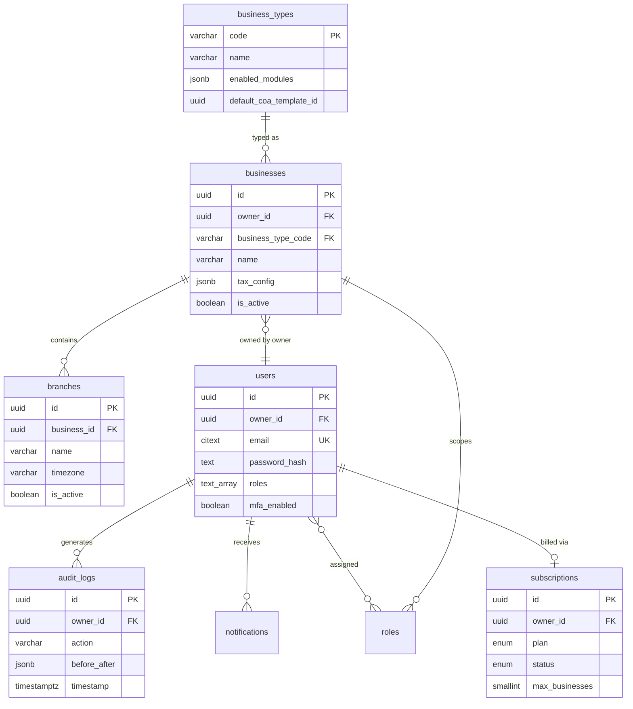

*Figure 6.1: Entity relationships: Tenancy, Identity & Platform, including the `business_types` vertical lookup*

## 6.3 ERD — POS & Sales

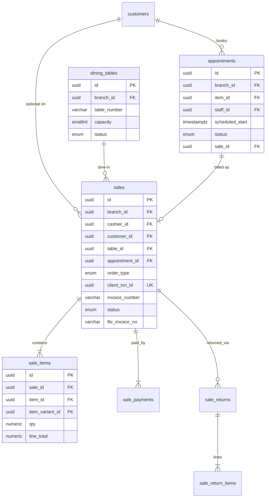

*Figure 6.2: Entity relationships: POS & Sales, including dine-in tables and appointment billing*

## 6.4 ERD — Catalog & Inventory

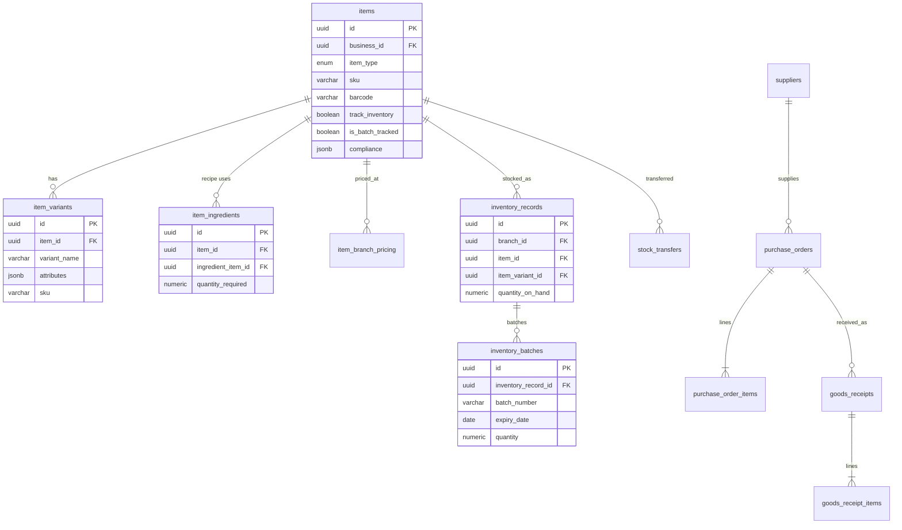

*Figure 6.3: Entity relationships: the unified multi-vertical catalog (items, variants, recipes, batches) and procurement*

## 6.5 ERD — Accounting & Tax

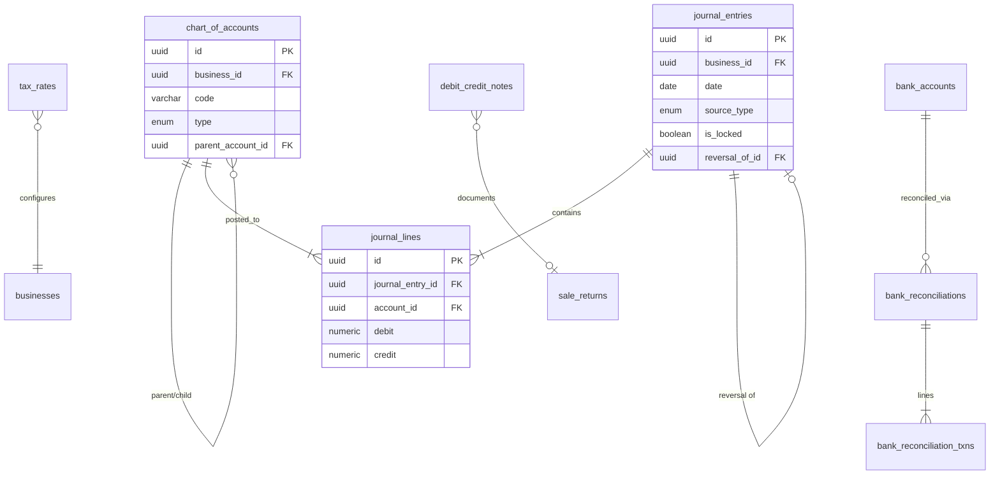

> **Trigger:** On `journal_lines` INSERT/UPDATE/DELETE, a deferred constraint trigger asserts `sum(debit) = sum(credit)` per entry; unbalanced transactions roll back at commit.

*Figure 6.4: Entity relationships: Accounting & Tax, including the journal-balance constraint trigger*

## 6.6 ERD — HR & Payroll

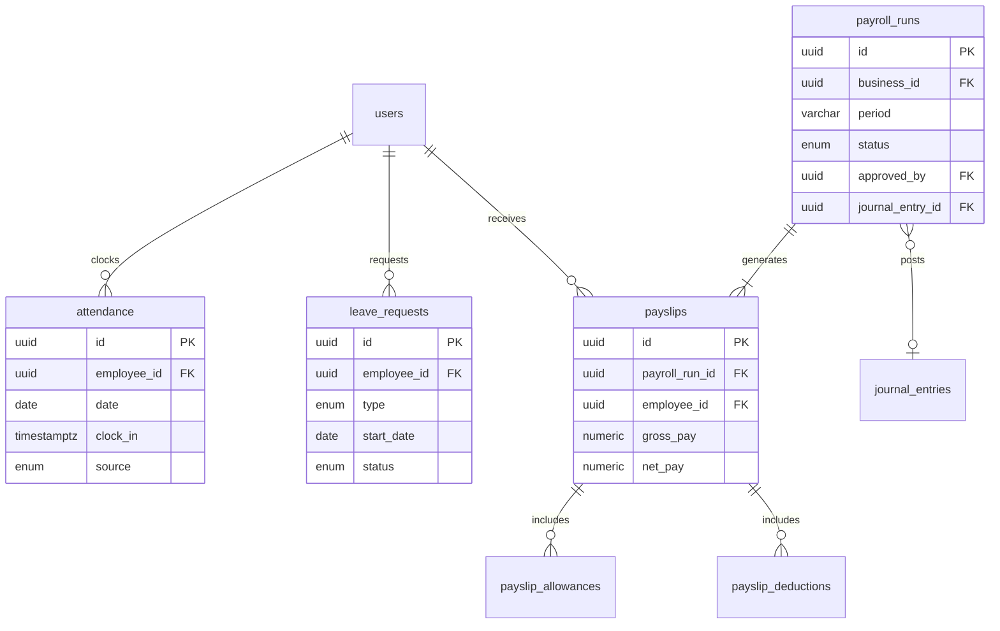

*Figure 6.5: Entity relationships: HR & Payroll*

## 6.7 Multi-Tenancy & Row-Level Security

Every tenant-scoped table carries `owner_id` and, where applicable, `business_id`/`branch_id`, and has an RLS policy in the form:

```sql
ALTER TABLE sales ENABLE ROW LEVEL SECURITY;

CREATE POLICY tenant_isolation ON sales
USING (branch_id IN (
  SELECT id FROM branches WHERE business_id IN (
    SELECT id FROM businesses
    WHERE owner_id = current_setting('app.owner_id')::uuid
  )
));
```

In practice, performance-sensitive tables denormalize `owner_id` directly onto the row (rather than requiring a subquery through `branches`/`businesses` on every read) so the policy is a single indexed equality check; the full hierarchy is shown for clarity above.

## 6.8 New Tables Introduced for Multi-Vertical Support

The v1.0 schema (retail-only) had 26 tables. This version has 38, all shown in the ERDs above; the ones genuinely new to this revision are detailed below since they don't appear in any prior version of this document.

| Table | Purpose |
|-------|---------|
| `business_types` | Lookup/seed table of supported verticals (Table 2.2). Drives default Chart of Accounts and which optional modules (`appointments`, `recipes`, `batchTracking`, `dineIn`) are surfaced for a business. Adding a vertical is an INSERT, not a migration (TEN-FR-011). |
| `item_variants` | Attribute-based variants of a catalog item (e.g. size × color for clothing), each with its own SKU/barcode and stock record. |
| `item_ingredients` | Bill-of-Materials rows linking a `recipe_item` to its raw-material ingredient items and the quantity each sale consumes (INV-FR-012). |
| `inventory_batches` | Batch/lot number and expiry date tracking per inventory record, created at goods-receipt time for items flagged `is_batch_tracked` (INV-FR-013, INV-FR-014). |
| `appointments` | Service bookings: item (service), assigned staff, customer, time slot, and status lifecycle, for the Salon/Service vertical (SCH-FR-001–SCH-FR-006). |
| `dining_tables` | Physical tables per branch for the Food/Restaurant vertical's dine-in order type (INV-FR-017). |

*Table 6.1: Tables new in v2.0*

### `business_types` — full definition

| Field | Type | Notes |
|-------|------|-------|
| `code` | VARCHAR, PK | e.g. `'retail'`, `'salon'`, `'restaurant'`, `'clothing'`, `'agrochemical'`, `'animal_feed'`, `'pharmacy'`, `'general'`. A natural-key PK is used deliberately (rather than a UUID) since the code is referenced in application feature-flag logic. |
| `name` | VARCHAR | Display name. |
| `enabled_modules` | JSONB | E.g. `{"appointments": true, "recipes": false, "batchTracking": true, "dineIn": false}`. |
| `default_coa_template_id` | UUID, nullable | References a seed Chart-of-Accounts template applied on business creation. |

### `appointments` — full definition

| Field | Type | Notes |
|-------|------|-------|
| `id` | UUID, PK | |
| `branch_id`, `customer_id` | UUID (FK) | `customer_id` nullable (walk-in without a saved profile). |
| `item_id` | UUID (FK), NOT NULL | The service being booked; must reference an `items` row with `item_type = 'service'`. |
| `staff_id` | UUID (FK users), NOT NULL | The assigned Service Staff member. |
| `scheduled_start`, `scheduled_end` | TIMESTAMPTZ | Both required; validated against staff double-booking (SCH-FR-002) via an exclusion constraint (`EXCLUDE USING gist` on `staff_id` and the time range). |
| `status` | `appointment_status_enum` | `Booked`, `CheckedIn`, `InProgress`, `Completed`, `Cancelled`, `NoShow`. |
| `sale_id` | UUID (FK), nullable | Set once the appointment is billed (SCH-FR-005). |

Indexes: `{staff_id, scheduled_start}` · exclusion constraint preventing overlapping bookings for the same staff member.

## 6.9 Data Dictionary — Remaining Tables

The remaining 32 tables (tenancy, POS/sales, procurement, accounting, HR) carry the same fields shown in the ERDs above (Figures 6.1–6.5); field-by-field detail at the same depth as `business_types` and `appointments` above is maintained in a separate database schema reference (companion to this SRS) rather than reproduced in full here, to keep this document at a manageable length. The key structural facts carried over from the v1.0 design remain true: `sales`/`sale_items`/`sale_payments` are append-mostly with a client-generated idempotency key; `journal_entries`/`journal_lines` are insert-only once posted; and every table's first index begins with its tenant-scoping column(s).

---

# 7 UML Diagrams

## 7.1 Class Diagram

Figure 7.1 shows the core domain classes and their behavior-oriented methods, distinct from the storage-oriented ERDs of Section 6.

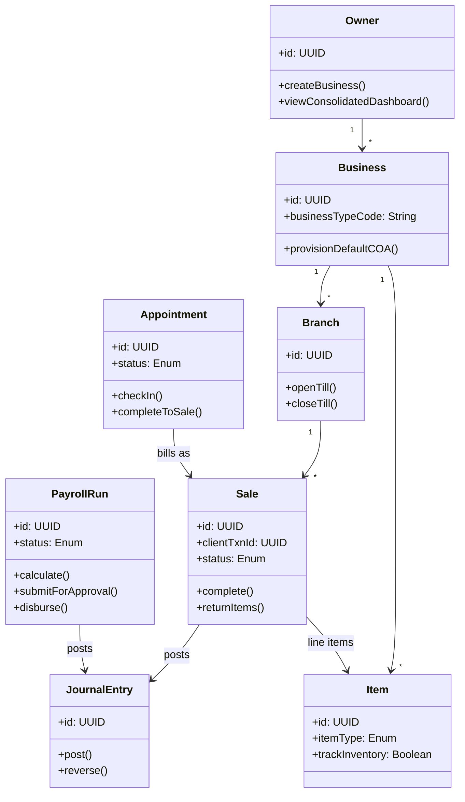

*Figure 7.1: Core domain class diagram (simplified)*

## 7.2 State Diagrams

### 7.2.1 Sale / Invoice Lifecycle

Figure 7.2 governs the `status` column of the `sales` table and directly implements the return/refund rules in POS-FR-007 and POS-FR-008. It applies identically whether the sale originated from retail checkout, a dine-in order, or a completed service appointment (SCH-FR-005).

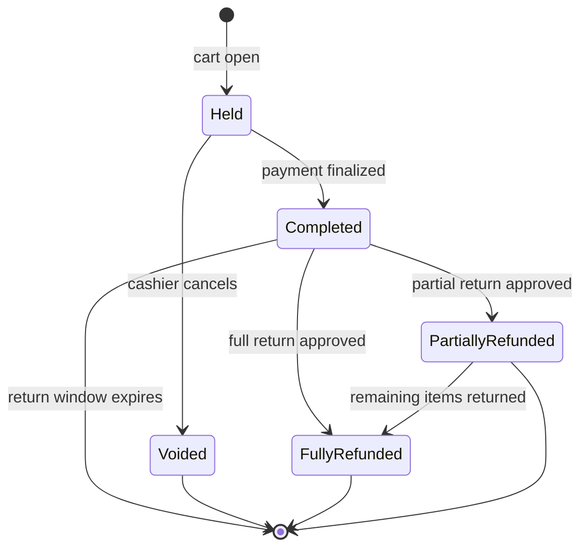

*Figure 7.2: Sale / invoice state diagram*

### 7.2.2 Payroll Run Lifecycle

Figure 7.3 governs the `status` column of the `payroll_runs` table and enforces the mandatory approval gate of HR-FR-009 before any journal entry is posted or salary (including commissions) disbursed.

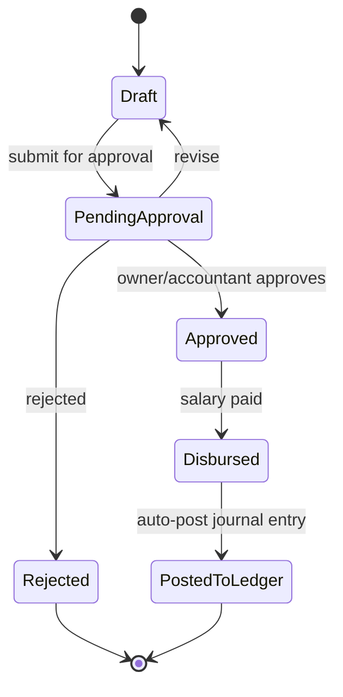

*Figure 7.3: Payroll run state diagram*

## 7.3 Sequence Diagrams

### 7.3.1 POS Sale Checkout

Figure 7.4 traces UC-01 (Process Sale) through the architecture of Section 3, now against PostgreSQL. Steps 8 and 10 each execute as a single database transaction (sale + `sale_items` together; `journal_entry` + `journal_lines` together). Accounting posting (steps 9–10) remains explicitly asynchronous relative to the cashier-facing response, keeping POS latency (PERF-NFR-001) independent of ledger-posting load.

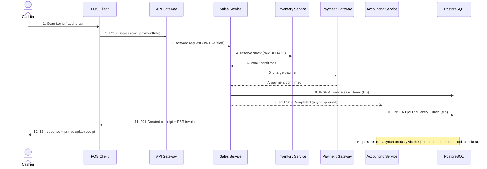

*Figure 7.4: POS sale checkout sequence*

### 7.3.2 Payroll Processing & Posting

Figure 7.5 traces UC-15 (Process Payroll), showing the approval gate (steps 6–8) between draft calculation and ledger posting, matching the state diagram in Figure 7.3. Commission amounts (HR-FR-007) are folded into the gross-pay calculation at step 4 alongside base salary and attendance.

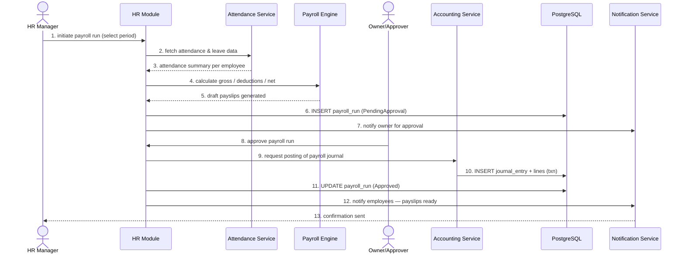

*Figure 7.5: Payroll processing and posting sequence*

## 7.4 Activity Diagram — Return / Refund Approval Workflow

Figure 7.6 details the branching approval logic referenced in UC-02 and requirements POS-FR-007/POS-FR-008. This workflow is vertical-agnostic: a returned pesticide bag, a returned shirt, and a refunded (but not yet delivered) service booking all follow the same approval path.

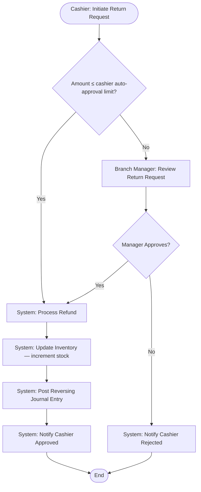

*Figure 7.6: Return / refund approval activity diagram*

> Note: the auto-approval limit is a configurable per-branch policy value maintained by the Business Owner.

---

# 8 External Interface Requirements

## 8.1 User Interfaces

- **POS UI:** Large touch targets, minimal required taps for the most common flow (scan → pay → print), works fully offline, designed for cashiers with minimal training. The scan flow accepts both 1D barcodes and 2D QR codes transparently (Section 8.2).
- **Owner/Manager Dashboard:** Data-dense but organized around "what needs my attention" (approvals pending, low stock, batch expiries, upcoming appointments) rather than raw table dumps.
- **Accountant Workspace:** Familiar ledger/spreadsheet-like conventions (debit/credit columns, running balances) rather than a generic CRUD interface.
- **Employee Self-Service (mobile):** Three primary actions — clock in/out, view payslip, request leave — plus, for Service Staff, a fourth: view today's appointment schedule.
- **Vertical-aware UI:** Screens and terminology adapt to the business's vertical (Section 2.2) — e.g. "Book Appointment" only appears for salon/service businesses, "Manage Recipes" only for food/restaurant, "Batch & Expiry" only where `is_batch_tracked` items exist.
- **Localization:** English and Urdu language support at minimum, given the target market.

## 8.2 Hardware Interfaces

| Device | Interface Requirement |
|--------|----------------------|
| Barcode / QR Scanner | USB-HID 2D imager (keyboard-emulation input), capable of reading both 1D barcodes (EAN/UPC/Code128) and 2D QR codes without a driver or mode switch (POS-FR-001). Camera-based scanning via the mobile/tablet camera is a supported fallback. |
| Thermal Receipt Printer | ESC/POS command set over USB or LAN, for the standard till receipt (POS-FR-014); must support reprint of any historical receipt. |
| Standard A4/Letter Printer | Used for formal invoices (POS-FR-015) and for printing product/shelf labels (INV-FR-016) where a dedicated label printer is not available. |
| Label Printer (optional) | Direct-thermal label printer (e.g. Zebra-compatible, ZPL or similar) for barcode/QR shelf labels, as an alternative to A4 label sheets. |
| Cash Drawer | Triggered via RJ11/RJ12 signal from the receipt printer on sale completion. |
| Card / Payment Terminal | Integration via the Payment Gateway Adapter (Section 8.3.1); Kaarobar does not directly handle raw card data (Section 9.5). |

*Table 8.1: Hardware interface requirements*

## 8.3 Software Interfaces

### 8.3.1 Payment Gateway Adapter

Captures card/wallet payments at the point of sale via a tokenized integration with a local payment gateway/aggregator, distinct from platform subscription billing (Section 8.3.2). Raw card numbers are never stored by Kaarobar.

### 8.3.2 Subscription Billing Interface (LemonSqueezy)

Handles the Owner's payment for their Kaarobar subscription plan, as Merchant of Record.

### 8.3.3 Notification Channels

Email, SMS, and WhatsApp Business API for approval alerts, payslip availability, appointment reminders, low-stock/expiry warnings, and digitally-shared bills (POS-FR-016, NOT-FR-001–NOT-FR-003).

### 8.3.4 FBR POS Integration

Pakistan's Federal Board of Revenue requires businesses classified as Tier-1 retailers under the Sales Tax Act, 1990 to integrate their point-of-sale systems with FBR's system for real-time sales tax reporting, under Chapter XIV-A of the Sales Tax Rules, 2006.

#### Who Qualifies as Tier-1 (informational summary)

Based on FBR's published criteria, a retailer is Tier-1 if it meets any of the following: it operates as a unit of a national/international chain of stores; it operates in an air-conditioned shopping mall, plaza, or centre (excluding kiosks); its cumulative electricity bill over the preceding twelve months exceeds Rs. 1,200,000; it is a wholesaler-cum-retailer engaged in bulk import and supply; its shop area is 1,000 sq. ft. or more; or, per a 2023 FBR notification, its withholding tax deducted under Income Tax Ordinance section 236H exceeded Rs. 100,000 in the preceding twelve months. Restaurants, cafes, bakeries, and sweetmeat shops are separately brought into scope under Chapter XIV-A regardless of the general criteria above — directly relevant given the Food/Restaurant vertical (Section 2.2).

#### Integration Requirements

- Real-time transmission of each sale transaction to FBR's system at the time of sale.
- Printed/digital receipts must include: business/brand name and address; NTN and STRN; the POS registration number; a unique sequential invoice number; date and time; item-wise description and tax rate/amount; and the FBR-issued invoice number with FBR logo and QR code.
- Debit/credit card acceptance must be available at every payment counter and cannot be refused to a customer.
- Returns and exchanges must be handled through debit/credit notes so that reported sales figures reconcile in the monthly sales tax return annexures.
- Any POS system failure, tampering, or disruption must be reported to the relevant Commissioner Inland Revenue within 24 hours.

#### Non-Compliance Exposure (informational, not legal advice)

Public FBR guidance describes financial penalties for non-integration or bypass that can include fixed fines, a reduction in adjustable input tax for the relevant tax period, and, for continued non-compliance, sealing of business premises. This SRS does not attempt to state the current exact penalty percentages or amounts as authoritative — confirm with a tax professional or FBR's current published guidance before communicating specific figures to tenants inside the product.

#### Resulting Requirements

| ID | Requirement | Priority |
|----|-------------|----------|
| FBR-FR-001 | The system shall allow a Business to be flagged as an FBR Tier-1 retailer, enabling the FBR integration adapter for that business. | **Must** |
| FBR-FR-002 | The system shall transmit each completed sale from a Tier-1-flagged business to FBR's system in real time and store the returned FBR invoice number against the sale record. | **Must** |
| FBR-FR-003 | The system shall render the FBR invoice number, FBR logo, and QR code on both thermal receipts and formal A4 invoices for Tier-1-flagged businesses. | **Must** |
| FBR-FR-004 | The system shall queue failed FBR transmissions for automatic retry and shall never block a customer-facing sale on FBR transmission success. | **Must** |
| FBR-FR-005 | The system shall record debit/credit notes for returns against Tier-1-flagged sales in a form suitable for monthly sales tax annexure reconciliation. | **Should** |
| FBR-FR-006 | The system shall alert the Owner/Accountant if FBR transmission failures persist beyond a configurable threshold, given the 24-hour incident reporting obligation. | **Should** |

*Table 8.2: FBR integration requirements*

## 8.4 Communication Interfaces

- REST API (OpenAPI 3-documented) over HTTPS/TLS 1.2+ for all client-server communication.
- WebSocket channel (Socket.IO) for real-time push (stock-level changes across branches, live approval notifications, appointment updates).
- Webhook endpoints for inbound events from LemonSqueezy (billing events) and the payment gateway (payment confirmations).

---

# 9 Non-Functional Requirements

## 9.1 Performance Efficiency

| ID | Requirement | Priority |
|----|-------------|----------|
| PERF-NFR-001 | A POS checkout (cart submit to confirmation) shall complete in under 2 seconds at the 95th percentile under normal load when online. | **Must** |
| PERF-NFR-002 | API response time for standard read/write operations shall be under 500ms at the 95th percentile. | **Must** |
| PERF-NFR-003 | Every tenant-scoped table shall carry a compound index beginning with its tenant-scoping columns (`owner_id`, `business_id`, `branch_id` as applicable), so that tenant-filtered queries and the RLS policy check (Section 6.7) are both index-covered. | **Must** |
| PERF-NFR-004 | Dashboard and report queries over a single month of data for a single branch shall render in under 3 seconds at the 95th percentile. | **Should** |
| PERF-NFR-005 | The system shall be designed to an initial target scale of approximately 500 tenants, 1,500 branches, and 50,000 POS transactions/day; this is a design planning assumption, not a hard cap. A single appropriately-sized managed PostgreSQL instance is expected to serve this comfortably, with read replicas available for reporting workloads if contention is observed. | **Should** |

*Table 9.1: Performance Efficiency requirements*

## 9.2 Compatibility

| ID | Requirement | Priority |
|----|-------------|----------|
| COMP-NFR-001 | The web dashboard shall function correctly on the current and previous major versions of Chrome, Edge, Safari, and Firefox. | **Must** |
| COMP-NFR-002 | The desktop POS shall function correctly on Windows 10 and 11 (primary) and current macOS (secondary). | **Must** |
| COMP-NFR-003 | The mobile app shall function correctly on the current and previous major releases of Android and iOS. | **Must** |
| COMP-NFR-004 | The barcode/QR scan input shall be compatible with any USB-HID 2D imager without vendor-specific configuration. | **Should** |

*Table 9.2: Compatibility requirements*

## 9.3 Usability

| ID | Requirement | Priority |
|----|-------------|----------|
| USE-NFR-001 | A new cashier with no prior training on the system shall be able to complete a standard sale within 10 minutes of first exposure, guided only by on-screen affordances. | **Should** |
| USE-NFR-002 | The system shall support English and Urdu language display. | **Should** |
| USE-NFR-003 | Destructive or hard-to-reverse actions (voiding a sale, deleting an item, deactivating a branch) shall require an explicit confirmation step. | **Must** |
| USE-NFR-004 | The system shall present only the modules and terminology relevant to a business's configured vertical (Section 2.2), rather than exposing every feature to every business. | **Should** |

*Table 9.3: Usability requirements*

## 9.4 Reliability

| ID | Requirement | Priority |
|----|-------------|----------|
| REL-NFR-001 | The platform shall target 99.5% monthly uptime for the online (cloud-dependent) services, excluding scheduled maintenance windows. | **Should** |
| REL-NFR-002 | The desktop POS shall remain able to process sales and returns using locally cached data during internet outages of at least 24 hours (Section 10). | **Must** |
| REL-NFR-003 | Managed PostgreSQL automated backups (point-in-time recovery) shall be enabled with a recovery point objective (RPO) of 5 minutes and a recovery time objective (RTO) of 4 hours. | **Must** |
| REL-NFR-004 | Async job failures (journal posting, FBR transmission, notifications) shall be retried with exponential backoff and moved to a dead-letter queue with alerting after a configurable number of failed attempts. | **Must** |

*Table 9.4: Reliability requirements*

## 9.5 Security

| ID | Requirement | Priority |
|----|-------------|----------|
| SEC-NFR-001 | Tenant isolation shall be enforced by PostgreSQL Row-Level Security policies (Section 3.2.2) on every tenant-scoped table, in addition to application-layer scoping; this shall be covered by automated integration tests that assert cross-tenant queries return zero results even when application-layer filters are deliberately removed, run in CI on every change to a data-access module. | **Must** |
| SEC-NFR-002 | Role-based access control shall be enforced at the API layer (not only hidden in the UI) for every endpoint. | **Must** |
| SEC-NFR-003 | All network communication shall use TLS 1.2 or higher; data at rest shall use the managed database provider's encryption at rest. | **Must** |
| SEC-NFR-004 | Passwords shall be hashed with a modern adaptive algorithm (bcrypt or Argon2); plaintext passwords shall never be logged or stored. | **Must** |
| SEC-NFR-005 | Sensitive PII fields (CNIC, bank account numbers) shall be encrypted at the column level (e.g. via `pgcrypto`), independent of the underlying disk/volume encryption. | **Must** |
| SEC-NFR-006 | Authentication shall use short-lived access tokens with refresh-token rotation; sessions shall be revocable server-side. | **Must** |
| SEC-NFR-007 | The system shall never store raw payment card data; all card handling shall be tokenized through the Payment Gateway Adapter (Section 8.3.1). | **Must** |
| SEC-NFR-008 | API endpoints shall be rate-limited per user/IP; failed authentication attempts shall trigger progressive lockout. | **Should** |
| SEC-NFR-009 | The database application role shall have no UPDATE/DELETE grant on `audit_logs`, `journal_entries`, or `journal_lines` at the database-privilege level — immutability enforced structurally, not just by omitting the corresponding API endpoint. | **Must** |

*Table 9.5: Security requirements*

## 9.6 Maintainability

| ID | Requirement | Priority |
|----|-------------|----------|
| MNT-NFR-001 | The backend shall be organized into the bounded modules of Figure 3.2, each independently testable and, if needed, independently deployable in the future. | **Must** |
| MNT-NFR-002 | The REST API shall be versioned (e.g. `/v1/...`) from the first release to allow non-breaking evolution. | **Should** |
| MNT-NFR-003 | Core financial logic (journal balancing, payroll calculation, tax calculation) shall carry automated unit and integration test coverage above a defined threshold (target: 85%+), including tests that verify the database-level balance constraint trigger rejects an unbalanced entry. | **Must** |
| MNT-NFR-004 | Database schema changes shall be managed via versioned migrations (e.g. Prisma Migrate), with every migration reviewed for RLS-policy impact before merge. | **Must** |

*Table 9.6: Maintainability requirements*

## 9.7 Portability

| ID | Requirement | Priority |
|----|-------------|----------|
| PORT-NFR-001 | The web dashboard shall be responsive from tablet width (768px) upward without a separate codebase. | **Should** |
| PORT-NFR-002 | The Electron POS app and React Native mobile app shall share business-logic and API-client code with the web dashboard where feasible. | **Should** |
| PORT-NFR-003 | The application shall not depend on any PostgreSQL extension unavailable on mainstream managed providers (RDS, Aurora, Supabase, Neon), to avoid vendor lock-in to a single host. | **Should** |

*Table 9.7: Portability requirements*

## 9.8 Compliance

| ID | Requirement | Priority |
|----|-------------|----------|
| CMP-NFR-001 | The system shall meet the FBR POS integration requirements of Section 8.3.4 for tenants flagged as Tier-1 retailers. | **Must** |
| CMP-NFR-002 | Financial audit-trail requirements (ACC-FR-010, TEN-FR-008) shall be maintained such that a business's books can withstand external audit scrutiny. | **Must** |
| CMP-NFR-003 | The system's handling of personal data shall follow generally accepted data-minimization and purpose-limitation principles, positioning the product to adapt to Pakistan's data protection legislation as it matures. | **Could** |
| CMP-NFR-004 | Where a business's vertical involves regulated goods (agrochemicals), the system shall store and display the compliance metadata (INV-FR-015) needed for the owner's own regulatory recordkeeping, without Kaarobar itself asserting regulatory compliance on the owner's behalf. | **Could** |

*Table 9.8: Compliance requirements*

---

# 10 Offline & Synchronization Requirements

## 10.1 Design Rationale

Retail branches in the target market experience intermittent, not permanently absent, internet connectivity. The desktop POS (Electron) is therefore designed offline-first for its core loop (sell, return within cached limits, manage till) while treating cloud sync as an eventually-consistent background process rather than a blocking dependency of the sale itself. This is unchanged in spirit from the v1.0 design; the sync target is now a PostgreSQL transaction rather than a MongoDB document write.

## 10.2 Local Storage

The Electron POS app embeds a local SQLite database (`better-sqlite3`) that mirrors the subset of data a branch needs to keep operating offline: its item catalog (including barcodes/QR codes for scan lookups) and current stock snapshot, its open till/shift state, and a durable outbox queue of pending transactions (sales, returns, stock adjustments) awaiting sync.

## 10.3 Idempotent Sync

Every transaction created offline is assigned a client-generated UUID (`client_txn_id`) at creation time. When connectivity resumes, the outbox is drained to the server, which performs an `INSERT ... ON CONFLICT (client_txn_id) DO NOTHING` (or an equivalent upsert) inside a single transaction covering the sale and its line items — safe to retry without creating duplicate rows even if a sync attempt is interrupted mid-way.

## 10.4 Conflict Resolution Strategy

- **Stock quantities are never synced as absolute values.** Offline sales/adjustments are synced as delta operations and applied server-side via a single `UPDATE ... SET quantity_on_hand = quantity_on_hand - $qty`, exactly as an online sale would be (POS-FR-005). Two branches selling the same centrally-tracked item while both briefly offline do not overwrite each other's stock changes on reconnection.
- **Sales and returns are append-only by nature**, so there is no field-level conflict to resolve; the only failure mode is duplicate submission, which `client_txn_id` idempotency prevents.
- **Till/shift reconciliation is deliberately kept branch-local**; only one active till session is permitted per POS terminal at a time.
- **If an item was deleted or repriced centrally while a branch was offline**, the branch continues selling at its last-known cached price; the discrepancy is surfaced to the Branch Manager after sync rather than silently corrected.
- **Appointments (Section 5.4) are not designed to be booked offline in v1** — the staff double-booking exclusion constraint (Section 6) requires a live database check, so appointment booking requires connectivity; this is a documented limitation, not an oversight.

## 10.5 Requirements

| ID | Requirement | Priority |
|----|-------------|----------|
| OFF-FR-001 | The desktop POS shall cache the branch's item catalog (including barcode/QR values) and current stock snapshot locally, refreshed opportunistically whenever online. | **Must** |
| OFF-FR-002 | The desktop POS shall queue sales, returns, and stock adjustments locally when offline, each tagged with a client-generated unique transaction ID. | **Must** |
| OFF-FR-003 | The server shall treat sync submissions as idempotent on the client transaction ID, safely ignoring duplicate resubmission via a database-level unique constraint. | **Must** |
| OFF-FR-004 | Stock changes originating offline shall be applied as atomic delta UPDATE operations on sync, never as absolute overwrites. | **Must** |
| OFF-FR-005 | The POS UI shall visibly indicate offline status and pending-sync transaction count to the cashier at all times while offline. | **Should** |
| OFF-FR-006 | FBR real-time reporting (FBR-FR-002) for sales made offline shall be queued and transmitted on reconnection, consistent with the 24-hour incident reporting expectation in Section 8.3.4. | **Must** |
| OFF-FR-007 | Returns/refunds requiring Branch Manager approval (POS-FR-008) that cannot reach the manager's device while both are offline shall be queued as PendingApproval locally and resolved once connectivity is restored. | **Should** |

*Table 10.1: Offline & synchronization requirements*

---

# 11 Requirement Traceability Matrix

A full traceability matrix covering all requirements is maintained as a living spreadsheet outside this document; Table 11.1 shows a representative sample linking business goals (Section 1.4.2) through requirements, use cases, and the diagram(s) that model them, including the two new database-enforcement rows this version adds.

| Goal | Requirement(s) | Use Case | Diagram(s) | Verification Approach |
|------|----------------|----------|------------|----------------------|
| G1 | RPT-FR-001, ACC-FR-015 | UC-22 | Fig. 3.1 | Verify consolidated dashboard totals reconcile against sum of per-branch ledgers for a seeded multi-business test tenant. |
| G2 | ACC-FR-003, ACC-FR-004, ACC-FR-010 | UC-01, UC-09 | Fig. 7.4, Fig. 7.1 | Database-level test: attempt to INSERT an unbalanced `journal_lines` set directly via SQL (bypassing the application) and assert the constraint trigger rejects it; attempt UPDATE/DELETE on a posted entry with the application's DB role and assert a privilege error. |
| G3 | POS-FR-011, OFF-FR-002, OFF-FR-003 | UC-01 | Fig. 7.4 | Simulate offline sale, reconnect, assert single server-side row despite repeated sync attempts. |
| G3 | POS-FR-008, POS-FR-009 | UC-02, UC-03 | Fig. 7.6, Fig. 7.2 | Boundary test at the auto-approval threshold; confirm Branch Manager approval is required exactly above it. |
| G4 | FBR-FR-001–FBR-FR-006 | UC-13 | Section 8.3.4 | Sandbox integration test against FBR's test environment; verify async retry queue behavior on simulated FBR outage. |
| G5 | PERF-NFR-003, SEC-NFR-001 | — | Figs. 6.1–6.5 | Database-level test: with RLS enabled and the application's restricted DB role, run a cross-tenant query with a deliberately wrong `app.owner_id` session variable and assert zero rows returned, independent of any application-layer filter. |
| — | INV-FR-011, INV-FR-012, INV-FR-013 | UC-05, UC-24 | Fig. 6.3 | Seed one item of each type (variant, recipe, batch-tracked) per test vertical; verify a recipe sale decrements ingredient stock and a batch-tracked sale prefers the earliest-expiring batch under FEFO. |
| — | SCH-FR-002 | UC-23 | Section 6 | Attempt to book two overlapping appointments for the same staff member; assert the exclusion constraint rejects the second. |

*Table 11.1: Sample requirement traceability matrix*

---

# 12 Risk Register

This is a founder-engineer-led project; the risk register below deliberately includes delivery and single-point-of-failure risks alongside technical risks, since for a solo build these are often the dominant risk category. Risk ratings reflect the state after the v2.0 changes (PostgreSQL, multi-vertical schema) — several are lower-severity than they were in the v1.0 (MongoDB) version, as noted.

| Risk | Description | Likelihood | Impact | Mitigation |
|------|-------------|------------|--------|------------|
| Tenant data leakage | A missed tenant-scoping filter in a new endpoint exposes one owner's data to another. | Low (was Medium in v1.0) | Severe | Now backed by PostgreSQL Row-Level Security (Section 3.2.2) as a database-enforced second line of defense, in addition to the application-layer scoping checklist and CI cross-tenant tests (SEC-NFR-001). A missed application filter no longer results in a leak by itself. |
| Incorrect accounting logic | A bug in journal-entry generation produces unbalanced or incorrect books. | Low (was Medium in v1.0) | Severe | Now structurally prevented: the debit=credit invariant is a PostgreSQL constraint trigger (ACC-FR-003), not just an application check. High unit-test coverage target remains in force (MNT-NFR-003); validation with a practicing accountant before general availability is still required. |
| Multi-vertical scope creep | Supporting many business verticals (Section 2.2) becomes a set of half-finished features across seven industries instead of a few polished ones. | Medium (new in v2.0) | Moderate | Architectural mitigation is in place (Section 2.2.3): verticals are additive configuration on a shared core, not forked code paths. Product-management discipline is still required: launch with 1–2 verticals fully polished (retail and agrochemical are the natural first two) before broadening. |
| FBR regulatory drift | FBR rules, thresholds, or penalty structures change after this SRS is written; the Food/Restaurant vertical adds another category of Tier-1-relevant business to track. | High | Moderate | Treat FBR integration as a config-driven, updatable module rather than hard-coded logic; subscribe to FBR notifications; re-verify before each tax-season release. |
| Single-engineer bus factor | All architectural and business-logic knowledge currently sits with one founder-engineer. | Medium | Severe | This SRS and accompanying diagrams exist specifically to externalize that knowledge; keep documentation current as the system evolves, including this document's revision history when major decisions (like the v1.0→v2.0 database change) are made. |
| Offline sync data loss | A branch operates offline long enough, or the local device fails, before syncing queued transactions. | Low | Severe | Durable local SQLite storage; visible pending-sync indicator (OFF-FR-005); recommend a device backup/replacement procedure for branches as an operational control. |
| Scale assumptions invalidated | Actual usage significantly exceeds the planning target in PERF-NFR-005. | Low (early) | Moderate | PostgreSQL comfortably handles vertical scaling (bigger instance) well past the stated target; read replicas and, if ever needed, partitioning by `owner_id` remain available without a data-model rewrite. |
| Third-party dependency risk | Managed PostgreSQL provider, Cloudflare R2, LemonSqueezy, or the payment/FBR gateways change pricing, terms, or availability. | Low | Moderate | Adapter-pattern integration (Figure 3.2) isolates third-party specifics behind internal interfaces; PORT-NFR-003 avoids provider-specific PostgreSQL extensions, keeping a database-provider switch realistic if ever needed. |

*Table 12.1: Risk register*

---

# 13 Appendices

## Appendix A — Requirement Count Summary

| Module | Must | Should | Could | Total |
|--------|------|--------|-------|-------|
| Tenancy, Identity & Access | 8 | 2 | 1 | 11 |
| POS & Sales | 12 | 4 | 2 | 18 |
| Catalog & Inventory | 11 | 5 | 1 | 17 |
| Scheduling & Appointments (new) | 5 | 0 | 1 | 6 |
| Accounting & Finance | 15 | 4 | 1 | 20 |
| HR & Payroll | 9 | 3 | 0 | 12 |
| Reporting & Analytics | 3 | 3 | 1 | 7 |
| Platform Admin & Billing | 4 | 2 | 0 | 6 |
| Notifications | 2 | 1 | 0 | 3 |
| FBR Integration | 4 | 2 | 0 | 6 |
| Offline & Sync | 5 | 2 | 0 | 7 |
| **Total** | **78** | **28** | **7** | **113** |

*Table 13.1: Requirement counts by module and priority (functional requirements only; excludes NFRs)*

This grew from 86 "Must" items counted loosely against v1.0's smaller module set to 78 more precisely counted here, plus a new Scheduling module — the multi-vertical generalization added real scope (Section 2.2.3) even though several individual requirements were reworded rather than added outright. Treat this table as a planning aid, not a promise; re-count against the live requirement tracker before committing to a release date.

## Appendix B — Sample Default Chart of Accounts (Pakistan Retail Template)

Illustrative starting point provisioned automatically for a new Business (ACC-FR-001); the Accountant/Owner edits it as needed. Vertical-specific templates (e.g. Food/Restaurant adds a "Cost of Goods Sold — Ingredients" sub-account; Salon/Service adds "Commission Expense") are variations on this same base.

| Code | Account Name | Type |
|------|--------------|------|
| 1000 | Cash in Hand | Asset |
| 1010 | Cash at Bank | Asset |
| 1100 | Accounts Receivable | Asset |
| 1200 | Inventory | Asset |
| 1300 | Prepaid Expenses | Asset |
| 2000 | Accounts Payable | Liability |
| 2100 | Sales Tax Payable (FBR) | Liability |
| 2200 | Income Tax Payable | Liability |
| 2300 | EOBI Payable | Liability |
| 2400 | Net Pay Payable | Liability |
| 3000 | Owner's Equity | Equity |
| 3100 | Retained Earnings | Equity |
| 4000 | Sales Revenue | Revenue |
| 4100 | Service Revenue | Revenue |
| 5000 | Cost of Goods Sold | Expense |
| 5100 | Salary Expense | Expense |
| 5200 | Commission Expense | Expense |
| 5300 | Rent Expense | Expense |
| 5400 | Utilities Expense | Expense |

*Table 13.2: Sample Chart of Accounts*

## Appendix C — Open Questions for Accounting / Tax Advisor Review

Carried forward from v1.0 and extended with questions the multi-vertical generalization raises. None of these block engineering work, but none should be treated as settled without a Chartered Accountant's sign-off before real money moves through the system.

1. Confirm current FBR Tier-1 thresholds and penalty structure (Section 8.3.4) against the latest SRO at time of implementation, not this document's July 2026 snapshot.
2. Confirm correct provincial services-tax treatment (PRA/SRB/KPRA/BRA) for the Salon/Service vertical specifically — services tax registration and rates are province-administered and may differ meaningfully from goods sales tax.
3. Confirm whether a restaurant's recipe-based COGS (ingredient consumption, INV-FR-012) needs a different valuation/reporting treatment than simple resale COGS for FBR purposes.
4. Confirm EOBI and income-tax withholding treatment for commission-based pay (HR-FR-007) — is commission treated identically to base salary for withholding purposes?
5. Confirm default Chart of Accounts templates per vertical (Appendix B) against standard practice for each industry before they ship as defaults customers will rely on.

## Appendix D — Open Questions for Product/Engineering Review

1. Which two verticals launch first (Section 2.2.3)? This SRS assumes Retail and Agrochemical as the natural pair given the founder's existing business, but this is a product decision, not an engineering one.
2. Should appointment booking (Section 5.4) support offline creation in a later phase, given it currently requires connectivity (Section 10)?
3. Confirm the choice of managed PostgreSQL provider (RDS/Aurora vs. Supabase vs. Neon) — Document Control's rationale is provider-agnostic by design (PORT-NFR-003), but an actual choice is needed before infrastructure setup begins.

---

*Doc. No. KRB-SRS-002 | v2.0 (PostgreSQL) — ARCHIVED — Superseded by KRB-SRS-003 v3.0*
