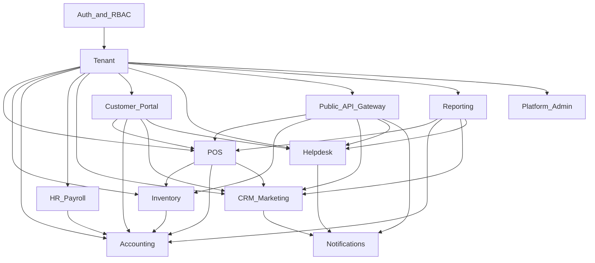
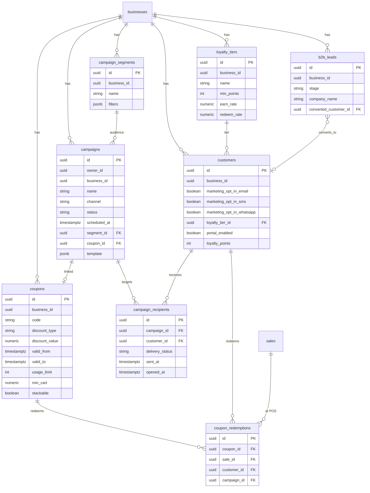
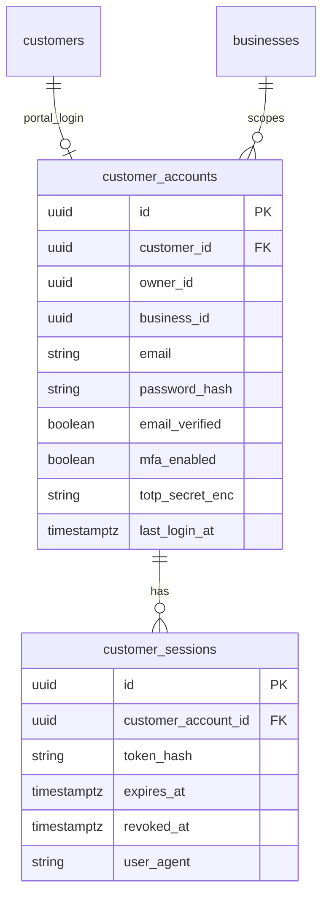
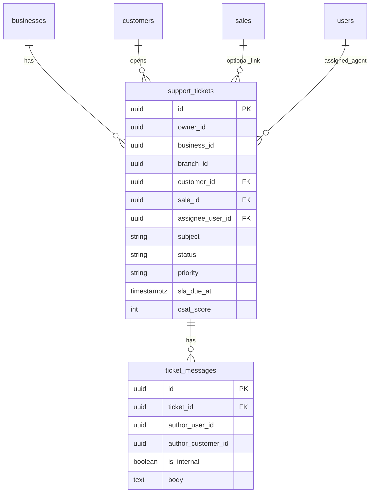
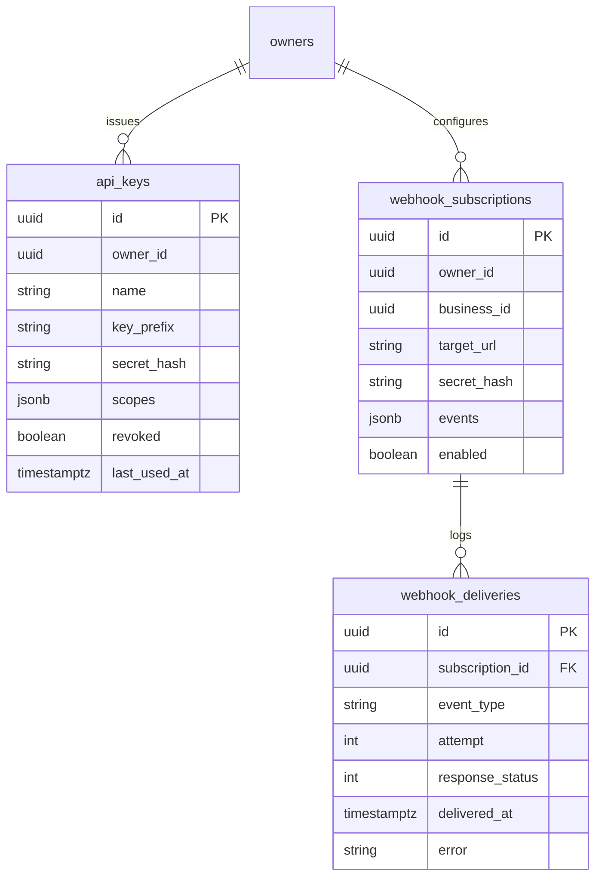
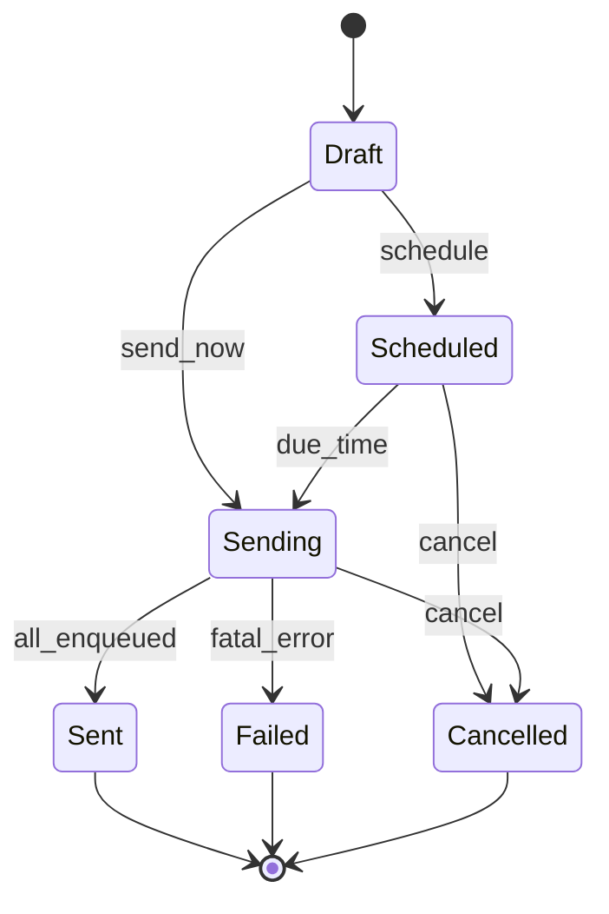
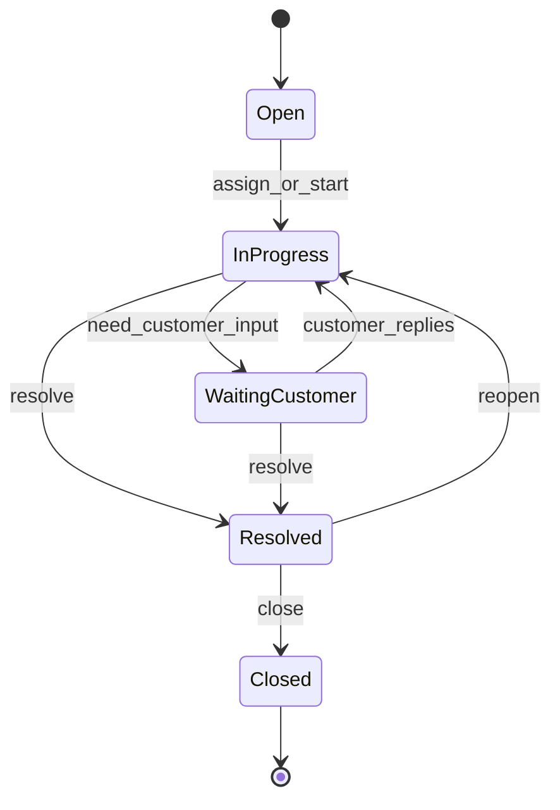
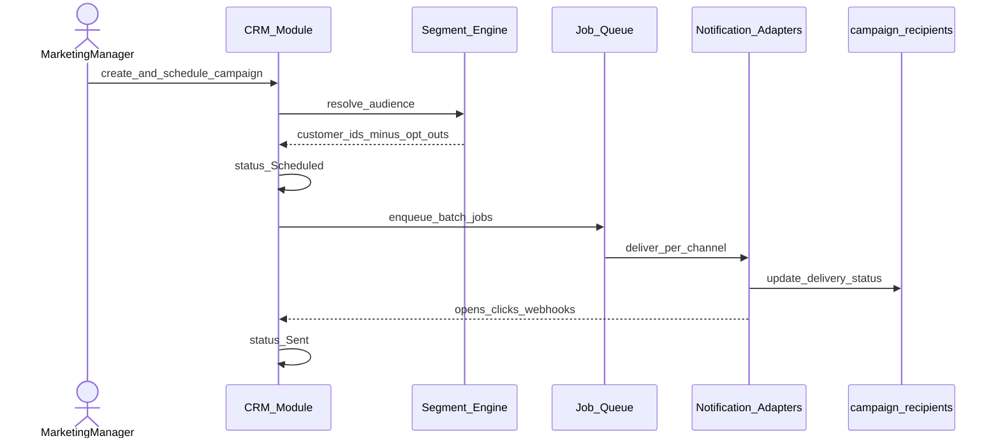
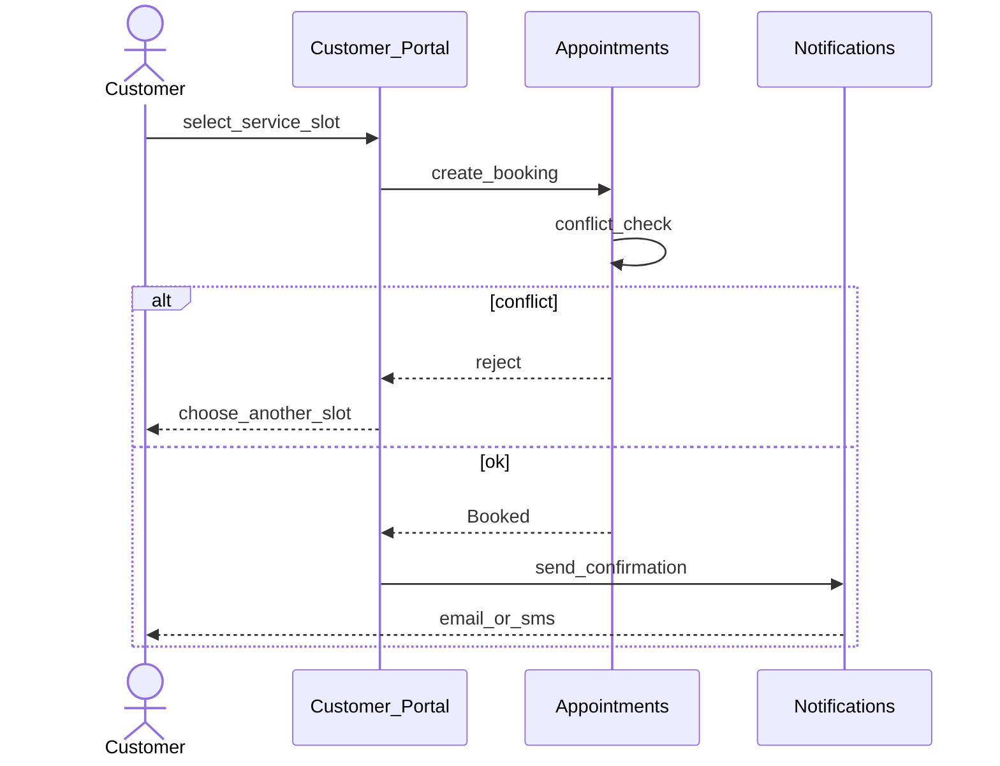

# SOFTWARE REQUIREMENTS SPECIFICATION

**Prepared in accordance with ISO/IEC/IEEE 29148:2018**

# Kaarobar — Unified POS, Accounting, Workforce, CRM & Customer Engagement Platform for Multi-Business, Multi-Branch Owners

| Field | Value |
|-------|-------|
| Document No. | **KRB-SRS-003** |
| Version | **3.1** (Production Baseline — Implementation-Aligned) |
| Date | July 22, 2026 |
| Supersedes | KRB-SRS-003 v3.0 (Draft for Review); KRB-SRS-002 v2.0 (archived) |
| Classification | Confidential — Internal Planning Document |
| Prepared By | Hamza AI — Founder & Lead Engineer |
| Standards | ISO/IEC/IEEE 29148:2018, ISO/IEC 25010:2011, ISO/IEC/IEEE 42010:2011 |
| Status | **Production baseline for engineering** — living document; Phase A remaining / Phase B roadmap retained |

This document is the authoritative engineering contract for Kaarobar. "Kaarobar" is a working product name and may be changed prior to release. Requirement language follows RFC 2119 (`shall` / `must` / `should` / `may`) and MoSCoW prioritization (**Must** / **Should** / **Could** / Won't).

> **v3.1 rule:** MoSCoW **Must** = production baseline (shipped or accepted Partial with stated criteria). Enterprise roadmap items remain in this SRS as **Should** / Phase A–B — they are not deleted, and they are not launch-blocking until Product promotes them.

---

## Document Control

### Revision History

| Version | Date | Author | Description |
|---------|------|--------|-------------|
| 1.0 | 2026-07-03 | Hamza AI | First complete draft. MongoDB Atlas architecture; NestJS modular monolith; core POS, Accounting, HR. |
| 2.0 | 2026-07-20 | Hamza AI | PostgreSQL migration (shared DB + RLS); multi-vertical catalog; scheduling; FBR Tier-1; offline sync hardening. |
| 3.0 | 2026-07-22 | Hamza AI | CRM & Marketing/Campaigns; Customer Portal login; role-scoped employee dashboards; Helpdesk; Public API & Webhooks; BI/analytics (RFM, campaign ROI, sales trends). Reverses v2.0 out-of-scope decisions on "native loyalty/CRM marketing automation" and "staff-initiated appointment booking only." |
| **3.1** | **2026-07-22** | **Hamza AI** | **Production Baseline.** Aligns Musts with the shipped Kaarobar codebase (Elixir/Phoenix + PostgreSQL + Oban): khata tender, loyalty points, industry presets, CRM campaigns as-built, push notifications, ESS employee portal login, desktop offline sync, en/ur i18n, branding. Rewrites CRM Must to shipped behavior; moves coupons/tiers/consent CRM, Customer Portal, Helpdesk, Public API, appointments, production FBR adapter, and full billing portal to Should / Phase A–B. Roles aligned to code (`marketing`, `admin`). |

### Why PostgreSQL Was Chosen (carried forward from v2.0)

KRB-SRS-002 replaced MongoDB Atlas with **PostgreSQL 16** as the system of record because:

1. **Financial integrity** — deferred constraint triggers, ACID transactions, and immutability grants are native fits for double-entry journals and till reconciliation.
2. **Row-Level Security (RLS)** — defense-in-depth tenant isolation via session variables (`app.owner_id`) in addition to application-layer scoping.
3. **Cost at early scale (G5)** — shared-database multi-tenancy avoids per-tenant cluster cost.
4. **Job queue affinity** — PostgreSQL-backed queues (BullMQ/Redis or Oban) keep transactional outbox patterns simple.

See also ADR 001 in the repository and KRB-SRS-002 §3.2.2 / Document Control.

### Why These Modules Were Added (v3.0) — still valid; delivery honesty in v3.1

Customer engagement remains strategic. v3.1 does **not** remove the enterprise roadmap; it separates **production baseline** (what ships and is Must) from **Phase A remaining / Phase B** (Should until Product promotes).

| Driver | Decision |
|--------|----------|
| **Retention moat** | Native CRM campaigns + loyalty points + khata keep purchase history inside the tenant today; coupons/tiers/consent/portal deepen the moat in Phase A remaining. |
| **Customer login closes the loop** | Customer Portal remains on the roadmap (Should / Phase A remaining) — not Must-complete for production baseline. |
| **Role-scoped access** | RBAC bundles + branch/business membership are Must; polished role-home dashboards beyond RBAC are Should. |
| **Public API / Webhooks (G7)** | Phase B Should — keep enterprise extensibility without blocking baseline. |
| **Helpdesk inside the tenant** | Phase B Should. |
| **Explicit reversals of v2.0 §1.4.4** | CRM marketing automation is **in scope** (baseline = campaigns as-built; full suite = Phase A remaining). Customer self-booking remains **roadmap** with appointments module. |

**Phased delivery (v3.1 — normative for prioritization)**

| Phase | Scope | MoSCoW |
|-------|-------|--------|
| **Production baseline (Release 1.0 Must)** | TEN, POS (incl. khata + loyalty points), INV core, ACC, HR/ESS, RPT core, ADM plan limits + LemonSqueezy webhook/checkout, NOT (in-app/email/push), OFF desktop, CRM campaigns as-built, FBR hooks (mock/non-blocking) | **Must** |
| **Phase A remaining** | Customer Portal (`CUS-FR`), coupons, loyalty tiers, marketing consent engine, named segments, SMS/WhatsApp campaigns, role-dashboard polish | **Should** until promoted |
| **Phase B** | Helpdesk (`SUP-FR`), Public API/Webhooks (`API-FR`), BI RFM/ROI, production FBR adapter, full LemonSqueezy portal, appointments/recipes/agrochemical polish | **Should** until promoted |

---

## Table of Contents

1. [Introduction](#1-introduction)
2. [Overall Description](#2-overall-description)
3. [System Architecture](#3-system-architecture)
4. [Use Case Model](#4-use-case-model)
5. [Functional Requirements](#5-functional-requirements)
6. [Data Model](#6-data-model)
7. [UML Diagrams](#7-uml-diagrams)
8. [External Interface Requirements](#8-external-interface-requirements)
9. [Non-Functional Requirements](#9-non-functional-requirements)
10. [Offline & Synchronization Requirements](#10-offline--synchronization-requirements)
11. [Requirement Traceability Matrix](#11-requirement-traceability-matrix)
12. [Risk Register](#12-risk-register)
13. [Appendices](#13-appendices)

---

## 1 Introduction

### 1.1 Purpose

This Software Requirements Specification (SRS) defines the functional, non-functional, interface, and data requirements for **Kaarobar**, a multi-tenant SaaS platform that unifies:

1. **Point of Sale** — fast sales, returns, tills, inventory, receipts; **desktop offline-tolerant**.
2. **Accounting** — double-entry bookkeeping under the POS (sales, purchases, payroll, AR/AP, khata).
3. **HR & Payroll** — employees, attendance, leave, payroll into the ledger, Employee Self-Service (ESS).
4. **CRM & Marketing (baseline)** — draft→send campaigns (email + in-app), audience filters, loyalty points.
5. **Customers** — profiles, khata (credit), loyalty points, ledger view for staff.
6. **Platform** — subscription plan limits, LemonSqueezy webhook/checkout, FBR Tier-1 hooks (non-blocking), notifications (in-app / email / push), en/ur localization.

**Enterprise roadmap** (documented in this SRS, not Must-complete for production baseline): Customer Portal, coupons/tiers/consent CRM, Helpdesk, Public API & webhooks, appointments, production FBR adapter, BI.

The SRS is the authoritative engineering contract. It is prepared in accordance with **ISO/IEC/IEEE 29148:2018**.

### 1.2 Document Conventions

| Convention | Meaning |
|------------|---------|
| **shall** / **must** | Mandatory requirement (RFC 2119) |
| **should** | Recommended but not mandatory for MVP cut |
| **may** | Optional / discretionary |
| MoSCoW **Must** | Release 1.0 blocking |
| MoSCoW **Should** | Strongly desired in Release 1.0 if capacity allows |
| MoSCoW **Could** | Desirable; deferrable |
| `Requirement-ID` | Stable ID for traceability (e.g. `CRM-FR-001`) |
| Mermaid diagrams | Normative structure; render in Markdown viewers |

### 1.3 Intended Audience and Reading Suggestions

| Audience | Focus |
|----------|-------|
| Founder / Product | §§1–2, 4, 11–13 |
| Backend / API engineers | §§3, 5–7, 10 |
| Frontend / mobile / desktop | §§4, 5 (relevant modules), 8.1, 9.3 |
| Security / compliance reviewers | §§3.2.2, 3.2.4, 6.7, 9.5, 9.8, 12 |
| QA | §§5, 9, 11 |

### 1.4 Project Scope

#### 1.4.1 Product Perspective

Kaarobar is a multi-tenant SaaS product for Pakistan-first Owners who operate one or more businesses, each with one or more branches. It replaces fragmented POS + spreadsheet accounting + separate payroll (+ optional external CRM) with a single tenant-scoped platform.

**Clients (production baseline):** Web (dashboard / browser POS), Desktop Electron (offline-capable till), Mobile (oversight + ESS + lighter POS).

**Roadmap clients:** Customer Portal (end-customer self-service) — Phase A remaining.

#### 1.4.2 Goals and Objectives

| ID | Goal | Success signal |
|----|------|----------------|
| **G1** | Less hustle for the Owner — one view of sales, cash, stock, and staff | Owner dashboard used weekly; consolidated KPIs trusted |
| **G2** | Real accounting — sales, purchases, and payroll post balanced journals | Zero unbalanced posted journals; TB ties |
| **G3** | Branches that can work alone, with the Owner still in control (incl. offline POS) | Desktop POS usable offline ≥ 24h; sync idempotent |
| **G4** | Pakistan-ready (FBR Tier-1 hooks + configurable tax) | Tier-1 sales enqueue asynchronously; receipts carry FBR fields; production adapter Should |
| **G5** | Keep early operating cost low (shared DB, modular monolith) | Single PostgreSQL cluster; no per-tenant DB |
| **G6** | Customer engagement & retention | Campaign sends + loyalty activity in baseline; Portal adoption when Phase A remaining ships |
| **G7** | Platform extensibility via API | Public API + webhooks when Phase B ships |

#### 1.4.3 In Scope — Production Baseline (Release 1.0 Must)

- Owner / Business / Branch management with **`Business.industry` presets** (`retail`, `restaurant`, `salon`, `pharmacy`, `supermarket`, `wholesale`, `general`) seeding categories
- Roles (code-aligned): `owner`, `admin`, `branch_manager`, `cashier`, `inventory_manager`, `accountant`, `hr_manager`, `marketing`, `employee`
- POS: sales, discounts, returns, tills/shifts, receipts (web + **offline desktop**); **khata (credit) tender**; **loyalty points redeem/earn**; split tender; `client_txn_id`
- Inventory: products (goods/service), categories, branch stock, transfers, PO, GRN; **variants/modifiers/batches** supported in API/consume path (management UI Should if incomplete)
- Accounting: COA, journals (auto + manual), immutability, GL, TB, P&L, BS, AR/AP, customer ledger, consolidated Owner view
- Pakistan sales tax defaults + **FBR Tier-1 hooks** (flag, async enqueue, receipt fields, non-blocking) — production adapter Should
- HR: employees, attendance, leave, payroll (PK tax + EOBI), payslips; **ESS** (clock / leave / payslips) with **employee portal login linkage**
- Owner / branch dashboards and reports (RBAC-filtered)
- Platform: subscription **plan limits**; LemonSqueezy **inbound webhook** + **checkout URL**
- Notifications: in-app inbox, email (Swoosh/Oban), **Expo push** + device tokens, prefs
- **CRM baseline:** draft→send campaigns (email + in-app); audiences `all` \| `khata` \| `min_points`; recipient tracking; async send
- Localization: **English + Urdu** (RTL for Urdu)
- Branding: modular-K logo assets / `KaarobarLogo`

#### 1.4.3a In Scope — Phase A Remaining / Phase B (Should until promoted)

| Phase | Items |
|-------|--------|
| **A remaining** | Customer Portal (`CUS-FR`); coupons (`POS-FR-019` / CRM coupon FRs); loyalty **tiers**; marketing consent/opt-out engine; named segments; SMS/WhatsApp campaigns; role-home dashboard polish (`TEN-FR-013` beyond RBAC) |
| **B** | Helpdesk (`SUP-FR`); Public API & signed webhooks (`API-FR`); BI RFM/campaign ROI/trends; production FBR adapter; full LemonSqueezy self-serve portal; appointments/scheduling; recipes/BOM; agrochemical/batch UI polish; `support_agent` role |

#### 1.4.4 Out of Scope (Release 1.0)

- Courier / driver dispatch networks and live delivery ETA maps
- Multi-restaurant carts in a single checkout
- External card PSP tokenization (online orders record `card`/`wallet` like POS until PSP lands)
- Cross-business shared loyalty point balances (points remain per business membership)

> **v3.2 note:** Platform-wide customer identity and marketplace discover/order-ahead are **in scope** (see CUS-FR marketplace requirements). The prior “e-commerce storefront out of scope” line is reversed for Kaarobar-listed businesses.
- Full **manufacturing / MRP** beyond simple recipe/BOM when that module is later enabled
- **Biometric** attendance hardware
- **Multi-currency group consolidation**
- **Non-Pakistan payroll e-filing** automation
- **Fixed asset** management / depreciation
- Native mobile Customer Portal app (responsive web when Portal ships)

#### 1.4.5 Assumptions and Dependencies

1. Owners accept shared-database multi-tenancy with application scoping (and RLS where enabled).
2. FBR rules may change; **baseline** implements hooks/mock path; tax-advisor review required before asserting production filing (Appendix C).
3. Email/push depend on third-party providers; SMS/WhatsApp when enabled.
4. LemonSqueezy (or equivalent) handles Owner→Kaarobar billing events; full portal is Should.
5. **This repository implements logical modules as Elixir/Phoenix contexts + Oban** (not NestJS/BullMQ). Older NestJS wording is historical; see §3.1.
6. Phase A remaining / Phase B items stay in the SRS for enterprise planning; they are **Should** until Product promotes them to Must.

#### 1.4.6 Implementation Status Summary (v3.1)

| Area | Status | Notes |
|------|--------|-------|
| TEN / Auth / RBAC | **Done** | MFA BE Done; client MFA UX Partial |
| POS / Returns / Tills | **Done** | Desktop offline Done; web/mobile online |
| Inventory / Procurement | **Done** | Variants/modifiers/batches: BE/consume Done; inventory admin UI Partial |
| Accounting / AR-AP | **Done** | |
| HR / Payroll / ESS | **Done** | Web ESS route Partial (desktop + mobile Done) |
| Customers / Khata / Loyalty points | **Done** | Tiers Should |
| CRM campaigns (as-built) | **Done** | Coupons/segments/consent Should |
| Reporting | **Done** | BI Should |
| Notifications + Push | **Done** | |
| Billing limits + LS webhook/checkout | **Done** | Full portal Should |
| FBR hooks | **Partial** | Mock/async Accepted for Must; production adapter Should |
| Customer Portal / Helpdesk / Public API | **Planned** | Phase A remaining / B |
| Appointments / Recipes | **Planned** | Phase B / future extensibility |
| Branding / i18n en-ur | **Done** | |

### 1.5 Definitions, Acronyms, and Abbreviations

| Term | Definition |
|------|------------|
| **Owner** | Paying tenant root; owns one or more Businesses |
| **Business** | Legal/operating entity under an Owner; has a vertical |
| **Branch** | Physical or logical location under a Business |
| **RLS** | PostgreSQL Row-Level Security |
| **ESS** | Employee Self-Service |
| **FBR** | Federal Board of Revenue (Pakistan) |
| **COA** | Chart of Accounts |
| **GRN** | Goods Receipt Note |
| **CRM** | Customer Relationship Management — campaigns, audiences, loyalty within a tenant |
| **Campaign** | Marketing message (email / in-app; SMS/WhatsApp when enabled) to an audience, optionally later linked to a coupon |
| **Audience filter** | Production-baseline campaign targeting: `all` \| `khata` \| `min_points` (named Segments are Should) |
| **Segment** | Saved named customer filter (purchase history, loyalty tier, branch, inactivity, consent) — Phase A remaining |
| **Customer Portal** | Authenticated self-service for end customers — Phase A remaining |
| **Khata** | Credit/on-account tender at POS that creates or updates an AR obligation for the customer |
| **Industry preset** | `Business.industry` value that seeds default categories/modules for a vertical |
| **Lead / Opportunity** | B2B prospect pipeline — Phase B / Should |
| **Ticket** | Helpdesk support case — Phase B |
| **Webhook** | HTTPS callback on platform events, HMAC-signed — Phase B (billing inbound webhook is baseline) |
| **API Key** | Credential for Public API — Phase B |
| **Loyalty points** | Accrual/redemption balance on a customer (baseline); **Loyalty Tier** is named tier rules (Should) |
| **Coupon** | Promo code — Phase A remaining |
| **RFM** | Recency / Frequency / Monetary scoring — Phase B BI |
| **MoSCoW** | Must / Should / Could / Won't prioritization |

### 1.6 References

1. ISO/IEC/IEEE 29148:2018 — Systems and software engineering — Life cycle processes — Requirements engineering
2. ISO/IEC 25010:2011 — Systems and software Quality Requirements and Evaluation (SQuaRE)
3. ISO/IEC/IEEE 42010:2011 — Architecture description
4. RFC 2119 — Key words for use in RFCs to Indicate Requirement Levels
5. Federal Board of Revenue, Government of Pakistan — Sales Tax Rules / POS Integration guidance
6. PostgreSQL 16 Documentation — Row Security Policies
7. KRB-SRS-002 v2.0 — prior SRS (archived at `docs/srs/KRB-SRS-002.md`)
8. ADR 001 — PostgreSQL multi-tenancy (repository)

---

## 2 Overall Description

### 2.1 Product Functions Overview

| Function group | Summary | Primary actors | Baseline |
|----------------|---------|----------------|----------|
| Tenancy & Access | Owners, businesses, branches, RBAC, audit | Owner, Platform Admin | Must |
| POS & Sales | Cart, tender (incl. khata), returns, tills, loyalty redeem | Cashier, Branch Manager | Must |
| Catalog & Inventory | Products, stock, PO/GRN, transfers | Inventory Manager | Must |
| Accounting & Finance | COA, journals, statements, AR/AP, tax | Accountant, Owner | Must |
| HR & Payroll | Employees, attendance, leave, payroll, ESS | HR Manager, Employee | Must |
| Reporting | Dashboards, TB/GL/P&L/BS, branch ops | Owner, Managers | Must |
| **CRM & Marketing (baseline)** | Campaigns draft→send, audiences, loyalty points | `marketing`, Owner | Must |
| Customers | Profiles, khata, loyalty points, ledger | Cashier, Accountant | Must |
| Notifications | In-app, email, push | System | Must |
| Platform Admin & Billing | Plan limits, LemonSqueezy webhook/checkout | Owner, Platform Admin | Must |
| Scheduling (roadmap) | Appointments, staff calendar, self-booking | Service Staff, Customer | Should |
| **CRM (extended)** | Named segments, coupons, tiers, consent, SMS/WA | `marketing` | Should |
| **Customer Portal** | Login, history, loyalty, booking, AR pay, prefs | Customer | Should |
| **Helpdesk & Support** | Tickets, SLA, CSAT | `support_agent`, Customer | Should |
| **Platform API & Integrations** | Public REST, outbound webhooks, keys | Owner, external systems | Should |
| Reporting & BI (extended) | RFM, campaign ROI, trends | Owner | Should |

### 2.2 Multi-Vertical Design Principle

One unified catalog and POS core. **Production model:** vertical differences are expressed via **`Business.industry` presets** that seed categories (and eventually enabled modules) — not separate codebases. Longer-term `business_types` lookup / agrochemical / recipes / dining / appointments remain **future extensibility**.

#### 2.2.1 Supported Industry Presets (Production Baseline)

`retail` · `restaurant` · `salon` · `pharmacy` · `supermarket` · `wholesale` · `general`

#### 2.2.2 How This Is Modeled (Summary)

- Products with `product_kind` (goods/service); optional variants, modifiers, batches in catalog API
- Branch pricing; FEFO batch consume when batches exist on sale
- CRM baseline and customers available across industries; appointments gated when that module ships

#### 2.2.3 A Note on Scope Discipline

Prefer polishing Retail + one service industry (e.g. Salon) before expanding presets. Phase A remaining / Phase B modules shall not block baseline vertical launch.

### 2.3 User Classes and Characteristics

| Actor | Code role (if staff) | Description | Data visibility |
|-------|----------------------|-------------|-----------------|
| **Owner** | `owner` | Tenant root; all businesses | All owned businesses |
| **Admin** | `admin` | Delegated owner-level ops | Per membership |
| **Branch Manager** | `branch_manager` | Branch operations | Assigned branch(es) |
| **Cashier** | `cashier` | Till / sales | Assigned branch POS |
| **Inventory Manager** | `inventory_manager` | Stock & procurement | Business / assigned branches |
| **Accountant** | `accountant` | Books & tax | Business financials |
| **HR Manager** | `hr_manager` | People & payroll | Business HR |
| **Marketing** | `marketing` | Campaigns & loyalty settings | Business-scoped CRM |
| **Employee** | `employee` | ESS | Own HR data |
| **Support Agent** | `support_agent` (Phase B) | Helpdesk tickets | Business/branch tickets |
| **Service Staff** | (roadmap) | Appointments / services | Own schedule |
| **Customer** | `customer_accounts` (Phase A remaining) | End customer portal | Own data only |
| **Platform Admin** | platform | Kaarobar ops | Cross-tenant support (no financials by default) |

**RBAC principle:** Staff access is filtered by role capability bundles and business/branch membership (TEN-FR-003/004). Polished per-role home dashboards beyond RBAC filters are Should (TEN-FR-013).

### 2.4 Operating Environment

| Layer | Environment |
|-------|-------------|
| Clients | Modern evergreen browsers; Electron desktop POS; iOS/Android via Expo; Customer Portal responsive web when shipped |
| Server | Linux containers; managed PostgreSQL 16; Oban (Postgres-backed jobs); optional Redis |
| Network | HTTPS/TLS 1.2+; desktop offline with local outbox |

### 2.5 Design and Implementation Constraints

1. Shared PostgreSQL database; tenant isolation by `owner_id` (+ `business_id` / `branch_id`); RLS where enabled.
2. Posted journals immutable; corrections via reversing entries.
3. FBR reporting must never block checkout.
4. Campaign sends must never block POS (async job queue).
5. Customer Portal auth (when shipped) is separate from staff auth (`customer_accounts` ≠ `users`).
6. API secrets / webhook secrets hashed; never logged in plaintext.
7. English + Urdu UI (`en` / `ur`, RTL for Urdu) for staff clients (USE-NFR / i18n Must).
8. **Reference implementation:** Elixir/Phoenix modular monolith + Oban (this repository).

### 2.6 Apportioning of Requirements

| Priority | Treatment |
|----------|-----------|
| Must | Production baseline — required for Release 1.0 acceptance |
| Should | Phase A remaining / Phase B / next increment; design shall not preclude |
| Could | Backlog |

Production baseline Must-set = TEN/POS/INV/ACC/HR/RPT/ADM-hooks/NOT/OFF-desktop/CRM-as-built/khata/loyalty-points. Phase A remaining Should-set = CUS-FR + coupons/tiers/consent. Phase B Should-set = SUP-FR + API-FR + BI + production FBR + appointments.

---
## 3 System Architecture

### 3.1 Architectural Style

Kaarobar is a **modular monolith**: a single deployable application composed of clearly bounded modules (contexts) with explicit dependency rules.

**Normative for this repository:** logical modules map 1:1 to **Elixir/Phoenix contexts** with **Oban** for async work. Historical NestJS/BullMQ wording in older revisions is not binding.

Clients (Web, Desktop, Mobile; Customer Portal when shipped) are independently deployable and communicate over HTTPS REST (`/api/v1/...`) with optional WebSockets later.

### 3.2 Deployment / Logical View

```
┌──────────────────────────────────────────────────────────────────┐
│ Client layer                                                     │
│  Web · Desktop Electron POS · Mobile · Customer Portal (web)     │
└─────────────────────────────┬────────────────────────────────────┘
                              │ TLS / REST /api/v1 (+ public API)
┌─────────────────────────────▼────────────────────────────────────┐
│ Edge: load balancer, rate limit, WAF                             │
└─────────────────────────────┬────────────────────────────────────┘
                              │
┌─────────────────────────────▼────────────────────────────────────┐
│ Application — Modular monolith                                   │
│  Auth & RBAC · Tenant · POS · Inventory · Accounting · HR        │
│  Reporting · CRM & Marketing · Customer Portal · Helpdesk        │
│  Public API Gateway · Notifications · Platform Admin / Billing   │
│  Job workers (journals, FBR, campaign send, webhooks, notify)    │
└──────────────┬───────────────────────────────┬───────────────────┘
               ▼                               ▼
        PostgreSQL 16                   Object storage (R2)
        (+ RLS session vars)            receipts / exports
```

#### 3.2.1 Technology Stack

| Layer | Technology (logical) | Notes |
|-------|----------------------|-------|
| Web / Portal | React / Next.js | Staff app + Customer Portal |
| Mobile | React Native / Expo | Owner oversight + ESS |
| Desktop POS | Electron + local outbox | Offline-first |
| API | **Elixir/Phoenix** (normative in this repo) | Modular monolith contexts |
| DB | PostgreSQL 16 | Shared DB; app tenant scope (+ RLS where enabled) |
| Jobs | **Oban** (Postgres-backed) | Campaigns, journals, FBR enqueue, notify |
| Auth (staff) | JWT + optional TOTP | `users` |
| Auth (customer) | JWT + optional MFA | `customer_accounts` (Phase A remaining) |
| Auth (public API) | API keys + OAuth2 client-credentials | Phase B |
| Webhooks | Inbound LemonSqueezy (Must); outbound HMAC (Phase B) | |
| Campaign delivery | Job queue + notification adapters | Email Must; SMS/WhatsApp Should |
| Billing | LemonSqueezy | Owner subscriptions |
| Payments | Payment gateway adapter | Customer→Owner; no raw PAN |
| FBR | Async adapter | Never blocks sale |

#### 3.2.2 Multi-Tenancy Model

Unchanged from v2.0 intent:

- Shared database; every tenant-scoped table carries `owner_id` (and usually `business_id` / `branch_id`).
- Session: `SET LOCAL app.owner_id = '...'` for staff requests; RLS policies enforce isolation.
- CI tests assert cross-tenant queries return zero rows (SEC-NFR-001).

#### 3.2.3 JSONB Usage Policy

JSONB is permitted for extensible metadata (e.g. item compliance fields, campaign template variables, webhook payload snapshots) where relational querying is not primary. Money, quantities, statuses, and foreign keys remain typed columns.

#### 3.2.4 Role-Based Data Visibility Model (NEW)

| Session type | Session variables | Visibility rule |
|--------------|-------------------|-----------------|
| **Staff** | `app.owner_id` (+ app-layer role/branch filters) | Tenant RLS + RBAC role permissions + assigned branch filters |
| **Customer** | `app.customer_id` (and typically `app.owner_id` / `app.business_id` for tenant binding) | RLS restricts to **own rows only** — e.g. sales, AR, tickets, appointments where `customer_id` matches |
| **Dashboard projection** | Derived from staff JWT claims | Widgets and aggregate queries filtered by role capabilities and assigned branches (TEN-FR-013) |
| **API keys** | Key id + owner/business scope in auth context | Permissions scoped per key; **every** access audited (API-FR-007) |

Example customer RLS predicate:

```sql
USING (customer_id = current_setting('app.customer_id')::uuid)
```

Customer identities shall never receive staff roles (TEN-FR-014).

### 3.3 Component / Module View



**Dependency rules**

- Auth & Tenant are foundational; no upward cycles into them.
- POS/Inventory/HR post into Accounting asynchronously so checkout/payroll UX is not blocked by ledger latency.
- CRM campaign send is async via Notifications adapters; never blocks POS.
- Reporting is read-only against other modules.
- Public API Gateway is a thin auth/rate-limit/audit façade over module services — not a second business-logic stack.

### 3.4 Integration Points Summary

| Integration | Direction | Blocking? |
|-------------|-----------|-----------|
| FBR POS | Outbound | No |
| Payment gateway | Inbound payment intents | No (async confirm) |
| LemonSqueezy | Subscription webhooks | N/A |
| Email / SMS / WhatsApp | Outbound marketing & transactional | No (queued) |
| Public webhooks | Outbound to Owner endpoints | No (queued + retry) |

---

## 4 Use Case Model

### 4.1 Actors

Business Owner · Admin · Branch Manager · Cashier · Inventory Manager · Accountant · HR Manager · Marketing · Employee · Support Agent (Phase B) · Service Staff (roadmap) · Customer (Phase A remaining) · Platform Admin · External API Client (Phase B)

### 4.2 Use Case Diagram (conceptual)

Staff actors interact with POS, Inventory, Accounting, HR, CRM, Helpdesk, and Reporting. Customer interacts only with Customer Portal (history, loyalty, booking, AR pay, tickets, preferences). External API Client interacts via Public API Gateway / Webhooks.

### 4.3 Use Case Summary Table — Core (All Verticals)

Carried forward from KRB-SRS-002 (UC-01–UC-27):

| ID | Use Case | Actors | Module |
|----|----------|--------|--------|
| UC-01 | Process Sale | Cashier | POS |
| UC-02 | Return / Refund | Cashier, Branch Manager | POS |
| UC-03 | Apply Discount | Cashier, Branch Manager | POS |
| UC-04 | Open / Close Till | Cashier, Branch Manager | POS |
| UC-05 | Manage Catalog Item | Inventory Manager | Inventory |
| UC-06 | Transfer Stock | Inventory Manager | Inventory |
| UC-07 | Create PO / Receive GRN | Inventory Manager | Inventory |
| UC-08 | Adjust Stock | Inventory Manager | Inventory |
| UC-09 | Post Manual Journal | Accountant | Accounting |
| UC-10 | View Financial Statements | Accountant, Owner | Accounting |
| UC-11 | Manage AR / AP | Accountant | Accounting |
| UC-12 | Configure Tax / FBR | Owner, Accountant | Accounting |
| UC-13 | Export Reports | Accountant, Owner | Reporting |
| UC-14 | Manage Employee | HR Manager | HR |
| UC-15 | Clock In / Out | Employee, Cashier | HR |
| UC-16 | Request / Approve Leave | Employee, Manager | HR |
| UC-17 | Run Payroll | HR Manager, Accountant, Owner | HR |
| UC-18 | View ESS | Employee | HR |
| UC-19 | Manage Business / Branch | Owner | Tenant |
| UC-20 | Invite / Assign Staff | Owner | Tenant |
| UC-21 | Manage Subscription | Owner, Platform Admin | Admin |
| UC-22 | Platform Support Access | Platform Admin | Admin |
| UC-23 | Book Appointment (staff) | Service Staff, Branch Manager | Scheduling |
| UC-24 | Complete Appointment → Sale | Service Staff, Cashier | Scheduling / POS |
| UC-25 | Manage Recipe / BOM Item | Inventory Manager | Inventory |
| UC-26 | Manage Batches / Expiry | Inventory Manager | Inventory |
| UC-27 | Dine-in Table Sale | Cashier | POS |

### 4.4 Use Case Summary Table — CRM, Portal, Helpdesk, API (NEW)

| ID | Use Case | Actors | Module |
|----|----------|--------|--------|
| UC-28 | Create / Manage Campaign | Marketing, Owner | CRM (baseline) |
| UC-29 | Segment Customers | Marketing | CRM (Should) |
| UC-30 | Redeem Coupon at POS | Cashier, Customer | CRM/POS (Should) |
| UC-31 | Customer Login & Self-Service | Customer | Customer Portal (Should) |
| UC-32 | Customer Book Appointment | Customer | Portal / Scheduling (Should) |
| UC-33 | Customer View / Pay Balance | Customer | Portal / AR (Should) |
| UC-34 | Raise / Manage Support Ticket | Customer, Support Agent | Helpdesk (Should) |
| UC-35 | Manage API Keys & Webhooks | Owner, Platform Admin | API (Should) |
| UC-36 | View Role-Scoped Dashboard | All staff roles | Reporting (Must RBAC) |
| UC-37 | Process Khata Sale | Cashier | POS (Must) |
| UC-38 | Redeem / Accrue Loyalty Points | Cashier, Customer | POS/CRM (Must) |

### 4.5 Detailed Use Case Descriptions

#### UC-28 — Create / Manage Campaign (Campaign Send)

| Field | Content |
|-------|---------|
| **Actors** | Marketing role (primary), Owner |
| **Preconditions** | Authenticated with `marketing` or Owner; business CRM enabled |
| **Trigger** | Actor chooses Create Campaign |
| **Main flow** | 1. Actor creates campaign (name, channel email or in-app).<br>2. Actor selects audience filter (`all` / `khata` / `min_points`) (CRM-FR-016).<br>3. Actor sends → Draft → Sending.<br>4. System enqueues recipient jobs (CRM-FR-011); notifications deliver.<br>5. System records per-recipient status in `campaign_recipients` (CRM-FR-008).<br>6. Campaign reaches Sent (or Failed). |
| **Alternate flows** | **A1 Partial failure:** Individual recipient failures logged; campaign may complete as Sent with error counts. |
| **Postconditions** | Audit entry written (CRM-FR-015); POS latency unaffected. |

> **v3.1 note:** Named segments, coupons, scheduling, and consent exclusion are Should (Phase A remaining).

#### UC-32 — Customer Book Appointment (Self-Service)

| Field | Content |
|-------|---------|
| **Actors** | Customer (primary) |
| **Preconditions** | Customer authenticated in Portal; business has appointments enabled and portal self-booking enabled; service item selectable |
| **Trigger** | Customer chooses Book Appointment |
| **Main flow** | 1. Customer selects service, branch, staff (optional), and time slot.<br>2. System conflict-checks staff/time (SCH-FR-002).<br>3. System creates `appointments` row status Booked, `customer_id` = session customer.<br>4. System sends confirmation notification to customer (and staff if configured).<br>5. Customer may reschedule/cancel per policy (CUS-FR-005). |
| **Alternate flows** | **A1 Conflict:** System rejects overlapping slot; Customer picks another.<br>**A2 Disabled:** If self-booking disabled, Portal shows contact/branch guidance only. |
| **Postconditions** | Appointment visible to staff schedule; reverses v2.0 staff-only booking decision for portal-enabled businesses. |

> **Note:** Staff-initiated booking (UC-23) remains supported. SCH-FR-001 is extended — customers may self-book via Customer Portal when enabled (**Must** for service verticals with portal enabled).

#### UC-34 — Raise / Manage Support Ticket

| Field | Content |
|-------|---------|
| **Actors** | Customer (create via Portal), Support Agent (manage), Owner (oversight) |
| **Preconditions** | Authenticated Customer or Support Agent; ticket module enabled |
| **Trigger** | Customer submits issue, or Agent creates ticket on behalf of customer |
| **Main flow** | 1. Ticket created with subject, body, priority; linked to `customer_id` and optional `sale_id` / invoice (SUP-FR-005).<br>2. Status = Open; notifications sent (SUP-FR-007).<br>3. Agent assigns to self/other; sets priority & SLA due (SUP-FR-002).<br>4. Lifecycle: Open → InProgress → WaitingCustomer → Resolved → Closed; messages: customer-visible vs internal notes (SUP-FR-003/004).<br>5. On Resolved, Customer may submit CSAT (SUP-FR-006); may Reopen from Resolved. |
| **Alternate flows** | **A1 SLA breach:** Analytics flag for Owner/Manager (SUP-FR-008).<br>**A2 Spam/abuse:** Agent closes with reason; audit retained. |
| **Postconditions** | Full message history retained; linked sale/customer navigable from staff UI. |

Abbreviated detailed descriptions for UC-01 (sale), UC-17 (payroll), and UC-02 (return) are **unchanged in intent from KRB-SRS-002 §4.5** and remain normative by reference.

---
## 5 Functional Requirements

All requirements use MoSCoW priority. Requirement IDs are unique and stable for traceability.

### 5.1 Tenancy, Identity & Access Management

| ID | Requirement | Priority |
|----|-------------|----------|
| TEN-FR-001 | The system shall allow an Owner to create and manage multiple Business entities under a single account, each assigned an industry preset (Section 2.2). | Must |
| TEN-FR-002 | The system shall allow each Business to contain multiple Branch entities. | Must |
| TEN-FR-003 | The system shall support assigning one or more roles (`owner`, `admin`, `branch_manager`, `cashier`, `inventory_manager`, `accountant`, `hr_manager`, `marketing`, `employee`) to a user, scoped to specific branches or business-wide. Phase B may add `support_agent`. | Must |
| TEN-FR-004 | The system shall restrict a user's data access to only the businesses/branches they are explicitly assigned to, enforced by application-layer tenant scope (and RLS where enabled) in addition to RBAC; the Owner implicitly has access to all businesses they own. | Must |
| TEN-FR-005 | The system shall support custom roles with a configurable permission set beyond the default roles. | Could |
| TEN-FR-006 | The system shall provide authentication via email/password with optional TOTP multi-factor authentication, required by default for Owner and Accountant roles. | Must |
| TEN-FR-007 | The system shall support configurable auto-logout after inactivity on POS terminals. | Should |
| TEN-FR-008 | The system shall maintain an immutable audit log of all create/update/delete actions, capturing user, timestamp, action type, and affected entity, via an INSERT-only database role with no UPDATE/DELETE grant on the audit table. | Must |
| TEN-FR-009 | The system shall allow an Owner to deactivate (not hard-delete) a Business or Branch, preserving historical data. | Must |
| TEN-FR-010 | The system shall support bulk user invitation via email with role pre-assignment. | Could |
| TEN-FR-011 | The system shall support industry presets on Business create (`Business.industry`) that seed default categories without a schema migration; future `business_types` lookup remains compatible. | Must |
| TEN-FR-012 | The system shall support the `marketing` role with permissions for campaigns and loyalty settings; `support_agent` shall be added when Helpdesk ships (Phase B). | Must (`marketing`); Should (`support_agent`) |
| TEN-FR-013 | The system shall filter dashboards and navigation by role capability bundles and branch assignments. Polished per-role home widget packs beyond RBAC filters are Should. | Must (RBAC filter); Should (widget packs) |
| TEN-FR-014 | When Customer Portal ships, customer identity shall be separate from staff users (`customer_accounts`); customer accounts shall never be granted staff roles. | Should (Phase A remaining) |
| TEN-FR-015 | The system shall allow linking an Employee master record to a staff `users` login for ESS (employee portal login), distinct from Customer Portal. | Must |

### 5.2 POS & Sales

| ID | Requirement | Priority |
|----|-------------|----------|
| POS-FR-001 | The cashier shall be able to build a sale cart by scanning a 1D barcode or a 2D QR code, by SKU/name search, or by manual entry; both symbologies shall resolve to the same item lookup. | Must |
| POS-FR-002 | The system shall calculate line-item and cart totals in real time, applying branch-specific pricing and applicable tax rates. | Must |
| POS-FR-003 | The system shall support split payments across multiple methods (cash, card, mobile wallet, **khata**) within one sale. | Must |
| POS-FR-004 | The cashier shall be able to hold/park a sale and resume it later. | Should |
| POS-FR-005 | The system shall atomically decrement inventory on sale completion using a single-statement `UPDATE ... SET quantity_on_hand = quantity_on_hand - $qty` to prevent race conditions between concurrent checkouts; when batches exist, consume FEFO. | Must |
| POS-FR-006 | The system shall generate a sequential per-branch invoice number and, for FBR-registered Tier-1 businesses, embed the FBR invoice number and QR code on the receipt (Section 8.3.4). | Must |
| POS-FR-007 | The system shall support full and partial returns against an original sale, validated against a configurable return window. | Must |
| POS-FR-008 | The system shall require Branch Manager approval for returns/refunds exceeding a configurable per-branch auto-approval threshold. | Must |
| POS-FR-009 | The system shall support item- and cart-level discounts, with a configurable cashier auto-approval limit above which Branch Manager approval is required. | Must |
| POS-FR-010 | The system shall support till/shift open and close operations with expected-vs-counted cash reconciliation and over/short reporting. | Must |
| POS-FR-011 | The desktop POS shall queue sales locally when offline and sync automatically upon reconnection using idempotent, client-generated transaction IDs (Section 10). Web/mobile POS may remain online-only. | Must |
| POS-FR-012 | The system shall support optional customer lookup/attachment to a sale and accrue loyalty points where configured. | Must |
| POS-FR-013 | The system shall support quotations/proforma invoices that do not affect stock or the ledger until converted to a sale. | Could |
| POS-FR-014 | The system shall print thermal receipts to ESC/POS-compatible printers and support reprinting any historical receipt, incrementing `sales.bill_print_count` on each print for audit purposes. | Should |
| POS-FR-015 | The system shall support printing a formal A4/letter-size bill/invoice (distinct from the thermal receipt) to a standard printer or as a downloadable PDF, for wholesale/B2B customers. | Should |
| POS-FR-016 | The system shall support sharing a digital copy of the bill/receipt via WhatsApp or email directly from the POS, in addition to or instead of printing. | Should |
| POS-FR-017 | The system shall prevent a sale from completing if requested quantity exceeds available stock for stock-tracked items, unless negative-stock selling is explicitly enabled for that business/branch. | Must |
| POS-FR-018 | The system shall support an `order_type` on each sale (`retail`, `dine_in`, `takeaway`, `delivery`, `service`), and, where `dine_in`, an associated table and number of covers. | Should |
| POS-FR-019 | The system should apply and validate coupon/promo codes at checkout and record redemption against the linked campaign where applicable (CRM-FR-005, CRM-FR-014). | Should |
| POS-FR-020 | The system shall support **khata** (credit/on-account) as a payment method that creates or updates an AR obligation for the attached customer. | Must |
| POS-FR-021 | The system shall allow redeeming loyalty points at checkout per business rates and shall accrue points on completed sales when a customer is attached. | Must |

### 5.3 Catalog & Inventory

| ID | Requirement | Priority |
|----|-------------|----------|
| INV-FR-001 | The system shall maintain a product catalog scoped to a Business and shared across its Branches (goods/service kinds), with branch-specific pricing. Recipe/bundle types are Should when that module ships. | Must |
| INV-FR-002 | The system shall maintain a separate stock quantity record per product (and, where applicable, per variant) per branch, for inventory-tracked items. | Must |
| INV-FR-003 | The system shall support stock transfer requests between branches of the same business, crediting stock to the receiving branch only after confirmation. | Must |
| INV-FR-004 | The system shall support creation of Purchase Orders to suppliers, including expected delivery date and line items. | Must |
| INV-FR-005 | The system shall support Goods Receipt Notes (GRN) against a Purchase Order, including partial receipt. | Must |
| INV-FR-006 | Upon GRN confirmation, the system shall increment stock and post a purchase/COGS journal entry using the business's configured stock valuation method. | Must |
| INV-FR-007 | The system shall support a configurable stock valuation method per business: FIFO, Weighted Average, or FEFO (First-Expired-First-Out, for batch-tracked items). | Should |
| INV-FR-008 | The system shall raise low-stock alerts based on a configurable reorder level per item (and variant) per branch. | Should |
| INV-FR-009 | The system shall support stock adjustments (wastage, damage, shrinkage) requiring a mandatory reason code and audit trail entry. | Must |
| INV-FR-010 | The system shall maintain supplier records including contact details and payment terms, linked to Accounts Payable (Section 5.5). | Should |
| INV-FR-011 | The system shall support product variants (e.g. size × color), each with its own SKU, barcode, and stock record, under a single parent product (API/consume Must; inventory admin UI Should if incomplete). | Must |
| INV-FR-012 | The system should support recipe/Bill-of-Materials items. | Should |
| INV-FR-013 | The system shall support batch/lot records with expiry where present and consume FEFO on sale when batches exist (API/consume Must; full GRN batch UI polish Should). | Must |
| INV-FR-014 | The system shall alert the Inventory Manager when a batch is within a configurable number of days of expiry, and shall flag (but not block, pending Owner policy) sale of expired batches. | Should |
| INV-FR-015 | The system shall support a vertical-specific compliance metadata field on an item stored as structured JSONB. | Could |
| INV-FR-016 | The system shall generate and print barcode or QR-code labels for an item (or variant) encoding the item/variant identifier. | Should |
| INV-FR-017 | For the Food/Restaurant vertical, the system shall support dining tables per branch and associate a sale with a table when `order_type = dine_in`. | Should |

### 5.4 Scheduling & Appointments

> **v3.1:** Entire module is **Phase B / Should** until Product promotes. Not part of production baseline Must-complete.

| ID | Requirement | Priority |
|----|-------------|----------|
| SCH-FR-001 | The system should allow booking an appointment for a service item, a specific staff member, and a time slot, optionally attached to a customer. When Customer Portal is enabled, customers may self-book (CUS-FR-005). | Should |
| SCH-FR-002 | The system should reject a booking that conflicts with the selected staff member's existing appointment at an overlapping time. | Should |
| SCH-FR-003 | The system should allow staff to view their own daily/weekly schedule via the mobile app. | Should |
| SCH-FR-004 | The system should support appointment status transitions: Booked → CheckedIn → InProgress → Completed, or Cancelled/NoShow from Booked. | Should |
| SCH-FR-005 | On marking an appointment Completed, the system should generate a linked sale (UC-01) pre-filled with the service item, price, and assigned staff member for commission attribution. | Should |
| SCH-FR-006 | The system may send a reminder notification (SMS/WhatsApp/push) to the customer and/or staff member ahead of a scheduled appointment. | Could |

### 5.5 Accounting & Finance

| ID | Requirement | Priority |
|----|-------------|----------|
| ACC-FR-001 | The system shall provision a default Chart of Accounts template for each new Business, selected according to its business vertical (Section 2.2) and editable by the Accountant/Owner. | Must |
| ACC-FR-002 | The system shall support hierarchical (parent/child) accounts within the Chart of Accounts. | Should |
| ACC-FR-003 | Every Journal Entry shall be balanced (total debits equal total credits), enforced by a PostgreSQL deferred constraint trigger on `journal_lines` that runs at transaction commit. | Must |
| ACC-FR-004 | The system shall automatically generate and post journal entries for completed sales (including service and recipe-item sales), processed returns, purchase/GRN transactions, and approved payroll runs. | Must |
| ACC-FR-005 | The system shall allow manual journal entries for adjustments not covered by automated postings. | Must |
| ACC-FR-006 | The system shall generate a General Ledger view per account showing chronological entries and running balance. | Must |
| ACC-FR-007 | The system shall generate a Trial Balance for any given period. | Must |
| ACC-FR-008 | The system shall generate a Profit & Loss Statement and a Balance Sheet for any given period, at branch level and consolidated business level. | Must |
| ACC-FR-009 | The system shall generate a basic Cash Flow Statement (indirect method) for a given period. | Should |
| ACC-FR-010 | Posted journal entries shall be immutable (no UPDATE/DELETE privilege on `journal_entries` / `journal_lines` to the application role); corrections shall be made via reversing entries. | Must |
| ACC-FR-011 | The system shall support an accounting period lock (e.g. monthly close) after which new postings to that period require an explicit unlock by the Owner/Accountant. | Should |
| ACC-FR-012 | The system shall maintain Accounts Receivable per customer, including invoice aging (current, 30/60/90+ days). | Must |
| ACC-FR-013 | The system shall maintain Accounts Payable per supplier, including bill aging and payment scheduling. | Must |
| ACC-FR-014 | The system shall support bank/cash account reconciliation via manual matching or CSV/OFX statement import against recorded transactions. | Should |
| ACC-FR-015 | The Owner shall be able to view consolidated financial statements across all Businesses/Branches they own, in addition to per-business and per-branch views. | Must |
| ACC-FR-016 | The system shall support configurable tax rates per jurisdiction, with Pakistani sales tax (federal and provincial) as the default template. | Must |
| ACC-FR-017 | For businesses flagged FBR Tier-1, the system shall **enqueue** each sale for FBR reporting asynchronously, store returned/mocked FBR invoice fields on the sale, and embed them on the receipt. Reporting shall never block checkout. A production FBR network adapter is Should. | Must (hooks); Should (production adapter) |
| ACC-FR-018 | The system shall support debit/credit note recording for returns/exchanges that must be reflected in FBR sales tax filing annexures. | Should |
| ACC-FR-019 | The system should export financial statements and reports to PDF and Excel formats. | Should |
| ACC-FR-020 | The system shall support a configurable fiscal year start month per business. | Could |

### 5.6 HR & Payroll

| ID | Requirement | Priority |
|----|-------------|----------|
| HR-FR-001 | The system shall maintain employee master records: personal details, employment details (position, branch assignment, join date), and compensation structure. | Must |
| HR-FR-002 | The system shall support clock-in/clock-out attendance capture from the POS terminal and/or mobile app. | Must |
| HR-FR-003 | The system shall allow manual attendance entry/correction by a Branch Manager or HR Manager, recorded in the audit log. | Should |
| HR-FR-004 | The system shall support configurable leave types (annual, sick, casual, etc.) with accrual rules and per-employee balances. | Should |
| HR-FR-005 | The system shall support a leave request and approval workflow: Employee requests, Branch Manager or HR Manager approves. | Must |
| HR-FR-006 | The system shall calculate gross pay from a configurable salary structure (basic + allowances) plus attendance/overtime data for a payroll period. | Must |
| HR-FR-007 | The system shall calculate commission for sales-performance and service-performance staff, driven by item commission settings and attributed sales/appointments. | Should |
| HR-FR-008 | The system shall calculate statutory deductions (Pakistan income tax withholding slabs, EOBI contribution) with a configurable deduction engine for other jurisdictions. | Must |
| HR-FR-009 | The system shall require an approval step (Owner or delegated Accountant) before a payroll run is disbursed. | Must |
| HR-FR-010 | Upon approval, the system shall post one consolidated payroll journal entry (including commission payouts) and generate individual payslips per employee. | Must |
| HR-FR-011 | The system shall provide an Employee Self-Service view for payslip history, leave balance/requests, and attendance history. | Must |
| HR-FR-012 | Payroll corrections shall be made via a new adjustment run rather than editing a disbursed run. | Should |

### 5.7 Reporting & Analytics

| ID | Requirement | Priority |
|----|-------------|----------|
| RPT-FR-001 | The system shall provide an Owner-level dashboard showing consolidated sales, cash position, and stock alerts across all businesses/branches. | Must |
| RPT-FR-002 | The system shall provide branch-level daily sales and shift reconciliation reports. | Must |
| RPT-FR-003 | The system shall provide inventory valuation, stock movement, and batch-expiry reports. | Should |
| RPT-FR-004 | The system shall provide the standard accounting reports (Section 5.5) in the product UI; PDF/Excel export is Should (ACC-FR-019). | Must |
| RPT-FR-005 | The system shall provide payroll cost summaries by branch and business, including commission payouts. | Should |
| RPT-FR-006 | The system shall support scheduled email delivery of key reports (e.g. daily sales summary) to the Owner. | Could |
| RPT-FR-007 | For service-based businesses, the system shall provide appointment utilization and staff-booking reports. | Could |
| RPT-FR-008 | The system should provide RFM and churn-oriented customer segment reports for Marketing and Owner (Phase B BI). | Should |
| RPT-FR-009 | The system should provide a Campaign ROI report (sends, opens, clicks, redemptions, attributed revenue) (Phase B BI). | Should |
| RPT-FR-010 | The system may provide sales trend / basic demand forecasting views to support purchasing decisions. | Could |

### 5.8 Platform Administration & Subscription Billing

| ID | Requirement | Priority |
|----|-------------|----------|
| ADM-FR-001 | Platform Admin should be able to view and manage all tenants (Owners) for support purposes, without exposing tenant financial data by default. | Should |
| ADM-FR-002 | The system shall enforce subscription plan limits (number of businesses, branches, and/or users) per Owner account. | Must |
| ADM-FR-003 | The system shall integrate with LemonSqueezy via **inbound webhook** (HMAC-verified) for plan/status changes and shall support a **checkout URL** for upgrades. | Must |
| ADM-FR-004 | The Owner should have a full self-service billing portal to view invoices and update the payment method. | Should |
| ADM-FR-005 | The system shall support a free trial period with automatic feature restriction upon expiry if no plan is selected. | Should |
| ADM-FR-006 | Platform Admin should be able to add or edit industry presets / future `business_types` via an internal admin tool, without a schema migration. | Should |

### 5.9 Notifications

| ID | Requirement | Priority |
|----|-------------|----------|
| NOT-FR-001 | The system shall provide an **in-app notification inbox** and send **email** for payroll/leave/return approvals, low-stock alerts, CRM campaign delivery, and billing events. | Must |
| NOT-FR-002 | The system should send WhatsApp Business API or SMS notifications for time-sensitive approvals, appointment reminders, digitally-shared bills, and marketing campaigns where configured and opted-in. | Should |
| NOT-FR-003 | The system shall notify employees when a new payslip is available via preferred channel (in-app, email, or **push**). | Must |
| NOT-FR-004 | The system shall support **Expo push** delivery with device token registration and per-user notification preferences. | Must |
| NOT-FR-005 | Staff clients shall support **English and Urdu** (`en` / `ur`) with RTL for Urdu, including a persisted user locale preference. | Must |
| NOT-FR-006 | Product chrome shall use the Kaarobar modular-K brand mark (`KaarobarLogo` / `docs/brand/`) consistently across web, desktop, and mobile. | Must |

### 5.10 CRM & Marketing

> **v3.1:** Must rows below match **shipped** behavior. Coupons, tiers, consent engine, named segments, SMS/WA, BI attribution remain Should / Phase A remaining.

| ID | Requirement | Priority |
|----|-------------|----------|
| CRM-FR-001 | The system should allow named customer segments by purchase history, loyalty tier, branch, industry, and inactivity (Phase A remaining). | Should |
| CRM-FR-002 | The system shall allow create/edit of **email and in-app** campaigns with draft→send lifecycle. | Must |
| CRM-FR-003 | The system should send SMS campaigns via configured SMS adapter. | Should |
| CRM-FR-004 | The system should send WhatsApp Business API campaigns to opted-in customers. | Should |
| CRM-FR-005 | The system should support coupons/promo codes with percent or fixed discount, validity window, usage limits, minimum cart, and stackability. | Should |
| CRM-FR-006 | The system should support automated trigger campaigns (e.g. win-back, birthday). | Should |
| CRM-FR-007 | The system shall support **loyalty points** accrual rates and redemption rates per business; named **loyalty tiers** are Should. | Must (points); Should (tiers) |
| CRM-FR-008 | The system shall record per-recipient campaign delivery status (`campaign_recipients`); full open/click/ROI analytics are Should. | Must (recipients); Should (ROI) |
| CRM-FR-009 | The system should track marketing consent and channel opt-in/opt-out per customer and suppress opted-out recipients. | Should |
| CRM-FR-010 | The system should support B2B lead/pipeline with stages New → Qualified → Won/Lost. | Should |
| CRM-FR-011 | Campaign send shall be asynchronous via the job queue and shall never block POS checkout latency. | Must |
| CRM-FR-012 | The system should preview audience size before send. | Should |
| CRM-FR-013 | The system may support A/B subject lines for email campaigns. | Could |
| CRM-FR-014 | The system should allow linking a coupon to a campaign for redemption attribution. | Should |
| CRM-FR-015 | The system shall write an audit log entry for campaign create and send actions. | Must |
| CRM-FR-016 | The system shall support campaign audience filters of at least `all`, `khata`, and `min_points`. | Must |
| CRM-FR-017 | Staff shall be able to maintain customer records including khata eligibility and loyalty point adjustments. | Must |

### 5.11 Customer Portal

> **v3.1:** Phase A remaining — all CUS-FR are **Should** until Product promotes.

| ID | Requirement | Priority |
|----|-------------|----------|
| CUS-FR-001 | The system should allow customer account creation via invite-from-sale or self-register, configurable per business. | Should |
| CUS-FR-002 | Customer authentication should support email/password; optional MFA may be available. | Should |
| CUS-FR-003 | The customer should be able to view their own order/purchase history and download invoices/receipts. | Should |
| CUS-FR-004 | The customer should be able to view loyalty points/tier and redeem rewards per business rules. | Should |
| CUS-FR-005 | The customer should be able to book, reschedule, and cancel their own appointments online when appointments + portal self-booking are enabled. | Should |
| CUS-FR-006 | The customer should be able to view outstanding AR/credit (khata) balance and initiate payment. | Should |
| CUS-FR-007 | The customer should be able to manage profile, contact info, and marketing opt-in/opt-out preferences. | Should |
| CUS-FR-008 | The system should enforce strict self-data-only visibility for customer sessions via `customer_id` isolation. | Should |
| CUS-FR-009 | The system should support password reset and email verification for customer accounts. | Should |
| CUS-FR-010 | The system should allow session revocation by the customer or by the Owner. | Should |
| CUS-FR-011 | Customer portal identity shall be platform-wide (unique email); a customer may hold memberships at multiple businesses across owners. | Should |
| CUS-FR-012 | The system should expose a public marketplace listing of businesses with `marketplace_enabled`, plus per-business catalog for the configured online branch. | Should |
| CUS-FR-013 | Authenticated customers should place online pickup/order-ahead sales (`source=online`) paid by card or wallet; khata is not accepted online in MVP. | Should |
| CUS-FR-014 | Consumer login shall not require a business ID; consumers select or filter by business after authentication. Business and consumer share one sign-in surface (`actor=business|consumer`); there is no separate portal login product. | Should |

### 5.12 Helpdesk & Support

> **v3.1:** Phase B — all SUP-FR are **Should** until Product promotes.

| ID | Requirement | Priority |
|----|-------------|----------|
| SUP-FR-001 | Tickets should be creatable by Customer (via Portal) or Support Agent. | Should |
| SUP-FR-002 | The system should allow assigning a ticket to an agent with priority and SLA due date. | Should |
| SUP-FR-003 | Ticket status lifecycle should be: Open → InProgress → WaitingCustomer → Resolved → Closed; Reopen from Resolved. | Should |
| SUP-FR-004 | The system should distinguish customer-visible messages from internal notes. | Should |
| SUP-FR-005 | Tickets should link to a customer and optionally to a sale/invoice. | Should |
| SUP-FR-006 | The system should collect a CSAT rating after resolve. | Should |
| SUP-FR-007 | The system should notify customer and agent on status and message events. | Should |
| SUP-FR-008 | The system should provide Owner/Manager ticket analytics (open count, SLA breach). | Should |

### 5.13 Public API & Webhooks

> **v3.1:** Phase B — outbound Public API/webhooks are **Should**. Inbound LemonSqueezy billing webhook remains Must (ADM-FR-003).

| ID | Requirement | Priority |
|----|-------------|----------|
| API-FR-001 | The system should expose a versioned public REST API under `/api/v1/public/...` (or equivalent). | Should |
| API-FR-002 | The system should issue API keys with scoped permissions and store hashed secrets only. | Should |
| API-FR-003 | The system should support OAuth2 client-credentials for server-to-server integrations. | Should |
| API-FR-004 | The system should enforce per-key rate limiting. | Should |
| API-FR-005 | The system should support outbound webhook subscriptions for events including `sale.completed`, `inventory.low`, `ticket.created`, `campaign.sent`. | Should |
| API-FR-006 | Outbound webhook payloads should be signed with HMAC-SHA256; delivery should retry with backoff; deliveries should be logged. | Should |
| API-FR-007 | The system should audit-log all Public API access. | Should |
| API-FR-008 | The Owner should be able to revoke API keys and disable webhooks immediately. | Should |

---
## 6 Data Model

### 6.1 Modeling Approach

Relational PostgreSQL schema with typed money/quantity columns, foreign keys, and tenant scoping columns. Production baseline centers on tenancy, POS, catalog, accounting, HR, customers/loyalty/CRM campaigns, notifications, billing. Phase A remaining / Phase B tables (`customer_accounts`, coupons, tickets, `api_keys`, webhooks, appointments) remain specified for enterprise roadmap.

#### 6.1.1 Catalog naming

This repository uses **`products`** (with goods/service kinds). Older SRS prose may say `items`; both refer to the unified catalog concept.

### 6.2 ERD — Tenancy, Identity & Platform

Normative: `users` → memberships → `businesses` (with `industry`) → `branches`; immutable `audit_logs`. Staff auth on `users`. Customer Portal auth (`customer_accounts`) is Phase A remaining.

### 6.3 ERD — POS, Catalog, Accounting, HR

Core: `sales` / line items / payments (incl. khata); `products` / variants / modifiers / batches / stock; `journal_entries` / `journal_lines`; employees / attendance / leave / payroll; `customers` with loyalty points and khata flags.

### 6.4 ERD — CRM & Marketing (NEW)



### 6.5 ERD — Customer Portal Identity (NEW)



Staff `users` and `customer_accounts` are distinct identity planes (TEN-FR-014).

### 6.6 ERD — Helpdesk (NEW)



### 6.7 ERD — Public API & Webhooks (NEW)



### 6.8 Multi-Tenancy & Row-Level Security

Staff path (unchanged intent):

```sql
USING (owner_id = current_setting('app.owner_id')::uuid)
```

Customer path (NEW):

```sql
USING (customer_id = current_setting('app.customer_id')::uuid)
```

Applicable to customer-visible projections of `sales`, `ar_invoices`, `appointments`, `support_tickets`, `coupon_redemptions`, loyalty balances, etc. Portal handlers shall `SET LOCAL app.customer_id` (and binding tenant vars) on every request.

### 6.9 Table Count Summary

| Area | Approx. tables |
|------|----------------|
| Core (v2.0) | ~38 |
| CRM & Marketing | +7 (`campaigns`, `campaign_segments`, `campaign_recipients`, `coupons`, `coupon_redemptions`, `loyalty_tiers`, `b2b_leads`) |
| Customer Portal | +2 (`customer_accounts`, `customer_sessions`) |
| Helpdesk | +2 (`support_tickets`, `ticket_messages`) |
| Public API | +3 (`api_keys`, `webhook_subscriptions`, `webhook_deliveries`) |
| **v3.0 total** | **≈ 51** |

### 6.10 Customers Field Expansions

| Field | Type | Notes |
|-------|------|-------|
| `marketing_opt_in_email` | boolean | Default false unless captured with consent |
| `marketing_opt_in_sms` | boolean | |
| `marketing_opt_in_whatsapp` | boolean | Required for WhatsApp campaigns |
| `loyalty_tier_id` | uuid FK | Nullable |
| `portal_enabled` | boolean | Gates invite/self-register |

---

## 7 UML Diagrams

### 7.1 Class Diagram

Logical domain classes remain as in KRB-SRS-002 §7.1 (Sale, Item, JournalEntry, Employee, etc.), extended with Campaign, Coupon, LoyaltyTier, CustomerAccount, SupportTicket, ApiKey, WebhookSubscription.

### 7.2 State Diagrams

#### 7.2.1 Sale / Invoice Lifecycle

**Unchanged from KRB-SRS-002 §7.2.1** (Draft/Completed/Returned states as previously specified).

#### 7.2.2 Payroll Run Lifecycle

**Unchanged from KRB-SRS-002 §7.2.2** (Draft → PendingApproval → Approved/Rejected → Posted).

#### 7.2.3 Campaign Lifecycle (NEW)



#### 7.2.4 Support Ticket Lifecycle (NEW)



### 7.3 Sequence Diagrams

#### 7.3.1 POS Sale Checkout

**Unchanged from KRB-SRS-002 §7.3.1** (cart → stock decrement → async journal → optional FBR enqueue). Coupon validation (POS-FR-019) inserts into the same checkout transaction before stock decrement when a code is present; online path validates live; offline path uses OFF-FR-008.

#### 7.3.2 Payroll Processing & Posting

**Unchanged from KRB-SRS-002 §7.3.2**.

#### 7.3.3 Campaign Send (NEW)



#### 7.3.4 Customer Self-Service Booking (NEW)



### 7.4 Activity Diagram — Return / Refund Approval Workflow

**Unchanged from KRB-SRS-002 §7.4**.

---

## 8 External Interface Requirements

### 8.1 User Interfaces

| Surface | Principles |
|---------|------------|
| Web staff app | Role-scoped navigation and dashboards (TEN-FR-013); dense POS-capable browser mode |
| Desktop POS | Offline-first; large tap targets; ESC/POS printers; visible offline badge |
| Mobile | Owner KPIs + ESS clock/leave/payslip |
| **Customer Portal** | Mobile-first; order history; booking; pay balance; loyalty; preferences; no staff chrome |
| **Marketing Manager** | Campaign builder (template, segment, schedule, preview audience, analytics) |
| **Support Agent** | Ticket inbox; customer/sale context pane; internal notes vs public replies |

### 8.2 Hardware Interfaces

Thermal ESC/POS printers, cash drawers, barcode/QR scanners, standard A4 printers, label printers — as in KRB-SRS-002. No biometric devices in Release 1.0.

### 8.3 Software Interfaces

#### 8.3.1 Payment Gateway Adapter

Tokenized card/wallet payments for Customer→Owner (AR pay in portal, card tender at POS). No raw PAN storage.

#### 8.3.2 Subscription Billing Interface (LemonSqueezy)

Owner→Kaarobar plan checkout, webhooks for plan changes and payment failures (ADM-FR-003).

#### 8.3.3 Notification Channels

| Channel | Use |
|---------|-----|
| Email | Transactional + marketing campaigns (Must) |
| SMS | Approvals, reminders, campaigns (Should) |
| WhatsApp Business API | Bills, reminders, opted-in campaigns (Should) |
| Push | ESS / staff app (Should) |

Marketing sends shall consult consent flags before enqueue (CRM-FR-009).

#### 8.3.4 FBR POS Integration

| ID | Requirement | Priority |
|----|-------------|----------|
| FBR-FR-001 | The system shall allow a Business to be flagged as an FBR Tier-1 retailer, enabling the FBR integration adapter for that business. | Must |
| FBR-FR-002 | The system shall transmit each completed sale from a Tier-1-flagged business to FBR's system in real time (async job) and store the returned FBR invoice number against the sale record. | Must |
| FBR-FR-003 | The system shall render the FBR invoice number, FBR logo, and QR code on both thermal receipts and formal A4 invoices for Tier-1-flagged businesses. | Must |
| FBR-FR-004 | The system shall queue failed FBR transmissions for automatic retry and shall never block a customer-facing sale on FBR transmission success. | Must |
| FBR-FR-005 | The system shall record debit/credit notes for returns against Tier-1-flagged sales in a form suitable for monthly sales tax annexure reconciliation. | Should |
| FBR-FR-006 | The system shall alert the Owner/Accountant if FBR transmission failures persist beyond a configurable threshold, given the 24-hour incident reporting obligation. | Should |

#### 8.3.5 Public API & Webhooks (NEW)

| Topic | Spec |
|-------|------|
| Base path | `/api/v1/public/...` (API-FR-001) |
| Auth | API key header or OAuth2 client-credentials (API-FR-002/003) |
| Rate limits | Per-key quotas (API-FR-004); HTTP 429 on breach |
| Webhook signature | `X-Kaarobar-Signature: sha256=<HMAC>` over raw body (API-FR-006) |
| Retries | Exponential backoff; delivery log retained |
| Event catalog (initial) | `sale.completed`, `sale.returned`, `inventory.low`, `appointment.booked`, `ticket.created`, `ticket.resolved`, `campaign.sent`, `campaign.failed`, `customer.created` |
| Revocation | Immediate key revoke / webhook disable (API-FR-008) |

### 8.4 Communication Interfaces

HTTPS/TLS 1.2+ only for all clients and webhooks. Desktop sync uses the same REST surface with idempotent POST bodies.

---

## 9 Non-Functional Requirements

Quality characteristics mapped to ISO/IEC 25010.

### 9.1 Performance Efficiency

| ID | Requirement | Priority |
|----|-------------|----------|
| PERF-NFR-001 | Online POS checkout p95 latency shall be < 2 seconds under normal branch load (excluding printer I/O). | Must |
| PERF-NFR-002 | Owner dashboard primary KPIs should load in < 3 seconds p95 for tenants within plan limits. | Should |
| PERF-NFR-003 | Sync of a pending offline outbox batch (≤ 100 sales) should complete in < 30 seconds on typical broadband. | Should |
| PERF-NFR-004 | Report export jobs may run asynchronously for large date ranges. | Could |
| PERF-NFR-005 | Database indexes shall begin with tenant scoping columns for all tenant-scoped tables. | Must |
| PERF-NFR-006 | Campaign batch send should sustain on the order of 10,000 recipients/hour per tenant without increasing POS checkout p95 beyond PERF-NFR-001. | Should |

### 9.2 Compatibility

| ID | Requirement | Priority |
|----|-------------|----------|
| COMP-NFR-001 | Public API shall be versioned; breaking changes require a new version path. | Must |
| COMP-NFR-002 | Thermal printing shall support common ESC/POS dialects used in PK retail. | Must |

### 9.3 Usability

| ID | Requirement | Priority |
|----|-------------|----------|
| USE-NFR-001 | Staff UI shall support English and Urdu (`en` / `ur`, RTL). | Must |
| USE-NFR-002 | Cashier shall complete a standard barcode sale in ≤ 4 taps/scans after cart build. | Should |
| USE-NFR-003 | Destructive actions (void, deactivate business, revoke API key) shall require confirmation. | Must |
| USE-NFR-004 | Accessibility: interactive controls should meet WCAG 2.1 AA for contrast on primary flows. | Should |
| USE-NFR-005 | Customer Portal order history and appointment booking flows should be completable without training. | Should |

### 9.4 Reliability

| ID | Requirement | Priority |
|----|-------------|----------|
| REL-NFR-001 | Posted financial data shall not be lost on application crash (transactional commits). | Must |
| REL-NFR-002 | Desktop POS shall remain usable offline ≥ 24 hours with cached catalog/stock. | Must |
| REL-NFR-003 | Job retries shall be idempotent for journals, FBR, campaigns, and webhooks. | Must |

### 9.5 Security

| ID | Requirement | Priority |
|----|-------------|----------|
| SEC-NFR-001 | Every tenant data access shall be scoped; CI shall include cross-tenant isolation tests. | Must |
| SEC-NFR-002 | RBAC shall be enforced at the API/authorization layer, not only in the UI. | Must |
| SEC-NFR-003 | Passwords shall be hashed with a modern KDF (e.g. Argon2). | Must |
| SEC-NFR-004 | Staff and customer access tokens shall be short-lived; refresh shall be rotatable. | Must |
| SEC-NFR-005 | Secrets shall not appear in logs or client bundles. | Must |
| SEC-NFR-006 | Transport shall be TLS for all non-local environments. | Must |
| SEC-NFR-007 | Audit log shall be tamper-evident (no update/delete API). | Must |
| SEC-NFR-008 | Payment card data shall not be stored; use tokenization. | Must |
| SEC-NFR-009 | Privilege escalation attempts shall be denied and audited. | Must |
| SEC-NFR-010 | CI shall include Customer Portal isolation tests proving customer A cannot read customer B data. | Must |
| SEC-NFR-011 | API keys shall be stored hashed; webhook secrets protected; signature verification mandatory before processing inbound management callbacks where applicable. | Must |
| SEC-NFR-012 | CI shall include role-scoped dashboard tests proving widgets/data honor role and branch assignments. | Must |

### 9.6 Maintainability

| ID | Requirement | Priority |
|----|-------------|----------|
| MNT-NFR-001 | Modules shall enforce dependency rules in §3.3. | Must |
| MNT-NFR-002 | Requirement IDs shall appear in tests and PR descriptions for Must items where practical. | Should |
| MNT-NFR-003 | Schema migrations shall be forward-only in production. | Must |

### 9.7 Portability

| ID | Requirement | Priority |
|----|-------------|----------|
| PORT-NFR-001 | Application shall run in Linux containers. | Must |
| PORT-NFR-002 | Managed PostgreSQL shall be provider-portable (PORT-NFR-003 intent from v2.0). | Should |
| PORT-NFR-003 | No hard dependency on a single cloud vendor's proprietary DB API. | Should |

### 9.8 Compliance

| ID | Requirement | Priority |
|----|-------------|----------|
| CMP-NFR-001 | FBR Tier-1 behaviour is an engineering interpretation of public rules — tax-advisor review required before production claims. | Must (process) |
| CMP-NFR-002 | Financial immutability supports external audit of books. | Must |
| CMP-NFR-003 | Personal data retention/deletion tooling may be added post-MVP. | Could |
| CMP-NFR-004 | Pakistan payroll statutory calculations are configurable; legal correctness is Owner's responsibility with advisor input. | Must (disclaimer) |
| CMP-NFR-005 | Marketing consent and opt-out shall be honored; PECA / data-protection implications are informational caveats — not legal advice; Owner remains data controller for their customers. | Could (process note) / Must honor opt-out in product (CRM-FR-009) |

---

## 10 Offline & Synchronization Requirements

### 10.1 Design Rationale

Branch POS must sell when the internet fails. Customer Portal, Helpdesk agent UI, Campaign management, and Public API are **online-only** in v3.0.

### 10.2 Local Storage

Desktop caches catalog (incl. barcodes) and stock snapshot; queues sales/returns/adjustments with `client_txn_id`.

### 10.3 Idempotent Sync

Server unique constraint on `client_txn_id`; duplicate POST is a no-op success.

### 10.4 Conflict Resolution Strategy

Stock applies as atomic deltas on sync (never absolute overwrite). Manager approvals pending offline resolve when online.

### 10.5 Requirements

| ID | Requirement | Priority |
|----|-------------|----------|
| OFF-FR-001 | The desktop POS shall cache the branch's item catalog (including barcode/QR values) and current stock snapshot locally, refreshed opportunistically whenever online. | Must |
| OFF-FR-002 | The desktop POS shall queue sales, returns, and stock adjustments locally when offline, each tagged with a client-generated unique transaction ID. | Must |
| OFF-FR-003 | The server shall treat sync submissions as idempotent on the client transaction ID, safely ignoring duplicate resubmission via a database-level unique constraint. | Must |
| OFF-FR-004 | Stock changes originating offline shall be applied as atomic delta UPDATE operations on sync, never as absolute overwrites. | Must |
| OFF-FR-005 | The POS UI shall visibly indicate offline status and pending-sync transaction count to the cashier at all times while offline. | Should |
| OFF-FR-006 | FBR real-time reporting (FBR-FR-002) for sales made offline shall be queued and transmitted on reconnection. | Must |
| OFF-FR-007 | Returns/refunds requiring Branch Manager approval (POS-FR-008) that cannot reach the manager while offline shall be queued as PendingApproval locally and resolved once connectivity is restored. | Must |
| OFF-FR-008 | While offline, the POS may accept cached coupon codes and shall re-validate coupon eligibility on sync; invalid redemptions shall be flagged for manager review and shall not silently corrupt campaign analytics. | Should |

**Online-only (v3.1):** Web POS, Mobile POS, Customer Portal (when shipped), Helpdesk, Campaign create/send UI, Public API, and live webhook delivery require connectivity. **Desktop POS** is the offline-capable client (OFF-FR-001–007).

---

## 11 Requirement Traceability Matrix

Sample traceability rows (not exhaustive — full matrix maintained in engineering backlog):

| Goal / Source | Requirements (sample) |
|---------------|----------------------|
| G1 Owner hustle reduction | RPT-FR-001, TEN-FR-013, RPT-FR-002 |
| G2 Real accounting | ACC-FR-003, ACC-FR-004, ACC-FR-010, ACC-FR-015 |
| G3 Branch autonomy / offline | POS-FR-011, OFF-FR-001–004, REL-NFR-002 |
| G4 Pakistan-ready | ACC-FR-016, ACC-FR-017, FBR-FR-001–004 |
| G5 Low operating cost | §3.1 modular monolith, §3.2.2 shared DB |
| **G6 Customer engagement** | CRM-FR-002/007/011/016/017, POS-FR-012/020/021; CUS-FR when Phase A remaining |
| **G7 Platform extensibility** | API-FR-001–008 (Phase B Should); ADM-FR-003 inbound billing webhook (Must) |
| UC-28 Campaign send | CRM-FR-002, CRM-FR-011, CRM-FR-015, CRM-FR-016, NOT-FR-001 |
| UC-37 Khata sale | POS-FR-020, ACC-FR-012 |
| UC-38 Loyalty | POS-FR-021, CRM-FR-007 |
| UC-32 Customer booking | CUS-FR-005, SCH-FR-001 (Should) |
| UC-34 Support ticket | SUP-FR-001–007 (Should) |
| UC-36 Role dashboard | TEN-FR-013, RPT-FR-001–002 |
| Security isolation | SEC-NFR-001, TEN-FR-004; CUS-FR-008 / SEC-NFR-010 when Portal ships |

---

## 12 Risk Register

| ID | Risk | Likelihood | Impact | Mitigation |
|----|------|------------|--------|------------|
| R-01 | Cross-tenant data leak via scoping bug | Medium | Severe | RLS + app checks + CI isolation tests |
| R-02 | FBR rule changes / penalties | Medium | High | Async adapter; advisor review; feature flags |
| R-03 | Offline sync stock divergence | Medium | Moderate | Delta updates; manager reconciliation tools |
| R-04 | Unbalanced journal bug | Low | Severe | DB deferred balance trigger; immutability |
| R-05 | Scope creep across verticals | High | Moderate | Vertical feature flags; launch 2 first |
| R-06 | Provider lock-in | Low | Moderate | PORT-NFR-003; standard Postgres |
| R-07 | **Marketing channel / WhatsApp Business policy compliance** | Medium | Moderate | Opt-in gates; template approval workflow; provider selection (Appendix D) |
| R-08 | **Customer PII exposure via portal or API** | Medium | Severe | `app.customer_id` RLS; consent; API key scoping; SEC-NFR-010/011 |
| R-09 | **API key leakage / abuse** | Medium | Severe | Hashed keys; rate limits; immediate revoke; audit log |
| R-10 | **Claiming unbuilt Musts as launch criteria** | High | Severe | v3.1 Production Baseline separates Must (shipped) from Should (roadmap) |
| R-11 | **Multi-module scope creep from Portal/Helpdesk/API** | High | Moderate | Keep Phase A remaining / Phase B as Should until Product promotes |

Risks R-01–R-06 carried forward from KRB-SRS-002; R-07–R-09 from v3.0; R-10–R-11 refined in v3.1.

---

## 13 Appendices

### Appendix A — Requirement Count Summary (v3.1)

| Prefix | Module / Area | Count (approx.) | Must (production baseline) |
|--------|---------------|-----------------|----------------------------|
| TEN-FR | Tenancy & Access | 15 | ~12 |
| POS-FR | POS & Sales | 21 | ~15 |
| INV-FR | Catalog & Inventory | 17 | ~10 |
| SCH-FR | Scheduling | 6 | 0 (all Should) |
| ACC-FR | Accounting | 20 | ~13 |
| HR-FR | HR & Payroll | 12 | ~8 |
| RPT-FR | Reporting & BI | 10 | ~3 |
| ADM-FR | Platform Admin | 6 | ~2 |
| NOT-FR | Notifications / i18n / brand | 6 | ~5 |
| CRM-FR | CRM & Marketing | 17 | ~7 (as-built) |
| CUS-FR | Customer Portal | 10 | 0 (all Should) |
| SUP-FR | Helpdesk | 8 | 0 (all Should) |
| API-FR | Public API | 8 | 0 (all Should; LS inbound under ADM) |
| FBR-FR | FBR interface | 6 | ~4 (hooks) |
| OFF-FR | Offline & Sync | 8 | ~6 (desktop) |
| *-NFR | Non-functional | ~40 | ~25 |
| **Total FR** | | **≈ 170** | **≈ 85 Must** (honest baseline) |
| **Grand total FR + NFR** | | **≈ 210+** | **≈ 110 Must** |

> v3.1 lowered Must count vs v3.0 draft by moving Portal/Helpdesk/Public API/coupons/appointments to Should. Exact enumeration is the authoritative tables in §§5, 8.3.4, 9, 10.

### Appendix B — Sample Default Chart of Accounts (Pakistan Retail Template)

| Code | Name | Type |
|------|------|------|
| 1000 | Cash in Hand | Asset |
| 1010 | Cash at Bank | Asset |
| 1100 | Accounts Receivable | Asset |
| 1200 | Inventory | Asset |
| 1300 | Prepaid Expenses | Asset |
| 2000 | Accounts Payable | Liability |
| 2100 | Sales Tax Payable (FBR) | Liability |
| 2200 | Income Tax Payable | Liability |
| 2300 | EOBI Payable | Liability |
| 2400 | Net Pay Payable | Liability |
| 3000 | Owner's Equity | Equity |
| 3100 | Retained Earnings | Equity |
| 4000 | Sales Revenue | Revenue |
| 4100 | Service Revenue | Revenue |
| 5000 | Cost of Goods Sold | Expense |
| 5100 | Salary Expense | Expense |
| 5200 | Commission Expense | Expense |
| 5300 | Rent Expense | Expense |
| 5400 | Utilities Expense | Expense |

Vertical-specific templates may extend this list (ACC-FR-001).

### Appendix C — Open Questions for Accounting / Tax Advisor Review

1. Confirm current FBR Tier-1 thresholds and penalty structure (Section 8.3.4) against the latest STGO before production.
2. Confirm correct provincial services-tax treatment (PRA/SRB/KPRA/BRA) for the Salon/Service vertical.
3. Confirm whether recipe-based COGS (INV-FR-012) needs different FBR valuation/reporting than simple resale COGS.
4. Confirm EOBI and income-tax withholding treatment for commission-based pay (HR-FR-007).
5. Confirm default Chart of Accounts templates per vertical (Appendix B) against industry practice.

### Appendix D — Open Questions for Product / Engineering Review

1. Which two verticals launch first (Section 2.2.3)?
2. Should appointment booking support offline creation in a later phase (currently online — Section 10)?
3. Confirm managed PostgreSQL provider (RDS/Aurora vs Supabase vs Neon) — provider-agnostic by design (PORT-NFR-003).
4. **Customer self-register vs invite-only default?** (CUS-FR-001 is configurable — which default ships?)
5. **Unified auth vs separate `customer_accounts`?** — This SRS **recommends separate** (TEN-FR-014); confirm before implementation.
6. **Which Phase A vs Phase B modules ship first?** — Recommendation: Phase A = Customer Portal + basic CRM; Phase B = Helpdesk + Public API + BI.
7. **WhatsApp Business API provider selection** (Meta Cloud API vs BSP aggregators) and template approval ownership.

### Appendix E — Requirement ID Prefix Reference (v3.0)

| Prefix | Section | Notes |
|--------|---------|-------|
| TEN-FR | §5.1 | Includes TEN-FR-012..014 (new) |
| POS-FR | §5.2 | Includes POS-FR-019 (new) |
| INV-FR | §5.3 | |
| SCH-FR | §5.4 | SCH-FR-001 extended for portal booking |
| ACC-FR | §5.5 | |
| HR-FR | §5.6 | |
| RPT-FR | §5.7 | Includes RPT-FR-008..010 (new) |
| ADM-FR | §5.8 | |
| NOT-FR | §5.9 | |
| **CRM-FR** | **§5.10** | **New — CRM & Marketing** |
| **CUS-FR** | **§5.11** | **New — Customer Portal** |
| **SUP-FR** | **§5.12** | **New — Helpdesk** |
| **API-FR** | **§5.13** | **New — Public API & Webhooks** |
| FBR-FR | §8.3.4 | |
| OFF-FR | §10.5 | Includes OFF-FR-008 (new) |
| PERF/COMP/USE/REL/SEC/MNT/PORT/CMP-NFR | §9 | Includes SEC-NFR-010..012, PERF-NFR-006, CMP-NFR-005, USE-NFR-005 |

---

*End of Document — KRB-SRS-003 v3.1*  
*Doc. No. KRB-SRS-003 | Version 3.1 Production Baseline | July 22, 2026 | Confidential*
