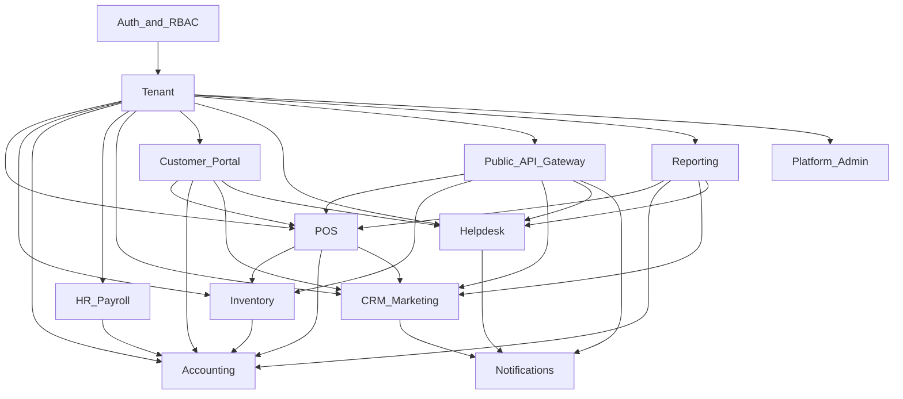
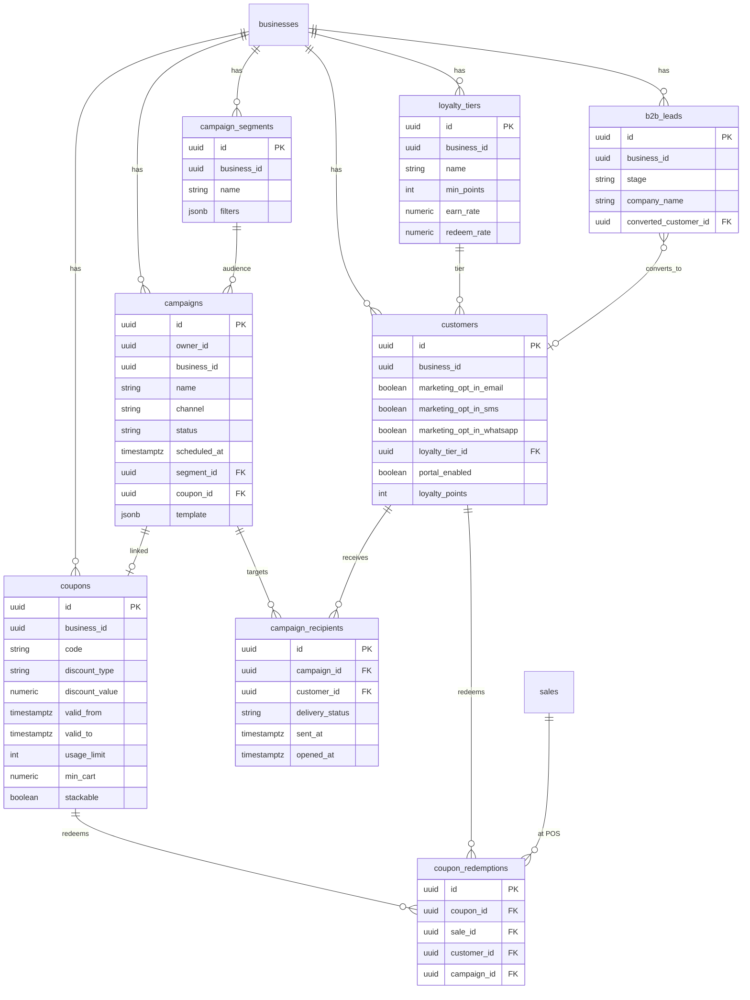
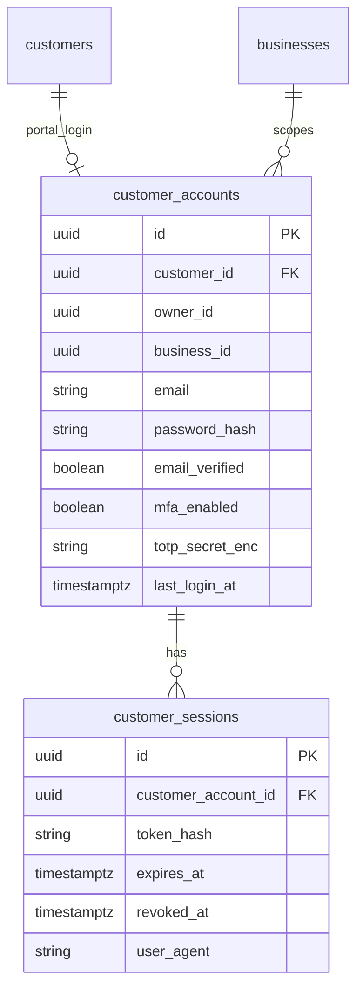
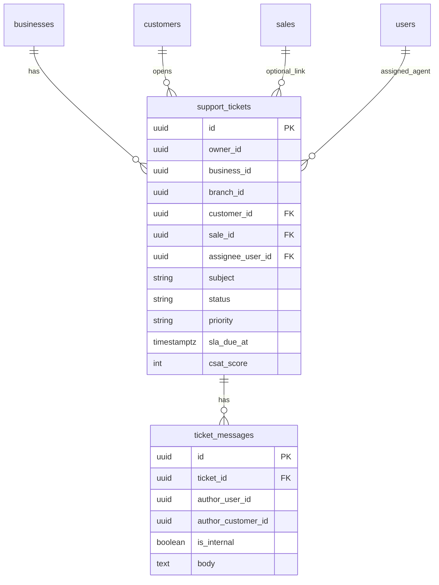
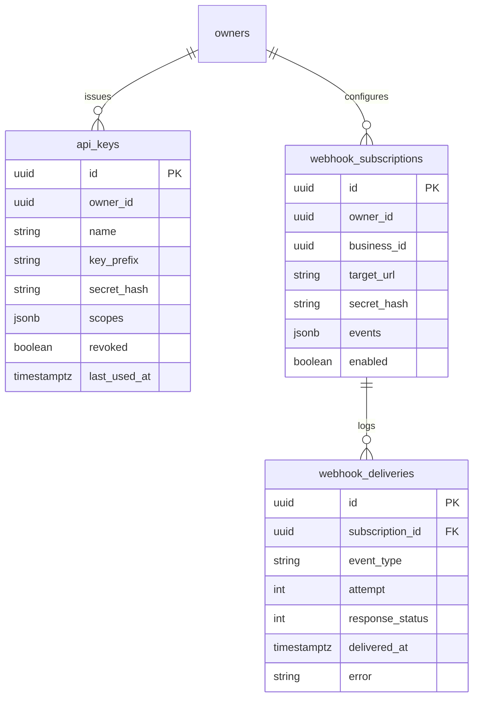
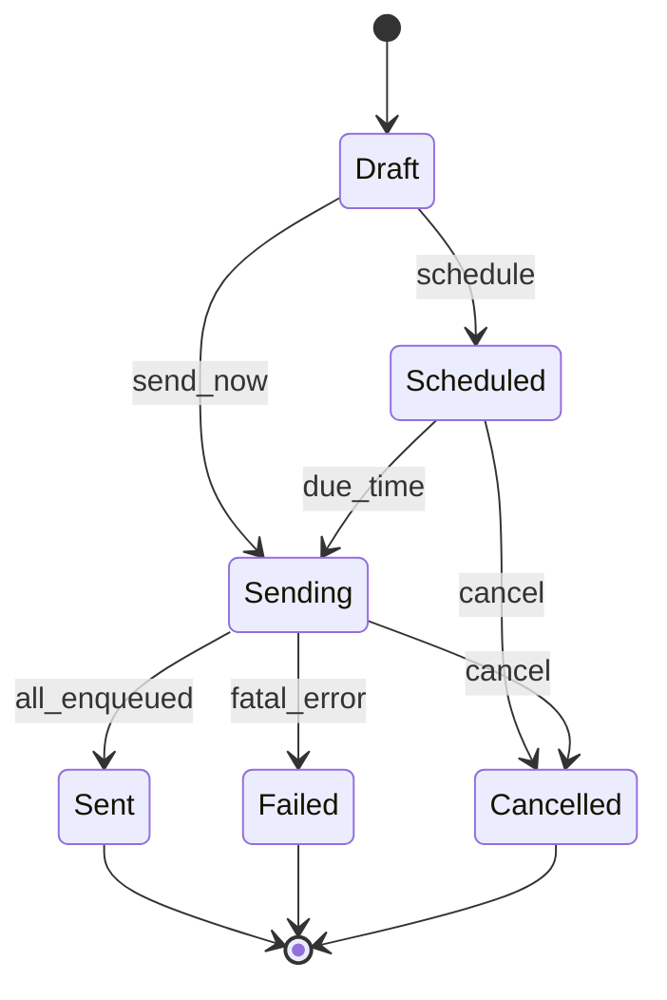
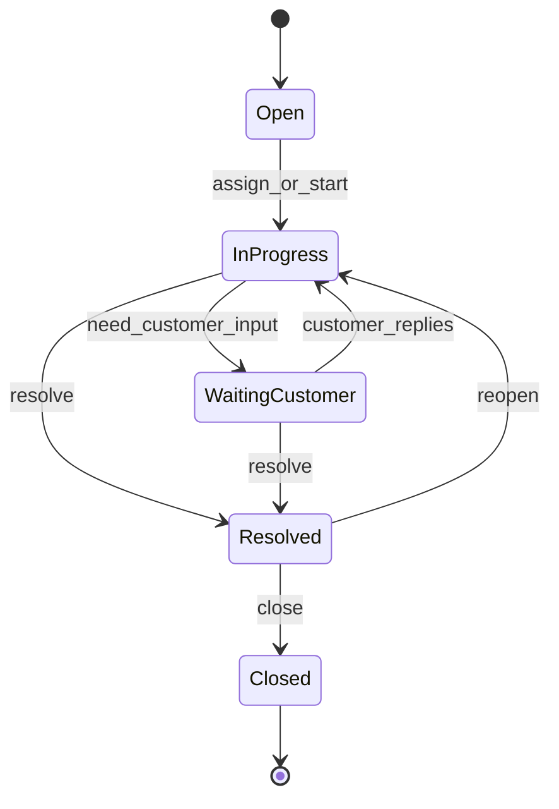
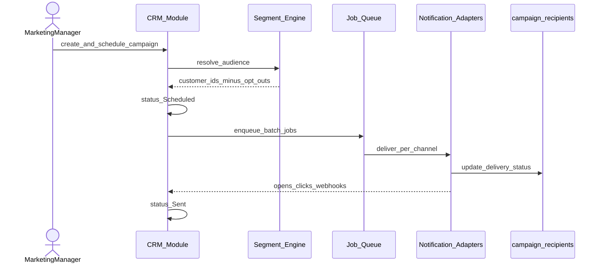
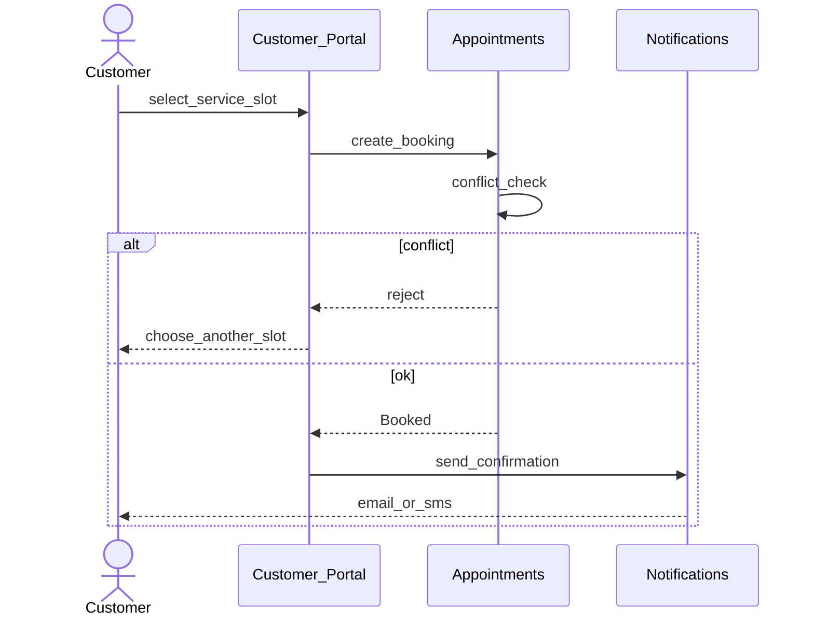

# SOFTWARE REQUIREMENTS SPECIFICATION

**Prepared in accordance with ISO/IEC/IEEE 29148:2018**

# Kaarobar — Unified POS, Accounting, Workforce, CRM & Customer Engagement Platform for Multi-Business, Multi-Branch Owners

| Field | Value |
|-------|-------|
| Document No. | **KRB-SRS-004** |
| Version | **4.1** (Whole Product Family — Multi-Market + Fiscal Packs) |
| Date | August 6, 2026 |
| Supersedes | KRB-SRS-004 v4.0; KRB-SRS-003 v3.2; KRB-SRS-002 v2.0; KRB-SRS-001 v1.0 (all retired) |
| Classification | Confidential — Internal Planning Document |
| Prepared By | Hamza AI — Founder & Lead Engineer |
| Publisher | **2ndHub Solutions** (Kaarobar is a product of 2ndHub Solutions) |
| Standards | ISO/IEC/IEEE 29148:2018, ISO/IEC 25010:2011, ISO/IEC/IEEE 42010:2011 |
| Status | **Authoritative engineering contract** for the whole Kaarobar product family in this monorepo |

This document is the authoritative engineering contract for **Kaarobar** (Cloud + Offline Desktop) across all packages in the POS monorepo. "Kaarobar" is the product name; the publisher / vendor is **2ndHub Solutions**. Requirement language follows RFC 2119 (`shall` / `must` / `should` / `may`) and MoSCoW prioritization (**Must** / **Should** / **Could** / Won't).

> **v4.1 rule:** MoSCoW **Must** = production baseline (shipped or accepted Partial with stated criteria). Two commercial editions remain normative: **Kaarobar Cloud** (subscription) and **Kaarobar Offline Desktop** (one-time license). Requirement IDs from KRB-SRS-003 / v4.0 are **stable** and carried forward. Phase A remaining / Phase B are **Should**. §14 lists **possible upcoming features** (Could / exploratory) that Product may promote later — they are **not** Must until explicitly promoted. **Geography:** Kaarobar is an **international** product (launch markets include Pakistan, United Kingdom, Germany, France, and further EU/international markets as Product enables). Jurisdiction-specific fiscal e-reporting (e.g. Pakistan **FBR** Tier-1 via `FBR-FR-*`) is a **pluggable pack**, not a Pakistan-only product scope.

---

## Document Control

### Revision History

| Version | Date | Author | Description |
|---------|------|--------|-------------|
| 1.0–3.1 | 2026-07 | Hamza AI | Historical drafts through production baseline (see git history / retired KRB-SRS-003). |
| 3.2 | 2026-08-01 | Hamza AI | Two editions (Cloud subscription vs Offline Desktop one-time). |
| 4.0 | 2026-08-06 | Hamza AI | Whole-product monorepo SRS. Documents all packages (`kaarobar-BE`, web, mobiles, Cloud Desktop, Offline Desktop). Confirms normative stack **Elixir/Phoenix + PostgreSQL + Oban** (NestJS wording retired). Adds §14 Possible Upcoming Features. Retires KRB-SRS-002 / KRB-SRS-003 as separate documents. |
| **4.1** | **2026-08-06** | **Hamza AI** | **Multi-market scope.** Removes Pakistan-only product framing. Launch markets: **Pakistan, United Kingdom, Germany, France**, plus further markets as Product enables. Reframes **G4** as jurisdiction-ready tax/fiscal integrations. Positions **FBR-FR-*** as the **Pakistan fiscal e-reporting pack** under a pluggable adapter model (hooks Must; production adapter Should). Expands staff locale Must-set and regional tax roadmap (UK VAT, DE/FR packs). **§14 feature detailing:** each `FUT-FR-*` has a full **Description** plus short **Notes**. **Expanded §14 catalogue:** hospitality floor/waitlist/pricing; stocktake/labels/supplier portal; bank feeds/expenses/budgets; HR docs/reviews/LMS; NPS/B2B/wallet/omnichannel; SSO/report builder/API sandbox; Offline bridge/scale; payments & wallets; vertical packs; AI; security/GDPR/DR. |

### Monorepo packages (v4.1 — normative)

| Package | Edition | Role |
|---------|---------|------|
| `kaarobar-BE` | Cloud | Elixir/Phoenix API + PostgreSQL + Oban |
| `kaarobar-web` | Cloud | Next.js staff dashboard + browser POS + buyer market |
| `kaarobar-mobile` | Cloud | React Native CLI — staff |
| `kaarobar-customer` | Cloud | React Native CLI — consumers |
| `kaarobar-desktop` | Cloud | Electron POS with local outbox sync (`OFF-FR-*`) |
| `kaarobar-desktop-offline` | Offline Desktop | Electron + local SQLite; license-then-offline (`ODE-FR-*`) |

Clients are independently deployable (no shared npm packages). Theme tokens are duplicated per app.

### Commercial editions (normative)

| Edition | Who | Platforms | Commercial |
|---------|-----|-----------|------------|
| **Kaarobar Cloud** | Multi-business / multi-branch owners; sync & owner dashboard | **Web**, **Desktop** (offline-capable then syncs — `OFF-FR`), **Mobile** | **Subscription** via Safepay on Pakistan path (Trial / Starter / Growth / Enterprise); additional market providers Should |
| **Kaarobar Offline Desktop** | Single shop on their own machine | **Fully offline Desktop** only (one business per install) | **One-time purchase** — license activation once online, then day-to-day offline (`ODE-FR-*`, ADM-FR-007) |

Cloud Desktop ≠ Offline Desktop SKU. Offline Edition **shall not** require cloud sync for day-to-day selling after license activation. See §10.5 (`OFF-FR`) and §10.6 (`ODE-FR`).

### Why PostgreSQL Was Chosen (carried forward from v2.0)

A prior SRS revision replaced MongoDB Atlas with **PostgreSQL 16** as the system of record because:

1. **Financial integrity** — deferred constraint triggers, ACID transactions, and immutability grants are native fits for double-entry journals and till reconciliation.
2. **Row-Level Security (RLS)** — defense-in-depth tenant isolation via session variables (`app.owner_id`) in addition to application-layer scoping.
3. **Cost at early scale (G5)** — shared-database multi-tenancy avoids per-tenant cluster cost.
4. **Job queue affinity** — PostgreSQL-backed queues (BullMQ/Redis or Oban) keep transactional outbox patterns simple.

See also ADR 001 in the repository. Historical PostgreSQL rationale originated in prior SRS revisions (retired).

### Why These Modules Were Added (v3.0) — still valid; delivery honesty in v3.1

Customer engagement remains strategic. v3.1 does **not** remove the enterprise roadmap; it separates **production baseline** (what ships and is Must) from **Phase A remaining / Phase B** (Should until Product promotes).

| Driver | Decision |
|--------|----------|
| **Retention moat** | Native CRM campaigns + loyalty points + khata keep purchase history inside the tenant today; coupons/tiers/consent/portal deepen the moat in Phase A remaining. |
| **Customer login closes the loop** | Customer Portal remains on the roadmap (Should / Phase A remaining) — not Must-complete for production baseline. |
| **Role-scoped access** | RBAC bundles + branch/business membership are Must; polished role-home dashboards beyond RBAC are Should. |
| **Public API / Webhooks (G7)** | Phase B Should — keep enterprise extensibility without blocking baseline. |
| **Helpdesk inside the tenant** | Phase B Should. |
| **Explicit reversals of v2.0 §1.4.4** | CRM marketing automation is **in scope** (baseline = campaigns as-built; full suite = Phase A remaining). Customer self-booking remains **roadmap** with appointments module. |

**Phased delivery (normative for prioritization)**

| Phase | Scope | MoSCoW |
|-------|-------|--------|
| **Production baseline (Release 1.0 Must)** | TEN, POS (incl. khata + loyalty points), INV core, ACC (configurable tax), HR/ESS, RPT core, ADM plan limits + **Safepay** webhook/checkout (Cloud; Pakistan billing path), NOT (in-app/email/push), OFF Cloud desktop sync, CRM campaigns as-built, **Pakistan FBR fiscal pack hooks** (mock/non-blocking, `FBR-FR-*`); **Offline Desktop Edition** (`ODE-FR-*`) + ADM-FR-007 license lockout; staff locales for launch markets | **Must** |
| **Phase A remaining** | Customer Portal (`CUS-FR`), coupons, loyalty tiers, marketing consent engine, named segments, SMS/WhatsApp campaigns, role-dashboard polish | **Should** until promoted |
| **Phase B** | Helpdesk (`SUP-FR`), Public API/Webhooks (`API-FR`), BI RFM/ROI, **production Pakistan FBR adapter**, full self-serve billing portal, appointments/recipes/agrochemical polish, regional Cloud billing providers for non-PK markets | **Should** until promoted |
| **Phase C / exploratory** | Possible upcoming features in §14 (KOT, gift cards, fixed assets, multi-currency consolidation, Offline multi-device sync, **UK/DE/FR and other regional tax packs**, etc.) | **Could** until promoted |

---

## Table of Contents

1. [Introduction](#1-introduction)
2. [Overall Description](#2-overall-description)
3. [System Architecture](#3-system-architecture)
4. [Use Case Model](#4-use-case-model)
5. [Functional Requirements](#5-functional-requirements)
6. [Data Model](#6-data-model)
7. [UML Diagrams](#7-uml-diagrams)
8. [External Interface Requirements](#8-external-interface-requirements)
9. [Non-Functional Requirements](#9-non-functional-requirements)
10. [Offline & Synchronization Requirements](#10-offline--synchronization-requirements) (Cloud sync + Offline Desktop Edition)
11. [Requirement Traceability Matrix](#11-requirement-traceability-matrix)
12. [Risk Register](#12-risk-register)
13. [Appendices](#13-appendices)
14. [Possible Upcoming Features](#14-possible-upcoming-features) (Phase C / Could — detailed `FUT-FR-*` catalogue)

---

## 1 Introduction

### 1.1 Purpose

This Software Requirements Specification (SRS) defines the functional, non-functional, interface, and data requirements for **Kaarobar**, a multi-tenant SaaS platform that unifies:

1. **Point of Sale** — fast sales, returns, tills, inventory, receipts; **desktop offline-tolerant**.
2. **Accounting** — double-entry bookkeeping under the POS (sales, purchases, payroll, AR/AP, khata).
3. **HR & Payroll** — employees, attendance, leave, payroll into the ledger, Employee Self-Service (ESS).
4. **CRM & Marketing (baseline)** — draft→send campaigns (email + in-app), audience filters, loyalty points.
5. **Customers** — profiles, khata (credit), loyalty points, ledger view for staff.
6. **Platform** — Cloud subscription plan limits, **Safepay** webhook/checkout (Pakistan Cloud billing path), Offline Desktop one-time license (ADM-FR-007), **jurisdiction fiscal packs** (Pakistan FBR Tier-1 hooks non-blocking; other markets via configurable tax), notifications (in-app / email / push), multi-locale UI for launch markets.

**Enterprise roadmap** (documented in this SRS, not Must-complete for production baseline): Customer Portal, coupons/tiers/consent CRM, Helpdesk, Public API & webhooks, appointments, **production Pakistan FBR adapter**, UK/DE/FR regional tax packs, BI.

The SRS is the authoritative engineering contract. It is prepared in accordance with **ISO/IEC/IEEE 29148:2018**.

### 1.2 Document Conventions

| Convention | Meaning |
|------------|---------|
| **shall** / **must** | Mandatory requirement (RFC 2119) |
| **should** | Recommended but not mandatory for MVP cut |
| **may** | Optional / discretionary |
| MoSCoW **Must** | Release 1.0 blocking |
| MoSCoW **Should** | Strongly desired in Release 1.0 if capacity allows |
| MoSCoW **Could** | Desirable; deferrable |
| `Requirement-ID` | Stable ID for traceability (e.g. `CRM-FR-001`) |
| Mermaid diagrams | Normative structure; render in Markdown viewers |

### 1.3 Intended Audience and Reading Suggestions

| Audience | Focus |
|----------|-------|
| Founder / Product | §§1–2, 4, 11–13 |
| Backend / API engineers | §§3, 5–7, 10 |
| Frontend / mobile / desktop | §§4, 5 (relevant modules), 8.1, 9.3 |
| Security / compliance reviewers | §§3.2.2, 3.2.4, 6.7, 9.5, 9.8, 12 |
| QA | §§5, 9, 11 |

### 1.4 Project Scope

#### 1.4.1 Product Perspective

**Kaarobar** is a product family of **2ndHub Solutions** for shop and multi-location owners in **multiple launch markets**, including **Pakistan, the United Kingdom, Germany, France**, and additional EU/international markets as Product enables them. Pakistan remains an early launch market and hosts the first fiscal e-reporting pack (**FBR**); it is **not** the sole product geography.

**Kaarobar Cloud** is a multi-tenant SaaS product for Owners who operate one or more businesses, each with one or more branches. It replaces fragmented POS + spreadsheet accounting + separate payroll (+ optional external CRM) with a single tenant-scoped platform.

**Kaarobar Offline Desktop** is a separate commercial edition: one shop per install, local SQLite, license-then-offline (see §10.6 and [`docs/offline-desktop.md`](../offline-desktop.md)).

**Cloud clients (production baseline):** Web (dashboard / browser POS), Desktop Electron (offline-capable till that **syncs** — `OFF-FR`), Mobile (oversight + ESS + lighter POS).

**Offline Desktop client:** Standalone Electron install (no browser SaaS; no multi-shop cloud sync).

**Roadmap clients:** Customer Portal (end-customer self-service) — Phase A remaining.

#### 1.4.2 Goals and Objectives

| ID | Goal | Success signal |
|----|------|----------------|
| **G1** | Less hustle for the Owner — one view of sales, cash, stock, and staff | Owner dashboard used weekly; consolidated KPIs trusted |
| **G2** | Real accounting — sales, purchases, and payroll post balanced journals | Zero unbalanced posted journals; TB ties |
| **G3** | Branches that can work alone, with the Owner still in control (incl. offline POS) | Desktop POS usable offline ≥ 24h; sync idempotent |
| **G4** | Jurisdiction-ready tax & fiscal integrations (configurable tax; pluggable e-reporting packs) | Tax rates configurable per business jurisdiction; Pakistan FBR Tier-1 pack enqueues asynchronously and stamps receipts when enabled; production FBR adapter Should; UK/DE/FR packs Could until promoted |
| **G5** | Keep early operating cost low (shared DB, modular monolith) | Single PostgreSQL cluster; no per-tenant DB |
| **G6** | Customer engagement & retention | Campaign sends + loyalty activity in baseline; Portal adoption when Phase A remaining ships |
| **G7** | Platform extensibility via API | Public API + webhooks when Phase B ships |

#### 1.4.3 In Scope — Production Baseline (Release 1.0 Must)

- Owner / Business / Branch management with **`Business.industry` presets** (`retail`, `restaurant`, `salon`, `pharmacy`, `supermarket`, `wholesale`, `general`) seeding categories
- Roles (code-aligned): `owner`, `admin`, `branch_manager`, `cashier`, `inventory_manager`, `accountant`, `hr_manager`, `marketing`, `employee`
- POS: sales, discounts, returns, tills/shifts, receipts (web + **offline desktop**); **khata (credit) tender**; **loyalty points redeem/earn**; split tender; `client_txn_id`
- Inventory: products (goods/service), categories, branch stock, transfers, PO, GRN; **variants/modifiers/batches** supported in API/consume path (management UI Should if incomplete)
- Accounting: COA, journals (auto + manual), immutability, GL, TB, P&L, BS, AR/AP, customer ledger, consolidated Owner view
- **Configurable sales tax per jurisdiction** (business country / tax profile); international SME COA defaults; **Pakistan FBR Tier-1 fiscal pack hooks** (flag, async enqueue, receipt fields, non-blocking) when the business is in the Pakistan pack — production FBR adapter Should
- HR: employees, attendance, leave, payroll (jurisdiction-configurable statutory deductions; Pakistan income tax + EOBI as first pack), payslips; **ESS** (clock / leave / payslips) with **employee portal login linkage**
- Owner / branch dashboards and reports (RBAC-filtered)
- Platform: Cloud subscription **plan limits**; **Safepay** inbound webhook + checkout URL (Pakistan Cloud billing path); Offline Desktop one-time license (ADM-FR-007)
- Notifications: in-app inbox, email (Swoosh/Oban), **Expo push** + device tokens, prefs
- **CRM baseline:** draft→send campaigns (email + in-app); audiences `all` \| `khata` \| `min_points`; recipient tracking; async send
- Localization: staff clients shall support launch-market locales — **English, Urdu, German, French, Spanish, Portuguese (Brazil), Arabic** (`en` / `ur` / `de` / `fr` / `es` / `pt-BR` / `ar`; RTL for `ur` and `ar`)
- Branding: modular-K logo assets / `KaarobarLogo`

#### 1.4.3a In Scope — Phase A Remaining / Phase B (Should until promoted)

| Phase | Items |
|-------|--------|
| **A remaining** | Customer Portal (`CUS-FR`); coupons (`POS-FR-019` / CRM coupon FRs); loyalty **tiers**; marketing consent/opt-out engine; named segments; SMS/WhatsApp campaigns; role-home dashboard polish (`TEN-FR-013` beyond RBAC) |
| **B** | Helpdesk (`SUP-FR`); Public API & signed webhooks (`API-FR`); BI RFM/campaign ROI/trends; **production Pakistan FBR adapter** (`FBR-FR-*`); full self-serve billing portal; regional Cloud billing providers for UK/DE/FR; appointments/scheduling; recipes/BOM; agrochemical/batch UI polish; `support_agent` role |

#### 1.4.4 Out of Scope (Release 1.0)

- Courier / driver dispatch networks and live delivery ETA maps
- Multi-restaurant carts in a single checkout
- External card PSP tokenization (online orders record `card`/`wallet` like POS until PSP lands)
- Cross-business shared loyalty point balances (points remain per business membership)

> **v3.2 note:** Platform-wide customer identity and marketplace discover/order-ahead are **in scope** (see CUS-FR marketplace requirements). The prior “e-commerce storefront out of scope” line is reversed for Kaarobar-listed businesses.
- Full **manufacturing / MRP** beyond simple recipe/BOM when that module is later enabled
- **Biometric** attendance hardware
- **Multi-currency group consolidation**
- **Automated statutory e-filing** for payroll/tax outside enabled jurisdiction packs (Pakistan FBR production adapter is Phase B Should; UK/DE/FR e-invoicing packs are §14 Could until promoted)
- **Fixed asset** management / depreciation
- Native mobile Customer Portal app (responsive web when Portal ships)

**Out of scope for Offline Desktop Edition (`ODE-FR`) specifically:**

- Multi-branch / multi-business **cloud** sync in one Offline install
- Browser SaaS for the Offline SKU
- Kitchen display / KOT
- Delivery rider tracking
- Split-bill at checkout
- Free-form brand color picker (curated presets only)
- OS-level background backup service (auto-backup runs while the app is open)

#### 1.4.5 Assumptions and Dependencies

1. Owners accept shared-database multi-tenancy with application scoping (and RLS where enabled).
2. Jurisdiction fiscal rules (including Pakistan FBR) may change; **baseline** implements configurable tax + Pakistan FBR hooks/mock path; tax-advisor review required before asserting production filing in any market (Appendix C).
3. Email/push depend on third-party providers; SMS/WhatsApp when enabled.
4. **Safepay** handles Owner→Kaarobar **Cloud** billing events on the **Pakistan** path; full self-serve portal is Should. Additional Cloud billing providers for UK/DE/FR (and other markets) are Should/Could as Product enables. Offline Desktop is a one-time license purchase (ADM-FR-007), not a Safepay subscription plan.
5. **This repository implements logical modules as Elixir/Phoenix contexts + Oban** (not NestJS/BullMQ). Older NestJS wording is historical; see §3.1.
6. Phase A remaining / Phase B items stay in the SRS for enterprise planning; they are **Should** until Product promotes them to Must.
7. Each Business shall have a **country / tax jurisdiction** used to select tax templates and optional fiscal e-reporting packs (Pakistan FBR is the first pack).

#### 1.4.6 Implementation Status Summary (v3.1)

| Area | Status | Notes |
|------|--------|-------|
| TEN / Auth / RBAC | **Done** | MFA BE Done; client MFA UX Partial |
| POS / Returns / Tills | **Done** | Desktop offline Done; web/mobile online |
| Inventory / Procurement | **Done** | Variants/modifiers/batches: BE/consume Done; inventory admin UI Partial |
| Accounting / AR-AP | **Done** | |
| HR / Payroll / ESS | **Done** | Web ESS route Partial (desktop + mobile Done) |
| Customers / Khata / Loyalty points | **Done** | Tiers Should |
| CRM campaigns (as-built) | **Done** | Coupons/segments/consent Should |
| Reporting | **Done** | BI Should |
| Notifications + Push | **Done** | |
| Billing limits + Safepay webhook/checkout | **Done** | Full portal Should; Offline one-time = ADM-FR-007; non-PK billing providers Should |
| Pakistan FBR fiscal pack hooks | **Partial** | Mock/async Accepted for Must; production adapter Should |
| Customer Portal / Helpdesk / Public API | **Planned** | Phase A remaining / B |
| Appointments / Recipes | **Planned** | Phase B / future extensibility |
| Branding / i18n (launch locales) | **Done** / **Partial** | `en`/`ur` Done; `de`/`fr`/`es`/`pt-BR`/`ar` shipped in client catalogs — keep in parity |

### 1.5 Definitions, Acronyms, and Abbreviations

| Term | Definition |
|------|------------|
| **Owner** | Paying tenant root; owns one or more Businesses |
| **Business** | Legal/operating entity under an Owner; has a vertical |
| **Branch** | Physical or logical location under a Business |
| **RLS** | PostgreSQL Row-Level Security |
| **ESS** | Employee Self-Service |
| **FBR** | Federal Board of Revenue (Pakistan) — first **jurisdiction fiscal e-reporting pack** (`FBR-FR-*`); not a product-wide requirement for non-PK businesses |
| **Fiscal pack** | Optional, jurisdiction-scoped tax/e-reporting adapter (e.g. Pakistan FBR; future UK VAT / DE / FR packs in §14) |
| **Jurisdiction** | Country (and optional sub-national tax profile) of a Business used for tax templates and fiscal packs |
| **COA** | Chart of Accounts |
| **GRN** | Goods Receipt Note |
| **CRM** | Customer Relationship Management — campaigns, audiences, loyalty within a tenant |
| **Campaign** | Marketing message (email / in-app; SMS/WhatsApp when enabled) to an audience, optionally later linked to a coupon |
| **Audience filter** | Production-baseline campaign targeting: `all` \| `khata` \| `min_points` (named Segments are Should) |
| **Segment** | Saved named customer filter (purchase history, loyalty tier, branch, inactivity, consent) — Phase A remaining |
| **Customer Portal** | Authenticated self-service for end customers — Phase A remaining |
| **Khata** | Credit/on-account tender at POS that creates or updates an AR obligation for the customer |
| **Industry preset** | `Business.industry` value that seeds default categories/modules for a vertical |
| **Lead / Opportunity** | B2B prospect pipeline — Phase B / Should |
| **Ticket** | Helpdesk support case — Phase B |
| **Webhook** | HTTPS callback on platform events, HMAC-signed — Phase B (billing inbound webhook is baseline) |
| **API Key** | Credential for Public API — Phase B |
| **Loyalty points** | Accrual/redemption balance on a customer (baseline); **Loyalty Tier** is named tier rules (Should) |
| **Coupon** | Promo code — Phase A remaining |
| **RFM** | Recency / Frequency / Monetary scoring — Phase B BI |
| **MoSCoW** | Must / Should / Could / Won't prioritization |

### 1.6 References

1. ISO/IEC/IEEE 29148:2018 — Systems and software engineering — Life cycle processes — Requirements engineering
2. ISO/IEC 25010:2011 — Systems and software Quality Requirements and Evaluation (SQuaRE)
3. ISO/IEC/IEEE 42010:2011 — Architecture description
4. RFC 2119 — Key words for use in RFCs to Indicate Requirement Levels
5. Federal Board of Revenue, Government of Pakistan — Sales Tax Rules / POS Integration guidance (Pakistan fiscal pack)
6. HMRC (UK), German fiscal / VAT guidance, and French e-invoicing (Factur-X / Chorus Pro) — informational for future regional packs (§14)
7. PostgreSQL 16 Documentation — Row Security Policies
8. Prior SRS revisions (KRB-SRS-001 / 002 / 003 / 004 v4.0) — retired or superseded; use git history for archival comparison
9. ADR 001 — PostgreSQL multi-tenancy (repository)

---

## 2 Overall Description

### 2.1 Product Functions Overview

| Function group | Summary | Primary actors | Baseline |
|----------------|---------|----------------|----------|
| Tenancy & Access | Owners, businesses, branches, RBAC, audit | Owner, Platform Admin | Must |
| POS & Sales | Cart, tender (incl. khata), returns, tills, loyalty redeem | Cashier, Branch Manager | Must |
| Catalog & Inventory | Products, stock, PO/GRN, transfers | Inventory Manager | Must |
| Accounting & Finance | COA, journals, statements, AR/AP, tax | Accountant, Owner | Must |
| HR & Payroll | Employees, attendance, leave, payroll, ESS | HR Manager, Employee | Must |
| Reporting | Dashboards, TB/GL/P&L/BS, branch ops | Owner, Managers | Must |
| **CRM & Marketing (baseline)** | Campaigns draft→send, audiences, loyalty points | `marketing`, Owner | Must |
| Customers | Profiles, khata, loyalty points, ledger | Cashier, Accountant | Must |
| Notifications | In-app, email, push | System | Must |
| Platform Admin & Billing | Plan limits, Safepay webhook/checkout (Cloud); Offline one-time license | Owner, Platform Admin | Must |
| Scheduling (roadmap) | Appointments, staff calendar, self-booking | Service Staff, Customer | Should |
| **CRM (extended)** | Named segments, coupons, tiers, consent, SMS/WA | `marketing` | Should |
| **Customer Portal** | Login, history, loyalty, booking, AR pay, prefs | Customer | Should |
| **Helpdesk & Support** | Tickets, SLA, CSAT | `support_agent`, Customer | Should |
| **Platform API & Integrations** | Public REST, outbound webhooks, keys | Owner, external systems | Should |
| Reporting & BI (extended) | RFM, campaign ROI, trends | Owner | Should |

### 2.2 Multi-Vertical Design Principle

One unified catalog and POS core. **Production model:** vertical differences are expressed via **`Business.industry` presets** that seed categories (and eventually enabled modules) — not separate codebases. Longer-term `business_types` lookup / agrochemical / recipes / dining / appointments remain **future extensibility**.

#### 2.2.1 Supported Industry Presets (Production Baseline)

`retail` · `restaurant` · `salon` · `pharmacy` · `supermarket` · `wholesale` · `general`

#### 2.2.2 How This Is Modeled (Summary)

- Products with `product_kind` (goods/service); optional variants, modifiers, batches in catalog API
- Branch pricing; FEFO batch consume when batches exist on sale
- CRM baseline and customers available across industries; appointments gated when that module ships

#### 2.2.3 A Note on Scope Discipline

Prefer polishing Retail + one service industry (e.g. Salon) before expanding presets. Phase A remaining / Phase B modules shall not block baseline vertical launch.

### 2.3 User Classes and Characteristics

| Actor | Code role (if staff) | Description | Data visibility |
|-------|----------------------|-------------|-----------------|
| **Owner** | `owner` | Tenant root; all businesses | All owned businesses |
| **Admin** | `admin` | Delegated owner-level ops | Per membership |
| **Branch Manager** | `branch_manager` | Branch operations | Assigned branch(es) |
| **Cashier** | `cashier` | Till / sales | Assigned branch POS |
| **Inventory Manager** | `inventory_manager` | Stock & procurement | Business / assigned branches |
| **Accountant** | `accountant` | Books & tax | Business financials |
| **HR Manager** | `hr_manager` | People & payroll | Business HR |
| **Marketing** | `marketing` | Campaigns & loyalty settings | Business-scoped CRM |
| **Employee** | `employee` | ESS | Own HR data |
| **Support Agent** | `support_agent` (Phase B) | Helpdesk tickets | Business/branch tickets |
| **Service Staff** | (roadmap) | Appointments / services | Own schedule |
| **Customer** | `customer_accounts` (Phase A remaining) | End customer portal | Own data only |
| **Platform Admin** | platform | Kaarobar ops | Cross-tenant support (no financials by default) |

**RBAC principle:** Staff access is filtered by role capability bundles and business/branch membership (TEN-FR-003/004). Polished per-role home dashboards beyond RBAC filters are Should (TEN-FR-013).

### 2.4 Operating Environment

| Layer | Environment |
|-------|-------------|
| Clients | Modern evergreen browsers; Electron desktop POS; iOS/Android via Expo; Customer Portal responsive web when shipped |
| Server | Linux containers; managed PostgreSQL 16; Oban (Postgres-backed jobs); optional Redis |
| Network | HTTPS/TLS 1.2+; desktop offline with local outbox |

### 2.5 Design and Implementation Constraints

1. Shared PostgreSQL database; tenant isolation by `owner_id` (+ `business_id` / `branch_id`); RLS where enabled.
2. Posted journals immutable; corrections via reversing entries.
3. Jurisdiction fiscal e-reporting (including Pakistan FBR) must never block checkout.
4. Campaign sends must never block POS (async job queue).
5. Customer Portal auth (when shipped) is separate from staff auth (`customer_accounts` ≠ `users`).
6. API secrets / webhook secrets hashed; never logged in plaintext.
7. Staff clients shall support launch-market locales (`en`, `ur`, `de`, `fr`, `es`, `pt-BR`, `ar`; RTL for `ur` / `ar`) (USE-NFR / i18n Must).
8. **Reference implementation:** Elixir/Phoenix modular monolith + Oban (this repository).
9. Fiscal packs are **opt-in per Business jurisdiction** — enabling Pakistan FBR shall not be required for UK/DE/FR (or other) businesses.

### 2.6 Apportioning of Requirements

| Priority | Treatment |
|----------|-----------|
| Must | Production baseline — required for Release 1.0 acceptance |
| Should | Phase A remaining / Phase B / next increment; design shall not preclude |
| Could | Backlog |

Production baseline Must-set = TEN/POS/INV/ACC/HR/RPT/ADM-hooks/NOT/OFF-desktop/CRM-as-built/khata/loyalty-points + Pakistan FBR pack hooks when applicable. Phase A remaining Should-set = CUS-FR + coupons/tiers/consent. Phase B Should-set = SUP-FR + API-FR + BI + production Pakistan FBR adapter + appointments.

---
## 3 System Architecture

### 3.1 Architectural Style

Kaarobar is a **modular monolith**: a single deployable application composed of clearly bounded modules (contexts) with explicit dependency rules.

**Normative for this repository:** logical modules map 1:1 to **Elixir/Phoenix contexts** with **Oban** for async work. Historical NestJS/BullMQ wording in older revisions is not binding.

Clients (Web, Desktop, Mobile; Customer Portal when shipped) are independently deployable and communicate over HTTPS REST (`/api/v1/...`) with optional WebSockets later.

### 3.2 Deployment / Logical View

```
┌──────────────────────────────────────────────────────────────────┐
│ Client layer                                                     │
│  Web · Desktop Electron POS · Mobile · Customer Portal (web)     │
└─────────────────────────────┬────────────────────────────────────┘
                              │ TLS / REST /api/v1 (+ public API)
┌─────────────────────────────▼────────────────────────────────────┐
│ Edge: load balancer, rate limit, WAF                             │
└─────────────────────────────┬────────────────────────────────────┘
                              │
┌─────────────────────────────▼────────────────────────────────────┐
│ Application — Modular monolith                                   │
│  Auth & RBAC · Tenant · POS · Inventory · Accounting · HR        │
│  Reporting · CRM & Marketing · Customer Portal · Helpdesk        │
│  Public API Gateway · Notifications · Platform Admin / Billing   │
│  Job workers (journals, fiscal packs, campaign send, webhooks, notify)    │
└──────────────┬───────────────────────────────┬───────────────────┘
               ▼                               ▼
        PostgreSQL 16                   Object storage (R2)
        (+ RLS session vars)            receipts / exports
```

#### 3.2.1 Technology Stack

| Layer | Technology (logical) | Notes |
|-------|----------------------|-------|
| Web / Portal | React / Next.js | Staff app + Customer Portal |
| Mobile | React Native / Expo | Owner oversight + ESS |
| Desktop POS | Electron + local outbox | Offline-first |
| API | **Elixir/Phoenix** (normative in this repo) | Modular monolith contexts |
| DB | PostgreSQL 16 | Shared DB; app tenant scope (+ RLS where enabled) |
| Jobs | **Oban** (Postgres-backed) | Campaigns, journals, fiscal-pack enqueue (FBR PK), notify |
| Auth (staff) | JWT + optional TOTP | `users` |
| Auth (customer) | JWT + optional MFA | `customer_accounts` (Phase A remaining) |
| Auth (public API) | API keys + OAuth2 client-credentials | Phase B |
| Webhooks | Inbound Safepay billing (Must, PK path); outbound HMAC (Phase B) | |
| Campaign delivery | Job queue + notification adapters | Email Must; SMS/WhatsApp Should |
| Billing | Safepay (Cloud, PK path); other-market providers Should; Offline one-time license | Owner subscriptions / ODE license |
| Payments | Payment gateway adapter | Customer→Owner; no raw PAN |
| Fiscal packs | Async adapters (Pakistan FBR first) | Never block sale; opt-in per jurisdiction |

#### 3.2.2 Multi-Tenancy Model

Unchanged from v2.0 intent:

- Shared database; every tenant-scoped table carries `owner_id` (and usually `business_id` / `branch_id`).
- Session: `SET LOCAL app.owner_id = '...'` for staff requests; RLS policies enforce isolation.
- CI tests assert cross-tenant queries return zero rows (SEC-NFR-001).

#### 3.2.3 JSONB Usage Policy

JSONB is permitted for extensible metadata (e.g. item compliance fields, campaign template variables, webhook payload snapshots) where relational querying is not primary. Money, quantities, statuses, and foreign keys remain typed columns.

#### 3.2.4 Role-Based Data Visibility Model (NEW)

| Session type | Session variables | Visibility rule |
|--------------|-------------------|-----------------|
| **Staff** | `app.owner_id` (+ app-layer role/branch filters) | Tenant RLS + RBAC role permissions + assigned branch filters |
| **Customer** | `app.customer_id` (and typically `app.owner_id` / `app.business_id` for tenant binding) | RLS restricts to **own rows only** — e.g. sales, AR, tickets, appointments where `customer_id` matches |
| **Dashboard projection** | Derived from staff JWT claims | Widgets and aggregate queries filtered by role capabilities and assigned branches (TEN-FR-013) |
| **API keys** | Key id + owner/business scope in auth context | Permissions scoped per key; **every** access audited (API-FR-007) |

Example customer RLS predicate:

```sql
USING (customer_id = current_setting('app.customer_id')::uuid)
```

Customer identities shall never receive staff roles (TEN-FR-014).

### 3.3 Component / Module View



**Dependency rules**

- Auth & Tenant are foundational; no upward cycles into them.
- POS/Inventory/HR post into Accounting asynchronously so checkout/payroll UX is not blocked by ledger latency.
- CRM campaign send is async via Notifications adapters; never blocks POS.
- Reporting is read-only against other modules.
- Public API Gateway is a thin auth/rate-limit/audit façade over module services — not a second business-logic stack.

### 3.4 Integration Points Summary

| Integration | Direction | Blocking? |
|-------------|-----------|-----------|
| Pakistan FBR POS (fiscal pack) | Outbound | No |
| Future UK/DE/FR fiscal packs | Outbound | No (when promoted) |
| Payment gateway | Inbound payment intents | No (async confirm) |
| Safepay | Cloud subscription webhooks / checkout (PK path) | N/A |
| Email / SMS / WhatsApp | Outbound marketing & transactional | No (queued) |
| Public webhooks | Outbound to Owner endpoints | No (queued + retry) |

---

## 4 Use Case Model

### 4.1 Actors

Business Owner · Admin · Branch Manager · Cashier · Inventory Manager · Accountant · HR Manager · Marketing · Employee · Support Agent (Phase B) · Service Staff (roadmap) · Customer (Phase A remaining) · Platform Admin · External API Client (Phase B)

### 4.2 Use Case Diagram (conceptual)

Staff actors interact with POS, Inventory, Accounting, HR, CRM, Helpdesk, and Reporting. Customer interacts only with Customer Portal (history, loyalty, booking, AR pay, tickets, preferences). External API Client interacts via Public API Gateway / Webhooks.

### 4.3 Use Case Summary Table — Core (All Verticals)

Carried forward from prior SRS revisions (UC-01–UC-27):

| ID | Use Case | Actors | Module |
|----|----------|--------|--------|
| UC-01 | Process Sale | Cashier | POS |
| UC-02 | Return / Refund | Cashier, Branch Manager | POS |
| UC-03 | Apply Discount | Cashier, Branch Manager | POS |
| UC-04 | Open / Close Till | Cashier, Branch Manager | POS |
| UC-05 | Manage Catalog Item | Inventory Manager | Inventory |
| UC-06 | Transfer Stock | Inventory Manager | Inventory |
| UC-07 | Create PO / Receive GRN | Inventory Manager | Inventory |
| UC-08 | Adjust Stock | Inventory Manager | Inventory |
| UC-09 | Post Manual Journal | Accountant | Accounting |
| UC-10 | View Financial Statements | Accountant, Owner | Accounting |
| UC-11 | Manage AR / AP | Accountant | Accounting |
| UC-12 | Configure Tax / Fiscal Pack (incl. FBR when PK) | Owner, Accountant | Accounting |
| UC-13 | Export Reports | Accountant, Owner | Reporting |
| UC-14 | Manage Employee | HR Manager | HR |
| UC-15 | Clock In / Out | Employee, Cashier | HR |
| UC-16 | Request / Approve Leave | Employee, Manager | HR |
| UC-17 | Run Payroll | HR Manager, Accountant, Owner | HR |
| UC-18 | View ESS | Employee | HR |
| UC-19 | Manage Business / Branch | Owner | Tenant |
| UC-20 | Invite / Assign Staff | Owner | Tenant |
| UC-21 | Manage Subscription | Owner, Platform Admin | Admin |
| UC-22 | Platform Support Access | Platform Admin | Admin |
| UC-23 | Book Appointment (staff) | Service Staff, Branch Manager | Scheduling |
| UC-24 | Complete Appointment → Sale | Service Staff, Cashier | Scheduling / POS |
| UC-25 | Manage Recipe / BOM Item | Inventory Manager | Inventory |
| UC-26 | Manage Batches / Expiry | Inventory Manager | Inventory |
| UC-27 | Dine-in Table Sale | Cashier | POS |

### 4.4 Use Case Summary Table — CRM, Portal, Helpdesk, API (NEW)

| ID | Use Case | Actors | Module |
|----|----------|--------|--------|
| UC-28 | Create / Manage Campaign | Marketing, Owner | CRM (baseline) |
| UC-29 | Segment Customers | Marketing | CRM (Should) |
| UC-30 | Redeem Coupon at POS | Cashier, Customer | CRM/POS (Should) |
| UC-31 | Customer Login & Self-Service | Customer | Customer Portal (Should) |
| UC-32 | Customer Book Appointment | Customer | Portal / Scheduling (Should) |
| UC-33 | Customer View / Pay Balance | Customer | Portal / AR (Should) |
| UC-34 | Raise / Manage Support Ticket | Customer, Support Agent | Helpdesk (Should) |
| UC-35 | Manage API Keys & Webhooks | Owner, Platform Admin | API (Should) |
| UC-36 | View Role-Scoped Dashboard | All staff roles | Reporting (Must RBAC) |
| UC-37 | Process Khata Sale | Cashier | POS (Must) |
| UC-38 | Redeem / Accrue Loyalty Points | Cashier, Customer | POS/CRM (Must) |

### 4.5 Detailed Use Case Descriptions

#### UC-28 — Create / Manage Campaign (Campaign Send)

| Field | Content |
|-------|---------|
| **Actors** | Marketing role (primary), Owner |
| **Preconditions** | Authenticated with `marketing` or Owner; business CRM enabled |
| **Trigger** | Actor chooses Create Campaign |
| **Main flow** | 1. Actor creates campaign (name, channel email or in-app).<br>2. Actor selects audience filter (`all` / `khata` / `min_points`) (CRM-FR-016).<br>3. Actor sends → Draft → Sending.<br>4. System enqueues recipient jobs (CRM-FR-011); notifications deliver.<br>5. System records per-recipient status in `campaign_recipients` (CRM-FR-008).<br>6. Campaign reaches Sent (or Failed). |
| **Alternate flows** | **A1 Partial failure:** Individual recipient failures logged; campaign may complete as Sent with error counts. |
| **Postconditions** | Audit entry written (CRM-FR-015); POS latency unaffected. |

> **v3.1 note:** Named segments, coupons, scheduling, and consent exclusion are Should (Phase A remaining).

#### UC-32 — Customer Book Appointment (Self-Service)

| Field | Content |
|-------|---------|
| **Actors** | Customer (primary) |
| **Preconditions** | Customer authenticated in Portal; business has appointments enabled and portal self-booking enabled; service item selectable |
| **Trigger** | Customer chooses Book Appointment |
| **Main flow** | 1. Customer selects service, branch, staff (optional), and time slot.<br>2. System conflict-checks staff/time (SCH-FR-002).<br>3. System creates `appointments` row status Booked, `customer_id` = session customer.<br>4. System sends confirmation notification to customer (and staff if configured).<br>5. Customer may reschedule/cancel per policy (CUS-FR-005). |
| **Alternate flows** | **A1 Conflict:** System rejects overlapping slot; Customer picks another.<br>**A2 Disabled:** If self-booking disabled, Portal shows contact/branch guidance only. |
| **Postconditions** | Appointment visible to staff schedule; reverses v2.0 staff-only booking decision for portal-enabled businesses. |

> **Note:** Staff-initiated booking (UC-23) remains supported. SCH-FR-001 is extended — customers may self-book via Customer Portal when enabled (**Must** for service verticals with portal enabled).

#### UC-34 — Raise / Manage Support Ticket

| Field | Content |
|-------|---------|
| **Actors** | Customer (create via Portal), Support Agent (manage), Owner (oversight) |
| **Preconditions** | Authenticated Customer or Support Agent; ticket module enabled |
| **Trigger** | Customer submits issue, or Agent creates ticket on behalf of customer |
| **Main flow** | 1. Ticket created with subject, body, priority; linked to `customer_id` and optional `sale_id` / invoice (SUP-FR-005).<br>2. Status = Open; notifications sent (SUP-FR-007).<br>3. Agent assigns to self/other; sets priority & SLA due (SUP-FR-002).<br>4. Lifecycle: Open → InProgress → WaitingCustomer → Resolved → Closed; messages: customer-visible vs internal notes (SUP-FR-003/004).<br>5. On Resolved, Customer may submit CSAT (SUP-FR-006); may Reopen from Resolved. |
| **Alternate flows** | **A1 SLA breach:** Analytics flag for Owner/Manager (SUP-FR-008).<br>**A2 Spam/abuse:** Agent closes with reason; audit retained. |
| **Postconditions** | Full message history retained; linked sale/customer navigable from staff UI. |

Abbreviated detailed descriptions for UC-01 (sale), UC-17 (payroll), and UC-02 (return) are **unchanged in intent from prior SRS §4.5** and remain normative by reference.

---
## 5 Functional Requirements

All requirements use MoSCoW priority. Requirement IDs are unique and stable for traceability.

### 5.1 Tenancy, Identity & Access Management

| ID | Requirement | Priority |
|----|-------------|----------|
| TEN-FR-001 | The system shall allow an Owner to create and manage multiple Business entities under a single account, each assigned an industry preset (Section 2.2). | Must |
| TEN-FR-002 | The system shall allow each Business to contain multiple Branch entities. | Must |
| TEN-FR-003 | The system shall support assigning one or more roles (`owner`, `admin`, `branch_manager`, `cashier`, `inventory_manager`, `accountant`, `hr_manager`, `marketing`, `employee`) to a user, scoped to specific branches or business-wide. Phase B may add `support_agent`. | Must |
| TEN-FR-004 | The system shall restrict a user's data access to only the businesses/branches they are explicitly assigned to, enforced by application-layer tenant scope (and RLS where enabled) in addition to RBAC; the Owner implicitly has access to all businesses they own. | Must |
| TEN-FR-005 | The system shall support custom roles with a configurable permission set beyond the default roles. | Could |
| TEN-FR-006 | The system shall provide authentication via email/password with optional TOTP multi-factor authentication, required by default for Owner and Accountant roles. | Must |
| TEN-FR-007 | The system shall support configurable auto-logout after inactivity on POS terminals. | Should |
| TEN-FR-008 | The system shall maintain an immutable audit log of all create/update/delete actions, capturing user, timestamp, action type, and affected entity, via an INSERT-only database role with no UPDATE/DELETE grant on the audit table. | Must |
| TEN-FR-009 | The system shall allow an Owner to deactivate (not hard-delete) a Business or Branch, preserving historical data. | Must |
| TEN-FR-010 | The system shall support bulk user invitation via email with role pre-assignment. | Could |
| TEN-FR-011 | The system shall support industry presets on Business create (`Business.industry`) that seed default categories without a schema migration; future `business_types` lookup remains compatible. | Must |
| TEN-FR-012 | The system shall support the `marketing` role with permissions for campaigns and loyalty settings; `support_agent` shall be added when Helpdesk ships (Phase B). | Must (`marketing`); Should (`support_agent`) |
| TEN-FR-013 | The system shall filter dashboards and navigation by role capability bundles and branch assignments. Polished per-role home widget packs beyond RBAC filters are Should. | Must (RBAC filter); Should (widget packs) |
| TEN-FR-014 | When Customer Portal ships, customer identity shall be separate from staff users (`customer_accounts`); customer accounts shall never be granted staff roles. | Should (Phase A remaining) |
| TEN-FR-015 | The system shall allow linking an Employee master record to a staff `users` login for ESS (employee portal login), distinct from Customer Portal. | Must |

### 5.2 POS & Sales

| ID | Requirement | Priority |
|----|-------------|----------|
| POS-FR-001 | The cashier shall be able to build a sale cart by scanning a 1D barcode or a 2D QR code, by SKU/name search, or by manual entry; both symbologies shall resolve to the same item lookup. | Must |
| POS-FR-002 | The system shall calculate line-item and cart totals in real time, applying branch-specific pricing and applicable tax rates. | Must |
| POS-FR-003 | The system shall support split payments across multiple methods (cash, card, mobile wallet, **khata**) within one sale. | Must |
| POS-FR-004 | The cashier shall be able to hold/park a sale and resume it later. | Should |
| POS-FR-005 | The system shall atomically decrement inventory on sale completion using a single-statement `UPDATE ... SET quantity_on_hand = quantity_on_hand - $qty` to prevent race conditions between concurrent checkouts; when batches exist, consume FEFO. | Must |
| POS-FR-006 | The system shall generate a sequential per-branch invoice number and, when a Pakistan FBR Tier-1 fiscal pack is enabled for the business, embed the FBR invoice number and QR code on the receipt (Section 8.3.4). | Must |
| POS-FR-007 | The system shall support full and partial returns against an original sale, validated against a configurable return window. | Must |
| POS-FR-008 | The system shall require Branch Manager approval for returns/refunds exceeding a configurable per-branch auto-approval threshold. | Must |
| POS-FR-009 | The system shall support item- and cart-level discounts, with a configurable cashier auto-approval limit above which Branch Manager approval is required. | Must |
| POS-FR-010 | The system shall support till/shift open and close operations with expected-vs-counted cash reconciliation and over/short reporting. | Must |
| POS-FR-011 | The desktop POS shall queue sales locally when offline and sync automatically upon reconnection using idempotent, client-generated transaction IDs (Section 10). Web/mobile POS may remain online-only. | Must |
| POS-FR-012 | The system shall support optional customer lookup/attachment to a sale and accrue loyalty points where configured. | Must |
| POS-FR-013 | The system shall support quotations/proforma invoices that do not affect stock or the ledger until converted to a sale. | Could |
| POS-FR-014 | The system shall print thermal receipts to ESC/POS-compatible printers and support reprinting any historical receipt, incrementing `sales.bill_print_count` on each print for audit purposes. | Should |
| POS-FR-015 | The system shall support printing a formal A4/letter-size bill/invoice (distinct from the thermal receipt) to a standard printer or as a downloadable PDF, for wholesale/B2B customers. | Should |
| POS-FR-016 | The system shall support sharing a digital copy of the bill/receipt via WhatsApp or email directly from the POS, in addition to or instead of printing. | Should |
| POS-FR-017 | The system shall prevent a sale from completing if requested quantity exceeds available stock for stock-tracked items, unless negative-stock selling is explicitly enabled for that business/branch. | Must |
| POS-FR-018 | The system shall support an `order_type` on each sale (`retail`, `dine_in`, `takeaway`, `delivery`, `service`), and, where `dine_in`, an associated table and number of covers. | Should |
| POS-FR-019 | The system should apply and validate coupon/promo codes at checkout and record redemption against the linked campaign where applicable (CRM-FR-005, CRM-FR-014). | Should |
| POS-FR-020 | The system shall support **khata** (credit/on-account) as a payment method that creates or updates an AR obligation for the attached customer. | Must |
| POS-FR-021 | The system shall allow redeeming loyalty points at checkout per business rates and shall accrue points on completed sales when a customer is attached. | Must |

### 5.3 Catalog & Inventory

| ID | Requirement | Priority |
|----|-------------|----------|
| INV-FR-001 | The system shall maintain a product catalog scoped to a Business and shared across its Branches (goods/service kinds), with branch-specific pricing. Recipe/bundle types are Should when that module ships. | Must |
| INV-FR-002 | The system shall maintain a separate stock quantity record per product (and, where applicable, per variant) per branch, for inventory-tracked items. | Must |
| INV-FR-003 | The system shall support stock transfer requests between branches of the same business, crediting stock to the receiving branch only after confirmation. | Must |
| INV-FR-004 | The system shall support creation of Purchase Orders to suppliers, including expected delivery date and line items. | Must |
| INV-FR-005 | The system shall support Goods Receipt Notes (GRN) against a Purchase Order, including partial receipt. | Must |
| INV-FR-006 | Upon GRN confirmation, the system shall increment stock and post a purchase/COGS journal entry using the business's configured stock valuation method. | Must |
| INV-FR-007 | The system shall support a configurable stock valuation method per business: FIFO, Weighted Average, or FEFO (First-Expired-First-Out, for batch-tracked items). | Should |
| INV-FR-008 | The system shall raise low-stock alerts based on a configurable reorder level per item (and variant) per branch. | Should |
| INV-FR-009 | The system shall support stock adjustments (wastage, damage, shrinkage) requiring a mandatory reason code and audit trail entry. | Must |
| INV-FR-010 | The system shall maintain supplier records including contact details and payment terms, linked to Accounts Payable (Section 5.5). | Should |
| INV-FR-011 | The system shall support product variants (e.g. size × color), each with its own SKU, barcode, and stock record, under a single parent product (API/consume Must; inventory admin UI Should if incomplete). | Must |
| INV-FR-012 | The system should support recipe/Bill-of-Materials items. | Should |
| INV-FR-013 | The system shall support batch/lot records with expiry where present and consume FEFO on sale when batches exist (API/consume Must; full GRN batch UI polish Should). | Must |
| INV-FR-014 | The system shall alert the Inventory Manager when a batch is within a configurable number of days of expiry, and shall flag (but not block, pending Owner policy) sale of expired batches. | Should |
| INV-FR-015 | The system shall support a vertical-specific compliance metadata field on an item stored as structured JSONB. | Could |
| INV-FR-016 | The system shall generate and print barcode or QR-code labels for an item (or variant) encoding the item/variant identifier. | Should |
| INV-FR-017 | For the Food/Restaurant vertical, the system shall support dining tables per branch and associate a sale with a table when `order_type = dine_in`. | Should |

### 5.4 Scheduling & Appointments

> **v3.1:** Entire module is **Phase B / Should** until Product promotes. Not part of production baseline Must-complete.

| ID | Requirement | Priority |
|----|-------------|----------|
| SCH-FR-001 | The system should allow booking an appointment for a service item, a specific staff member, and a time slot, optionally attached to a customer. When Customer Portal is enabled, customers may self-book (CUS-FR-005). | Should |
| SCH-FR-002 | The system should reject a booking that conflicts with the selected staff member's existing appointment at an overlapping time. | Should |
| SCH-FR-003 | The system should allow staff to view their own daily/weekly schedule via the mobile app. | Should |
| SCH-FR-004 | The system should support appointment status transitions: Booked → CheckedIn → InProgress → Completed, or Cancelled/NoShow from Booked. | Should |
| SCH-FR-005 | On marking an appointment Completed, the system should generate a linked sale (UC-01) pre-filled with the service item, price, and assigned staff member for commission attribution. | Should |
| SCH-FR-006 | The system may send a reminder notification (SMS/WhatsApp/push) to the customer and/or staff member ahead of a scheduled appointment. | Could |

### 5.5 Accounting & Finance

| ID | Requirement | Priority |
|----|-------------|----------|
| ACC-FR-001 | The system shall provision a default Chart of Accounts template for each new Business, selected according to its business vertical (Section 2.2) and editable by the Accountant/Owner. | Must |
| ACC-FR-002 | The system shall support hierarchical (parent/child) accounts within the Chart of Accounts. | Should |
| ACC-FR-003 | Every Journal Entry shall be balanced (total debits equal total credits), enforced by a PostgreSQL deferred constraint trigger on `journal_lines` that runs at transaction commit. | Must |
| ACC-FR-004 | The system shall automatically generate and post journal entries for completed sales (including service and recipe-item sales), processed returns, purchase/GRN transactions, and approved payroll runs. | Must |
| ACC-FR-005 | The system shall allow manual journal entries for adjustments not covered by automated postings. | Must |
| ACC-FR-006 | The system shall generate a General Ledger view per account showing chronological entries and running balance. | Must |
| ACC-FR-007 | The system shall generate a Trial Balance for any given period. | Must |
| ACC-FR-008 | The system shall generate a Profit & Loss Statement and a Balance Sheet for any given period, at branch level and consolidated business level. | Must |
| ACC-FR-009 | The system shall generate a basic Cash Flow Statement (indirect method) for a given period. | Should |
| ACC-FR-010 | Posted journal entries shall be immutable (no UPDATE/DELETE privilege on `journal_entries` / `journal_lines` to the application role); corrections shall be made via reversing entries. | Must |
| ACC-FR-011 | The system shall support an accounting period lock (e.g. monthly close) after which new postings to that period require an explicit unlock by the Owner/Accountant. | Should |
| ACC-FR-012 | The system shall maintain Accounts Receivable per customer, including invoice aging (current, 30/60/90+ days). | Must |
| ACC-FR-013 | The system shall maintain Accounts Payable per supplier, including bill aging and payment scheduling. | Must |
| ACC-FR-014 | The system shall support bank/cash account reconciliation via manual matching or CSV/OFX statement import against recorded transactions. | Should |
| ACC-FR-015 | The Owner shall be able to view consolidated financial statements across all Businesses/Branches they own, in addition to per-business and per-branch views. | Must |
| ACC-FR-016 | The system shall support configurable tax rates per jurisdiction (country / tax profile). Default templates shall include an international SME sales-tax/VAT profile; Pakistan (federal/provincial), United Kingdom (VAT), Germany (MwSt), and France (TVA) templates shall be available as Product enables them — Pakistan template and FBR pack hooks ship in baseline. | Must |
| ACC-FR-017 | For businesses with the **Pakistan FBR Tier-1 fiscal pack** enabled, the system shall **enqueue** each sale for FBR reporting asynchronously, store returned/mocked FBR invoice fields on the sale, and embed them on the receipt. Reporting shall never block checkout. A production FBR network adapter is Should. Businesses in other jurisdictions shall not be required to enable FBR. | Must (hooks); Should (production adapter) |
| ACC-FR-018 | The system shall support debit/credit note recording for returns/exchanges that must be reflected in Pakistan FBR sales tax filing annexures when the FBR pack is enabled. Equivalent annexure support for other fiscal packs is Could until those packs are promoted. | Should |
| ACC-FR-019 | The system should export financial statements and reports to PDF and Excel formats. | Should |
| ACC-FR-020 | The system shall support a configurable fiscal year start month per business. | Could |

### 5.6 HR & Payroll

| ID | Requirement | Priority |
|----|-------------|----------|
| HR-FR-001 | The system shall maintain employee master records: personal details, employment details (position, branch assignment, join date), and compensation structure. | Must |
| HR-FR-002 | The system shall support clock-in/clock-out attendance capture from the POS terminal and/or mobile app. | Must |
| HR-FR-003 | The system shall allow manual attendance entry/correction by a Branch Manager or HR Manager, recorded in the audit log. | Should |
| HR-FR-004 | The system shall support configurable leave types (annual, sick, casual, etc.) with accrual rules and per-employee balances. | Should |
| HR-FR-005 | The system shall support a leave request and approval workflow: Employee requests, Branch Manager or HR Manager approves. | Must |
| HR-FR-006 | The system shall calculate gross pay from a configurable salary structure (basic + allowances) plus attendance/overtime data for a payroll period. | Must |
| HR-FR-007 | The system shall calculate commission for sales-performance and service-performance staff, driven by item commission settings and attributed sales/appointments. | Should |
| HR-FR-008 | The system shall calculate statutory deductions via a **jurisdiction-configurable** deduction engine. The first shipping pack shall include Pakistan income tax withholding slabs and EOBI contribution; UK/DE/FR (and other) statutory packs are Should/Could as Product enables them. | Must |
| HR-FR-009 | The system shall require an approval step (Owner or delegated Accountant) before a payroll run is disbursed. | Must |
| HR-FR-010 | Upon approval, the system shall post one consolidated payroll journal entry (including commission payouts) and generate individual payslips per employee. | Must |
| HR-FR-011 | The system shall provide an Employee Self-Service view for payslip history, leave balance/requests, and attendance history. | Must |
| HR-FR-012 | Payroll corrections shall be made via a new adjustment run rather than editing a disbursed run. | Should |

### 5.7 Reporting & Analytics

| ID | Requirement | Priority |
|----|-------------|----------|
| RPT-FR-001 | The system shall provide an Owner-level dashboard showing consolidated sales, cash position, and stock alerts across all businesses/branches. | Must |
| RPT-FR-002 | The system shall provide branch-level daily sales and shift reconciliation reports. | Must |
| RPT-FR-003 | The system shall provide inventory valuation, stock movement, and batch-expiry reports. | Should |
| RPT-FR-004 | The system shall provide the standard accounting reports (Section 5.5) in the product UI; PDF/Excel export is Should (ACC-FR-019). | Must |
| RPT-FR-005 | The system shall provide payroll cost summaries by branch and business, including commission payouts. | Should |
| RPT-FR-006 | The system shall support scheduled email delivery of key reports (e.g. daily sales summary) to the Owner. | Could |
| RPT-FR-007 | For service-based businesses, the system shall provide appointment utilization and staff-booking reports. | Could |
| RPT-FR-008 | The system should provide RFM and churn-oriented customer segment reports for Marketing and Owner (Phase B BI). | Should |
| RPT-FR-009 | The system should provide a Campaign ROI report (sends, opens, clicks, redemptions, attributed revenue) (Phase B BI). | Should |
| RPT-FR-010 | The system may provide sales trend / basic demand forecasting views to support purchasing decisions. | Could |

### 5.8 Platform Administration & Subscription Billing

| ID | Requirement | Priority |
|----|-------------|----------|
| ADM-FR-001 | Platform Admin should be able to view and manage all tenants (Owners) for support purposes, without exposing tenant financial data by default. | Should |
| ADM-FR-002 | The system shall enforce subscription plan limits (number of businesses, branches, and/or users) per Owner account. | Must |
| ADM-FR-003 | The system shall integrate with **Safepay** via **inbound webhook** (HMAC-verified) for Cloud plan/status changes on the **Pakistan** billing path and shall support a **checkout URL** for upgrades. Additional Cloud payment providers for United Kingdom, Germany, France, and other launch markets should be added without changing the plan-limit model (ADM-FR-002). | Must (Safepay PK path); Should (other-market providers) |
| ADM-FR-004 | The Owner should have a full self-service billing portal to view invoices and update the payment method. | Should |
| ADM-FR-005 | The system shall support a free trial period with automatic feature restriction upon expiry if no plan is selected. | Should |
| ADM-FR-006 | Platform Admin should be able to add or edit industry presets / future `business_types` via an internal admin tool, without a schema migration. | Should |
| ADM-FR-007 | The Offline Desktop Edition shall support **one-time purchase / license entitlement**: activation (online once), term or lifetime validity, expiry reminders, and **lockout of POS / products / sales** when the license is expired (lifetime licenses shall never lock). See §10.6. | Must |

### 5.9 Notifications

| ID | Requirement | Priority |
|----|-------------|----------|
| NOT-FR-001 | The system shall provide an **in-app notification inbox** and send **email** for payroll/leave/return approvals, low-stock alerts, CRM campaign delivery, and billing events. | Must |
| NOT-FR-002 | The system should send WhatsApp Business API or SMS notifications for time-sensitive approvals, appointment reminders, digitally-shared bills, and marketing campaigns where configured and opted-in. | Should |
| NOT-FR-003 | The system shall notify employees when a new payslip is available via preferred channel (in-app, email, or **push**). | Must |
| NOT-FR-004 | The system shall support **Expo push** delivery with device token registration and per-user notification preferences. | Must |
| NOT-FR-005 | Staff clients shall support launch-market locales **English, Urdu, German, French, Spanish, Portuguese (Brazil), and Arabic** (`en` / `ur` / `de` / `fr` / `es` / `pt-BR` / `ar`) with RTL for Urdu and Arabic, including a persisted user locale preference. | Must |
| NOT-FR-006 | Product chrome shall use the Kaarobar modular-K brand mark (`KaarobarLogo` / `docs/brand/`) consistently across web, desktop, and mobile. | Must |

### 5.10 CRM & Marketing

> **v3.1:** Must rows below match **shipped** behavior. Coupons, tiers, consent engine, named segments, SMS/WA, BI attribution remain Should / Phase A remaining.

| ID | Requirement | Priority |
|----|-------------|----------|
| CRM-FR-001 | The system should allow named customer segments by purchase history, loyalty tier, branch, industry, and inactivity (Phase A remaining). | Should |
| CRM-FR-002 | The system shall allow create/edit of **email and in-app** campaigns with draft→send lifecycle. | Must |
| CRM-FR-003 | The system should send SMS campaigns via configured SMS adapter. | Should |
| CRM-FR-004 | The system should send WhatsApp Business API campaigns to opted-in customers. | Should |
| CRM-FR-005 | The system should support coupons/promo codes with percent or fixed discount, validity window, usage limits, minimum cart, and stackability. | Should |
| CRM-FR-006 | The system should support automated trigger campaigns (e.g. win-back, birthday). | Should |
| CRM-FR-007 | The system shall support **loyalty points** accrual rates and redemption rates per business; named **loyalty tiers** are Should. | Must (points); Should (tiers) |
| CRM-FR-008 | The system shall record per-recipient campaign delivery status (`campaign_recipients`); full open/click/ROI analytics are Should. | Must (recipients); Should (ROI) |
| CRM-FR-009 | The system should track marketing consent and channel opt-in/opt-out per customer and suppress opted-out recipients. | Should |
| CRM-FR-010 | The system should support B2B lead/pipeline with stages New → Qualified → Won/Lost. | Should |
| CRM-FR-011 | Campaign send shall be asynchronous via the job queue and shall never block POS checkout latency. | Must |
| CRM-FR-012 | The system should preview audience size before send. | Should |
| CRM-FR-013 | The system may support A/B subject lines for email campaigns. | Could |
| CRM-FR-014 | The system should allow linking a coupon to a campaign for redemption attribution. | Should |
| CRM-FR-015 | The system shall write an audit log entry for campaign create and send actions. | Must |
| CRM-FR-016 | The system shall support campaign audience filters of at least `all`, `khata`, and `min_points`. | Must |
| CRM-FR-017 | Staff shall be able to maintain customer records including khata eligibility and loyalty point adjustments. | Must |

### 5.11 Customer Portal

> **v3.1:** Phase A remaining — all CUS-FR are **Should** until Product promotes.

| ID | Requirement | Priority |
|----|-------------|----------|
| CUS-FR-001 | The system should allow customer account creation via invite-from-sale or self-register, configurable per business. | Should |
| CUS-FR-002 | Customer authentication should support email/password; optional MFA may be available. | Should |
| CUS-FR-003 | The customer should be able to view their own order/purchase history and download invoices/receipts. | Should |
| CUS-FR-004 | The customer should be able to view loyalty points/tier and redeem rewards per business rules. | Should |
| CUS-FR-005 | The customer should be able to book, reschedule, and cancel their own appointments online when appointments + portal self-booking are enabled. | Should |
| CUS-FR-006 | The customer should be able to view outstanding AR/credit (khata) balance and initiate payment. | Should |
| CUS-FR-007 | The customer should be able to manage profile, contact info, and marketing opt-in/opt-out preferences. | Should |
| CUS-FR-008 | The system should enforce strict self-data-only visibility for customer sessions via `customer_id` isolation. | Should |
| CUS-FR-009 | The system should support password reset and email verification for customer accounts. | Should |
| CUS-FR-010 | The system should allow session revocation by the customer or by the Owner. | Should |
| CUS-FR-011 | Customer portal identity shall be platform-wide (unique email); a customer may hold memberships at multiple businesses across owners. | Should |
| CUS-FR-012 | The system should expose a public marketplace listing of businesses with `marketplace_enabled`, plus per-business catalog for the configured online branch. | Should |
| CUS-FR-013 | Authenticated customers should place online pickup/order-ahead sales (`source=online`) paid by card or wallet; khata is not accepted online in MVP. | Should |
| CUS-FR-014 | Consumer login shall not require a business ID; consumers select or filter by business after authentication. Business and consumer share one sign-in surface (`actor=business|consumer`); there is no separate portal login product. | Should |

### 5.12 Helpdesk & Support

> **v3.1:** Phase B — all SUP-FR are **Should** until Product promotes.

| ID | Requirement | Priority |
|----|-------------|----------|
| SUP-FR-001 | Tickets should be creatable by Customer (via Portal) or Support Agent. | Should |
| SUP-FR-002 | The system should allow assigning a ticket to an agent with priority and SLA due date. | Should |
| SUP-FR-003 | Ticket status lifecycle should be: Open → InProgress → WaitingCustomer → Resolved → Closed; Reopen from Resolved. | Should |
| SUP-FR-004 | The system should distinguish customer-visible messages from internal notes. | Should |
| SUP-FR-005 | Tickets should link to a customer and optionally to a sale/invoice. | Should |
| SUP-FR-006 | The system should collect a CSAT rating after resolve. | Should |
| SUP-FR-007 | The system should notify customer and agent on status and message events. | Should |
| SUP-FR-008 | The system should provide Owner/Manager ticket analytics (open count, SLA breach). | Should |

### 5.13 Public API & Webhooks

> **v3.2:** Phase B — outbound Public API/webhooks are **Should**. Inbound **Safepay** Cloud billing webhook remains Must (ADM-FR-003). Offline one-time license behaviors are Must (ADM-FR-007 / §10.6).

| ID | Requirement | Priority |
|----|-------------|----------|
| API-FR-001 | The system should expose a versioned public REST API under `/api/v1/public/...` (or equivalent). | Should |
| API-FR-002 | The system should issue API keys with scoped permissions and store hashed secrets only. | Should |
| API-FR-003 | The system should support OAuth2 client-credentials for server-to-server integrations. | Should |
| API-FR-004 | The system should enforce per-key rate limiting. | Should |
| API-FR-005 | The system should support outbound webhook subscriptions for events including `sale.completed`, `inventory.low`, `ticket.created`, `campaign.sent`. | Should |
| API-FR-006 | Outbound webhook payloads should be signed with HMAC-SHA256; delivery should retry with backoff; deliveries should be logged. | Should |
| API-FR-007 | The system should audit-log all Public API access. | Should |
| API-FR-008 | The Owner should be able to revoke API keys and disable webhooks immediately. | Should |

---
## 6 Data Model

### 6.1 Modeling Approach

Relational PostgreSQL schema with typed money/quantity columns, foreign keys, and tenant scoping columns. Production baseline centers on tenancy, POS, catalog, accounting, HR, customers/loyalty/CRM campaigns, notifications, billing. Phase A remaining / Phase B tables (`customer_accounts`, coupons, tickets, `api_keys`, webhooks, appointments) remain specified for enterprise roadmap.

#### 6.1.1 Catalog naming

This repository uses **`products`** (with goods/service kinds). Older SRS prose may say `items`; both refer to the unified catalog concept.

### 6.2 ERD — Tenancy, Identity & Platform

Normative: `users` → memberships → `businesses` (with `industry`) → `branches`; immutable `audit_logs`. Staff auth on `users`. Customer Portal auth (`customer_accounts`) is Phase A remaining.

### 6.3 ERD — POS, Catalog, Accounting, HR

Core: `sales` / line items / payments (incl. khata); `products` / variants / modifiers / batches / stock; `journal_entries` / `journal_lines`; employees / attendance / leave / payroll; `customers` with loyalty points and khata flags.

### 6.4 ERD — CRM & Marketing (NEW)



### 6.5 ERD — Customer Portal Identity (NEW)



Staff `users` and `customer_accounts` are distinct identity planes (TEN-FR-014).

### 6.6 ERD — Helpdesk (NEW)



### 6.7 ERD — Public API & Webhooks (NEW)



### 6.8 Multi-Tenancy & Row-Level Security

Staff path (unchanged intent):

```sql
USING (owner_id = current_setting('app.owner_id')::uuid)
```

Customer path (NEW):

```sql
USING (customer_id = current_setting('app.customer_id')::uuid)
```

Applicable to customer-visible projections of `sales`, `ar_invoices`, `appointments`, `support_tickets`, `coupon_redemptions`, loyalty balances, etc. Portal handlers shall `SET LOCAL app.customer_id` (and binding tenant vars) on every request.

### 6.9 Table Count Summary

| Area | Approx. tables |
|------|----------------|
| Core (v2.0) | ~38 |
| CRM & Marketing | +7 (`campaigns`, `campaign_segments`, `campaign_recipients`, `coupons`, `coupon_redemptions`, `loyalty_tiers`, `b2b_leads`) |
| Customer Portal | +2 (`customer_accounts`, `customer_sessions`) |
| Helpdesk | +2 (`support_tickets`, `ticket_messages`) |
| Public API | +3 (`api_keys`, `webhook_subscriptions`, `webhook_deliveries`) |
| **v3.0 total** | **≈ 51** |

### 6.10 Customers Field Expansions

| Field | Type | Notes |
|-------|------|-------|
| `marketing_opt_in_email` | boolean | Default false unless captured with consent |
| `marketing_opt_in_sms` | boolean | |
| `marketing_opt_in_whatsapp` | boolean | Required for WhatsApp campaigns |
| `loyalty_tier_id` | uuid FK | Nullable |
| `portal_enabled` | boolean | Gates invite/self-register |

---

## 7 UML Diagrams

### 7.1 Class Diagram

Logical domain classes remain as in prior SRS §7.1 (Sale, Item, JournalEntry, Employee, etc.), extended with Campaign, Coupon, LoyaltyTier, CustomerAccount, SupportTicket, ApiKey, WebhookSubscription.

### 7.2 State Diagrams

#### 7.2.1 Sale / Invoice Lifecycle

**Unchanged from prior SRS §7.2.1** (Draft/Completed/Returned states as previously specified).

#### 7.2.2 Payroll Run Lifecycle

**Unchanged from prior SRS §7.2.2** (Draft → PendingApproval → Approved/Rejected → Posted).

#### 7.2.3 Campaign Lifecycle (NEW)



#### 7.2.4 Support Ticket Lifecycle (NEW)



### 7.3 Sequence Diagrams

#### 7.3.1 POS Sale Checkout

**Unchanged from prior SRS §7.3.1** (cart → stock decrement → async journal → optional jurisdiction fiscal-pack enqueue, e.g. Pakistan FBR). Coupon validation (POS-FR-019) inserts into the same checkout transaction before stock decrement when a code is present; online path validates live; offline path uses OFF-FR-008.

#### 7.3.2 Payroll Processing & Posting

**Unchanged from prior SRS §7.3.2**.

#### 7.3.3 Campaign Send (NEW)



#### 7.3.4 Customer Self-Service Booking (NEW)



### 7.4 Activity Diagram — Return / Refund Approval Workflow

**Unchanged from prior SRS §7.4**.

---

## 8 External Interface Requirements

### 8.1 User Interfaces

| Surface | Principles |
|---------|------------|
| Web staff app | Role-scoped navigation and dashboards (TEN-FR-013); dense POS-capable browser mode |
| Desktop POS | Offline-first; large tap targets; ESC/POS printers; visible offline badge |
| Mobile | Owner KPIs + ESS clock/leave/payslip |
| **Customer Portal** | Mobile-first; order history; booking; pay balance; loyalty; preferences; no staff chrome |
| **Marketing Manager** | Campaign builder (template, segment, schedule, preview audience, analytics) |
| **Support Agent** | Ticket inbox; customer/sale context pane; internal notes vs public replies |

### 8.2 Hardware Interfaces

Thermal ESC/POS printers, cash drawers, barcode/QR scanners, standard A4 printers, label printers — as previously specified. No biometric devices in Release 1.0.

### 8.3 Software Interfaces

#### 8.3.1 Payment Gateway Adapter

Tokenized card/wallet payments for Customer→Owner (AR pay in portal, card tender at POS). No raw PAN storage.

#### 8.3.2 Subscription Billing Interface (Safepay — Cloud, Pakistan path)

Baseline Cloud billing uses **Safepay** for the Pakistan path (ADM-FR-003). Additional providers for United Kingdom, Germany, France, and other markets are Should/Could (`FUT-FR-026`) and shall reuse the same plan-limit model.

Owner→Kaarobar **Cloud** plan checkout, webhooks for plan changes and payment failures (ADM-FR-003). Offline Desktop one-time license is separate (ADM-FR-007 / §10.6).

#### 8.3.3 Notification Channels

| Channel | Use |
|---------|-----|
| Email | Transactional + marketing campaigns (Must) |
| SMS | Approvals, reminders, campaigns (Should) |
| WhatsApp Business API | Bills, reminders, opted-in campaigns (Should) |
| Push | ESS / staff app (Should) |

Marketing sends shall consult consent flags before enqueue (CRM-FR-009).

#### 8.3.4 Jurisdiction Fiscal Packs — Pakistan FBR POS Integration

> **v4.1:** Fiscal e-reporting is modeled as **pluggable jurisdiction packs**. `FBR-FR-*` IDs remain stable and define the **Pakistan** pack (Federal Board of Revenue Tier-1 POS integration). Businesses whose jurisdiction is United Kingdom, Germany, France, or another non-PK market **shall not** be required to enable FBR. Future UK VAT, German, and French e-invoicing packs are tracked under §14 (`FUT-FR-023` and related) until Product promotes them.

| ID | Requirement | Priority |
|----|-------------|----------|
| FBR-FR-001 | The system shall allow a Business in the **Pakistan** jurisdiction to be flagged as an FBR Tier-1 retailer, enabling the Pakistan FBR fiscal pack adapter for that business only. | Must |
| FBR-FR-002 | When the Pakistan FBR pack is enabled, the system shall transmit each completed sale to FBR's system in real time (async job) and store the returned FBR invoice number against the sale record. Transmission shall not apply to businesses without the pack enabled. | Must |
| FBR-FR-003 | When the Pakistan FBR pack is enabled, the system shall render the FBR invoice number, FBR logo, and QR code on both thermal receipts and formal A4 invoices. | Must |
| FBR-FR-004 | The system shall queue failed FBR transmissions for automatic retry and shall never block a customer-facing sale on FBR transmission success. | Must |
| FBR-FR-005 | The system shall record debit/credit notes for returns against FBR-enabled sales in a form suitable for monthly Pakistan sales tax annexure reconciliation. | Should |
| FBR-FR-006 | The system shall alert the Owner/Accountant if FBR transmission failures persist beyond a configurable threshold, given Pakistan's 24-hour incident reporting obligation where applicable. | Should |
| FBR-FR-007 | The FBR adapter shall be implemented behind a **jurisdiction fiscal-pack interface** so additional country packs (UK, Germany, France, etc.) can be added without changing the POS checkout path. | Must (architecture); packs beyond PK = Could until promoted |

#### 8.3.5 Public API & Webhooks (NEW)

| Topic | Spec |
|-------|------|
| Base path | `/api/v1/public/...` (API-FR-001) |
| Auth | API key header or OAuth2 client-credentials (API-FR-002/003) |
| Rate limits | Per-key quotas (API-FR-004); HTTP 429 on breach |
| Webhook signature | `X-Kaarobar-Signature: sha256=<HMAC>` over raw body (API-FR-006) |
| Retries | Exponential backoff; delivery log retained |
| Event catalog (initial) | `sale.completed`, `sale.returned`, `inventory.low`, `appointment.booked`, `ticket.created`, `ticket.resolved`, `campaign.sent`, `campaign.failed`, `customer.created` |
| Revocation | Immediate key revoke / webhook disable (API-FR-008) |

### 8.4 Communication Interfaces

HTTPS/TLS 1.2+ only for all clients and webhooks. Desktop sync uses the same REST surface with idempotent POST bodies.

---

## 9 Non-Functional Requirements

Quality characteristics mapped to ISO/IEC 25010.

### 9.1 Performance Efficiency

| ID | Requirement | Priority |
|----|-------------|----------|
| PERF-NFR-001 | Online POS checkout p95 latency shall be < 2 seconds under normal branch load (excluding printer I/O). | Must |
| PERF-NFR-002 | Owner dashboard primary KPIs should load in < 3 seconds p95 for tenants within plan limits. | Should |
| PERF-NFR-003 | Sync of a pending offline outbox batch (≤ 100 sales) should complete in < 30 seconds on typical broadband. | Should |
| PERF-NFR-004 | Report export jobs may run asynchronously for large date ranges. | Could |
| PERF-NFR-005 | Database indexes shall begin with tenant scoping columns for all tenant-scoped tables. | Must |
| PERF-NFR-006 | Campaign batch send should sustain on the order of 10,000 recipients/hour per tenant without increasing POS checkout p95 beyond PERF-NFR-001. | Should |

### 9.2 Compatibility

| ID | Requirement | Priority |
|----|-------------|----------|
| COMP-NFR-001 | Public API shall be versioned; breaking changes require a new version path. | Must |
| COMP-NFR-002 | Thermal printing shall support common ESC/POS dialects used in retail across launch markets (including Pakistan, UK, Germany, and France). | Must |

### 9.3 Usability

| ID | Requirement | Priority |
|----|-------------|----------|
| USE-NFR-001 | Staff UI shall support launch-market locales: English, Urdu, German, French, Spanish, Portuguese (Brazil), and Arabic (`en` / `ur` / `de` / `fr` / `es` / `pt-BR` / `ar`, RTL for `ur` / `ar`). | Must |
| USE-NFR-002 | Cashier shall complete a standard barcode sale in ≤ 4 taps/scans after cart build. | Should |
| USE-NFR-003 | Destructive actions (void, deactivate business, revoke API key) shall require confirmation. | Must |
| USE-NFR-004 | Accessibility: interactive controls should meet WCAG 2.1 AA for contrast on primary flows. | Should |
| USE-NFR-005 | Customer Portal order history and appointment booking flows should be completable without training. | Should |

### 9.4 Reliability

| ID | Requirement | Priority |
|----|-------------|----------|
| REL-NFR-001 | Posted financial data shall not be lost on application crash (transactional commits). | Must |
| REL-NFR-002 | Desktop POS shall remain usable offline ≥ 24 hours with cached catalog/stock. | Must |
| REL-NFR-003 | Job retries shall be idempotent for journals, fiscal-pack reporting (incl. FBR), campaigns, and webhooks. | Must |

### 9.5 Security

| ID | Requirement | Priority |
|----|-------------|----------|
| SEC-NFR-001 | Every tenant data access shall be scoped; CI shall include cross-tenant isolation tests. | Must |
| SEC-NFR-002 | RBAC shall be enforced at the API/authorization layer, not only in the UI. | Must |
| SEC-NFR-003 | Passwords shall be hashed with a modern KDF (e.g. Argon2). | Must |
| SEC-NFR-004 | Staff and customer access tokens shall be short-lived; refresh shall be rotatable. | Must |
| SEC-NFR-005 | Secrets shall not appear in logs or client bundles. | Must |
| SEC-NFR-006 | Transport shall be TLS for all non-local environments. | Must |
| SEC-NFR-007 | Audit log shall be tamper-evident (no update/delete API). | Must |
| SEC-NFR-008 | Payment card data shall not be stored; use tokenization. | Must |
| SEC-NFR-009 | Privilege escalation attempts shall be denied and audited. | Must |
| SEC-NFR-010 | CI shall include Customer Portal isolation tests proving customer A cannot read customer B data. | Must |
| SEC-NFR-011 | API keys shall be stored hashed; webhook secrets protected; signature verification mandatory before processing inbound management callbacks where applicable. | Must |
| SEC-NFR-012 | CI shall include role-scoped dashboard tests proving widgets/data honor role and branch assignments. | Must |

### 9.6 Maintainability

| ID | Requirement | Priority |
|----|-------------|----------|
| MNT-NFR-001 | Modules shall enforce dependency rules in §3.3. | Must |
| MNT-NFR-002 | Requirement IDs shall appear in tests and PR descriptions for Must items where practical. | Should |
| MNT-NFR-003 | Schema migrations shall be forward-only in production. | Must |

### 9.7 Portability

| ID | Requirement | Priority |
|----|-------------|----------|
| PORT-NFR-001 | Application shall run in Linux containers. | Must |
| PORT-NFR-002 | Managed PostgreSQL shall be provider-portable (PORT-NFR-003 intent from v2.0). | Should |
| PORT-NFR-003 | No hard dependency on a single cloud vendor's proprietary DB API. | Should |

### 9.8 Compliance

| ID | Requirement | Priority |
|----|-------------|----------|
| CMP-NFR-001 | Pakistan FBR Tier-1 behaviour (`FBR-FR-*`) is an engineering interpretation of public rules — tax-advisor review required before production claims in Pakistan. Equivalent review is required before enabling any other fiscal pack. | Must (process) |
| CMP-NFR-002 | Financial immutability supports external audit of books. | Must |
| CMP-NFR-003 | Personal data retention/deletion tooling may be added post-MVP; UK GDPR / EU GDPR readiness for launch markets is Should when those markets go live. | Could (tooling) / Should (process for EU/UK) |
| CMP-NFR-004 | Statutory payroll calculations are jurisdiction-configurable; legal correctness is Owner's responsibility with advisor input (Pakistan pack ships first). | Must (disclaimer) |
| CMP-NFR-005 | Marketing consent and opt-out shall be honored; PECA / GDPR / local data-protection implications are informational caveats — not legal advice; Owner remains data controller for their customers. | Could (process note) / Must honor opt-out in product (CRM-FR-009) |

---

## 10 Offline & Synchronization Requirements

### 10.1 Design Rationale

Branch POS must sell when the internet fails. Customer Portal, Helpdesk agent UI, Campaign management, and Public API are **online-only** in v3.0.

### 10.2 Local Storage

Desktop caches catalog (incl. barcodes) and stock snapshot; queues sales/returns/adjustments with `client_txn_id`.

### 10.3 Idempotent Sync

Server unique constraint on `client_txn_id`; duplicate POST is a no-op success.

### 10.4 Conflict Resolution Strategy

Stock applies as atomic deltas on sync (never absolute overwrite). Manager approvals pending offline resolve when online.

### 10.5 Requirements

| ID | Requirement | Priority |
|----|-------------|----------|
| OFF-FR-001 | The desktop POS shall cache the branch's item catalog (including barcode/QR values) and current stock snapshot locally, refreshed opportunistically whenever online. | Must |
| OFF-FR-002 | The desktop POS shall queue sales, returns, and stock adjustments locally when offline, each tagged with a client-generated unique transaction ID. | Must |
| OFF-FR-003 | The server shall treat sync submissions as idempotent on the client transaction ID, safely ignoring duplicate resubmission via a database-level unique constraint. | Must |
| OFF-FR-004 | Stock changes originating offline shall be applied as atomic delta UPDATE operations on sync, never as absolute overwrites. | Must |
| OFF-FR-005 | The POS UI shall visibly indicate offline status and pending-sync transaction count to the cashier at all times while offline. | Should |
| OFF-FR-006 | When the Pakistan FBR fiscal pack is enabled, FBR real-time reporting (FBR-FR-002) for sales made offline shall be queued and transmitted on reconnection. Other jurisdiction packs shall follow the same non-blocking queue pattern when promoted. | Must |
| OFF-FR-007 | Returns/refunds requiring Branch Manager approval (POS-FR-008) that cannot reach the manager while offline shall be queued as PendingApproval locally and resolved once connectivity is restored. | Must |
| OFF-FR-008 | While offline, the POS may accept cached coupon codes and shall re-validate coupon eligibility on sync; invalid redemptions shall be flagged for manager review and shall not silently corrupt campaign analytics. | Should |

> **v3.2:** `OFF-FR-*` apply to **Kaarobar Cloud Desktop** (sync offline → reconnection). They do **not** define the Offline Desktop Edition SKU.

**Online-only (Cloud):** Web POS, Mobile POS, Customer Portal (when shipped), Helpdesk, Campaign create/send UI, Public API, and live webhook delivery require connectivity. **Cloud Desktop POS** is the offline-capable syncing client (OFF-FR-001–007).

### 10.6 Offline Desktop Edition (Single Shop)

Product feature doc: [`docs/offline-desktop.md`](../offline-desktop.md). Publisher: **2ndHub Solutions**.

**Kaarobar Offline Desktop** is a commercial edition for a **single shop** install: local SQLite, license activation once online, then **day-to-day selling without cloud**. It is distinct from Cloud Desktop sync (`OFF-FR`).

| ID | Requirement | Priority |
|----|-------------|----------|
| ODE-FR-001 | The Offline Desktop Edition shall support **exactly one business / shop per install** (no multi-business create or multi-branch cloud sync). | Must |
| ODE-FR-002 | Shop operational data shall persist in a **local SQLite** database on the install machine. | Must |
| ODE-FR-003 | After successful **license activation** (online once), day-to-day selling and shop operations shall work **without continuous internet**. | Must |
| ODE-FR-004 | The Offline Desktop UI shall support launch-market locales including **English, Urdu, German, French, Spanish, Portuguese (Brazil), and Arabic**, with **RTL** layout for Urdu and Arabic. | Must |
| ODE-FR-005 | The POS shall be **vertical-aware** (retail / food / salon / services): nature chosen at setup; catalog kinds and POS controls filtered accordingly (tables/tickets for food; served-by for salon/services). | Must |
| ODE-FR-006 | Checkout shall support barcode/tap add, cash / card-online / **khata**, overstock block for stock-tracked products, and printable receipts (EN/UR layout). | Must |
| ODE-FR-007 | The edition shall provide product catalog, stock updates from sales and purchase receive, low-stock visibility, suppliers, purchase orders, and receive flow. | Must |
| ODE-FR-008 | The edition shall provide searchable sales history with role-gated refunds/voids and stock restore where applicable. | Must |
| ODE-FR-009 | The edition shall provide **customers and khata**: profiles, balances, debit/credit ledger (date filter), print ledger, khata sales, and customer payment recording. | Must |
| ODE-FR-010 | Staff access shall use RBAC roles **owner / admin / manager / cashier** (create, edit, deactivate). | Must |
| ODE-FR-011 | Business branding/settings shall support shop name, currency, logo, curated brand color presets, social links on receipts, and branch contact details. | Must |
| ODE-FR-012 | The edition shall support **encrypted** `.kaarobar-backup` archives (database + media), restore from Backup or setup, and optional **auto-backup while the app is open** (not an OS background service). | Must |
| ODE-FR-013 | License expiry within 7 days (or already expired) shall surface in reminders; **expired licenses shall lock POS, products, and sales** (including mid-session); **lifetime** licenses shall never lock. Restock reminders from sales velocity shall be available. | Must |
| ODE-FR-014 | Client installers shall be available for **macOS DMG**, **Windows Setup/Portable**, and **Linux AppImage**. | Must |

**Out of scope for ODE** (also §1.4.4): multi-branch cloud sync; browser SaaS; KOT/kitchen display; delivery rider tracking; split-bill; free-form brand color picker; OS background backup service.

---

## 11 Requirement Traceability Matrix

Sample traceability rows (not exhaustive — full matrix maintained in engineering backlog):

| Goal / Source | Requirements (sample) |
|---------------|----------------------|
| G1 Owner hustle reduction | RPT-FR-001, TEN-FR-013, RPT-FR-002 |
| G2 Real accounting | ACC-FR-003, ACC-FR-004, ACC-FR-010, ACC-FR-015 |
| G3 Branch autonomy / offline | POS-FR-011, OFF-FR-001–004 (Cloud Desktop), ODE-FR-001–003/013 (Offline Edition), REL-NFR-002 |
| G4 Jurisdiction-ready tax / fiscal packs | ACC-FR-016, ACC-FR-017, FBR-FR-001–004/007; FUT-FR-023 (UK/DE/FR packs) |
| G5 Low operating cost | §3.1 modular monolith, §3.2.2 shared DB |
| **G6 Customer engagement** | CRM-FR-002/007/011/016/017, POS-FR-012/020/021; CUS-FR when Phase A remaining |
| **G7 Platform extensibility** | API-FR-001–008 (Phase B Should); ADM-FR-003 Safepay inbound billing webhook (Must); ADM-FR-007 Offline license (Must) |
| UC-28 Campaign send | CRM-FR-002, CRM-FR-011, CRM-FR-015, CRM-FR-016, NOT-FR-001 |
| UC-37 Khata sale | POS-FR-020, ACC-FR-012 |
| UC-38 Loyalty | POS-FR-021, CRM-FR-007 |
| UC-32 Customer booking | CUS-FR-005, SCH-FR-001 (Should) |
| UC-34 Support ticket | SUP-FR-001–007 (Should) |
| UC-36 Role dashboard | TEN-FR-013, RPT-FR-001–002 |
| Security isolation | SEC-NFR-001, TEN-FR-004; CUS-FR-008 / SEC-NFR-010 when Portal ships |

---

## 12 Risk Register

| ID | Risk | Likelihood | Impact | Mitigation |
|----|------|------------|--------|------------|
| R-01 | Cross-tenant data leak via scoping bug | Medium | Severe | RLS + app checks + CI isolation tests |
| R-02 | Jurisdiction fiscal rule changes / penalties (FBR and future packs) | Medium | High | Async adapters; advisor review; feature flags; pack isolation |
| R-03 | Offline sync stock divergence | Medium | Moderate | Delta updates; manager reconciliation tools |
| R-04 | Unbalanced journal bug | Low | Severe | DB deferred balance trigger; immutability |
| R-05 | Scope creep across verticals | High | Moderate | Vertical feature flags; launch 2 first |
| R-06 | Provider lock-in | Low | Moderate | PORT-NFR-003; standard Postgres |
| R-07 | **Marketing channel / WhatsApp Business policy compliance** | Medium | Moderate | Opt-in gates; template approval workflow; provider selection (Appendix D) |
| R-08 | **Customer PII exposure via portal or API** | Medium | Severe | `app.customer_id` RLS; consent; API key scoping; SEC-NFR-010/011 |
| R-09 | **API key leakage / abuse** | Medium | Severe | Hashed keys; rate limits; immediate revoke; audit log |
| R-10 | **Claiming unbuilt Musts as launch criteria** | High | Severe | v3.1 Production Baseline separates Must (shipped) from Should (roadmap) |
| R-11 | **Multi-module scope creep from Portal/Helpdesk/API** | High | Moderate | Keep Phase A remaining / Phase B as Should until Product promotes |

Risks R-01–R-06 carried forward from prior SRS revisions; R-07–R-09 from v3.0; R-10–R-11 refined in v3.1.

---

## 13 Appendices

### Appendix A — Requirement Count Summary (v4.1)

| Prefix | Module / Area | Count (approx.) | Must (production baseline) |
|--------|---------------|-----------------|----------------------------|
| TEN-FR | Tenancy & Access | 15 | ~12 |
| POS-FR | POS & Sales | 21 | ~15 |
| INV-FR | Catalog & Inventory | 17 | ~10 |
| SCH-FR | Scheduling | 6 | 0 (all Should) |
| ACC-FR | Accounting | 20 | ~13 |
| HR-FR | HR & Payroll | 12 | ~8 |
| RPT-FR | Reporting & BI | 10 | ~3 |
| ADM-FR | Platform Admin | 7 | ~3 (incl. ADM-FR-007) |
| NOT-FR | Notifications / i18n / brand | 6 | ~5 |
| CRM-FR | CRM & Marketing | 17 | ~7 (as-built) |
| CUS-FR | Customer Portal | 10 | 0 (all Should) |
| SUP-FR | Helpdesk | 8 | 0 (all Should) |
| API-FR | Public API | 8 | 0 (all Should; Safepay inbound under ADM) |
| FBR-FR | Pakistan FBR fiscal pack | 7 | ~5 (hooks + pack interface) |
| OFF-FR | Cloud Desktop Offline & Sync | 8 | ~6 |
| ODE-FR | Offline Desktop Edition | 14 | ~14 |
| *-NFR | Non-functional | ~40 | ~25 |
| **Total FR** | | **≈ 186** | **≈ 100 Must** (honest baseline + ODE) |
| **Grand total FR + NFR** | | **≈ 225+** | **≈ 125 Must** |

> v4.1 carries forward Offline Desktop Musts (`ODE-FR`, ADM-FR-007), Safepay Cloud billing (PK path), multi-market geography, and §14 Possible Upcoming Features (Could). Exact enumeration of Must/Should remains the authoritative tables in §§5, 8.3.4, 9, 10.

### Appendix B — Sample Default Chart of Accounts (International SME Template)

Default seed for new businesses is an **international SME** template. Country-specific statutory accounts (e.g. Pakistan FBR/EOBI, UK VAT control) attach via optional jurisdiction packs.

| Code | Name | Type |
|------|------|------|
| 1000 | Cash in Hand | Asset |
| 1010 | Cash at Bank | Asset |
| 1100 | Accounts Receivable | Asset |
| 1200 | Inventory | Asset |
| 1300 | Prepaid Expenses | Asset |
| 2000 | Accounts Payable | Liability |
| 2100 | Sales Tax / VAT Payable | Liability |
| 2200 | Income Tax Payable | Liability |
| 2300 | Statutory Contributions Payable | Liability |
| 2400 | Net Pay Payable | Liability |
| 3000 | Owner's Equity | Equity |
| 3100 | Retained Earnings | Equity |
| 4000 | Sales Revenue | Revenue |
| 4100 | Service Revenue | Revenue |
| 5000 | Cost of Goods Sold | Expense |
| 5100 | Salary Expense | Expense |
| 5200 | Commission Expense | Expense |
| 5300 | Rent Expense | Expense |
| 5400 | Utilities Expense | Expense |

**Pakistan pack aliases (when PK jurisdiction selected):** account 2100 may display as “Sales Tax Payable (FBR)”; account 2300 as “EOBI Payable”. Vertical-specific templates may extend this list (ACC-FR-001).

### Appendix C — Open Questions for Accounting / Tax Advisor Review

1. Confirm current Pakistan FBR Tier-1 thresholds and penalty structure (Section 8.3.4) against the latest STGO before production filing claims.
2. Confirm correct provincial services-tax treatment (PRA/SRB/KPRA/BRA) for the Salon/Service vertical in Pakistan.
3. Confirm whether recipe-based COGS (INV-FR-012) needs different FBR valuation/reporting than simple resale COGS.
4. Confirm EOBI and income-tax withholding treatment for commission-based pay (HR-FR-007) in Pakistan.
5. Confirm default Chart of Accounts templates per vertical (Appendix B) against industry practice in each launch market.
6. Confirm UK VAT, German MwSt, and French TVA default rate profiles and any mandatory e-invoicing obligations before promoting those packs from §14.

### Appendix D — Open Questions for Product / Engineering Review

1. Which two verticals launch first (Section 2.2.3)?
2. Should appointment booking support offline creation in a later phase (currently online — Section 10)?
3. Confirm managed PostgreSQL provider (RDS/Aurora vs Supabase vs Neon) — provider-agnostic by design (PORT-NFR-003).
4. **Customer self-register vs invite-only default?** (CUS-FR-001 is configurable — which default ships?)
5. **Unified auth vs separate `customer_accounts`?** — This SRS **recommends separate** (TEN-FR-014); confirm before implementation.
6. **Which Phase A vs Phase B modules ship first?** — Recommendation: Phase A = Customer Portal + basic CRM; Phase B = Helpdesk + Public API + BI.
7. **WhatsApp Business API provider selection** (Meta Cloud API vs BSP aggregators) and template approval ownership.
8. **Launch-market sequencing** — confirm go-live order among Pakistan, United Kingdom, Germany, and France, and which Cloud billing provider ships per market.
9. **Fiscal-pack interface ownership** — confirm module boundary for FBR-FR-007 vs Accounting context before adding UK/DE/FR adapters.

### Appendix E — Requirement ID Prefix Reference (v4.1)

| Prefix | Section | Notes |
|--------|---------|-------|
| TEN-FR | §5.1 | Includes TEN-FR-012..014 |
| POS-FR | §5.2 | Includes POS-FR-019 |
| INV-FR | §5.3 | |
| SCH-FR | §5.4 | SCH-FR-001 extended for portal booking |
| ACC-FR | §5.5 | Jurisdiction tax (ACC-FR-016); FBR hooks via ACC-FR-017 |
| HR-FR | §5.6 | Jurisdiction-configurable statutory packs |
| RPT-FR | §5.7 | Includes RPT-FR-008..010 |
| ADM-FR | §5.8 | Safepay Cloud PK path (ADM-FR-003); Offline one-time (ADM-FR-007) |
| NOT-FR | §5.9 | Multi-locale launch set |
| CRM-FR | §5.10 | CRM & Marketing |
| CUS-FR | §5.11 | Customer Portal |
| SUP-FR | §5.12 | Helpdesk |
| API-FR | §5.13 | Public API & Webhooks |
| FBR-FR | §8.3.4 | Pakistan FBR fiscal pack (pluggable interface FBR-FR-007) |
| OFF-FR | §10.5 | Cloud Desktop sync; includes OFF-FR-008 |
| ODE-FR | §10.6 | Offline Desktop Edition (single shop) |
| FUT-FR | §14 | Possible upcoming features (Could / exploratory IDs) |
| PERF/COMP/USE/REL/SEC/MNT/PORT/CMP-NFR | §9 | Includes SEC-NFR-010..012, PERF-NFR-006, CMP-NFR-005, USE-NFR-005 |

---

## 14 Possible Upcoming Features

This section records **candidate** product capabilities for future increments. Unless Product promotes an item to **Should** or **Must**, items here are **Could** / exploratory. They **shall not** block production baseline delivery. Stable requirement IDs below (`FUT-FR-*`) are reserved for traceability when promoted; until then, treat them as planning placeholders.

Each feature below includes a **Description** (behaviour, actors, scope) in addition to a short **Notes** line for implementation caveats.

**Index (scan)**

| ID | Feature | MoSCoW |
|----|---------|--------|
| FUT-FR-001 | Kitchen Display / KOT | Could |
| FUT-FR-002 | Split bill / share check | Could |
| FUT-FR-003 | Course / fire timing | Could |
| FUT-FR-004 | Delivery rider assignment | Could |
| FUT-FR-005 | Online ordering aggregator connectors | Could |
| FUT-FR-006 | Table / floor-plan management | Could |
| FUT-FR-007 | Waitlist & queue management | Could |
| FUT-FR-008 | Time-based / happy-hour pricing | Could |
| FUT-FR-010 | Serial / IMEI tracking | Could |
| FUT-FR-011 | Lot recall workflows | Could |
| FUT-FR-012 | Gift cards / store credit | Could |
| FUT-FR-013 | Price lists / customer-specific pricing | Could |
| FUT-FR-014 | Auto-reorder suggestions | Could |
| FUT-FR-015 | Manufacturing / light MRP | Could |
| FUT-FR-016 | Recipes / COGS polish | Could |
| FUT-FR-017 | Guided stocktake / cycle count | Could |
| FUT-FR-018 | Barcode / shelf-label designer | Could |
| FUT-FR-019 | Supplier portal (ASN / invoices) | Could |
| FUT-FR-020 | Fixed-asset register | Could |
| FUT-FR-021 | Multi-currency consolidation | Could |
| FUT-FR-022 | Accounting export packs | Could |
| FUT-FR-023 | Regional tax / e-invoicing packs (UK/DE/FR/…) | Could |
| FUT-FR-024 | Pakistan e-filing automation | Could |
| FUT-FR-025 | Production FBR adapter | Should / Could extras |
| FUT-FR-026 | Non-PK Cloud billing providers | Should / Could |
| FUT-FR-027 | Bank feed import & matching | Could |
| FUT-FR-028 | Expense claims / petty cash | Could |
| FUT-FR-029 | Budgets & cash-flow forecast | Could |
| FUT-FR-030 | Biometric / face clock | Could |
| FUT-FR-031 | Tip pooling | Could |
| FUT-FR-032 | Shift rostering | Could |
| FUT-FR-033 | Commission schemes UI | Could |
| FUT-FR-034 | Employee document vault | Could |
| FUT-FR-035 | Performance reviews | Could |
| FUT-FR-036 | Training / LMS lite | Could |
| FUT-FR-040 | In-app customer chat | Could |
| FUT-FR-041 | Abandoned cart / browse recovery | Could |
| FUT-FR-042 | Referral programs | Could |
| FUT-FR-043 | Seller analytics suite | Could |
| FUT-FR-044 | Full e-commerce storefront themes | Could |
| FUT-FR-045 | Subscription products for shops | Could |
| FUT-FR-046 | Review / NPS collection | Could |
| FUT-FR-047 | B2B leads & opportunity pipeline | Could |
| FUT-FR-048 | Customer wallet / prepaid top-up | Could |
| FUT-FR-049 | Omnichannel inbox (email/WA/SMS) | Could |
| FUT-FR-050 | White-label / reseller console | Could |
| FUT-FR-051 | Franchise packs | Could |
| FUT-FR-052 | Advanced BI / forecasting | Could |
| FUT-FR-053 | Hardware hub | Could |
| FUT-FR-054 | Kiosk / self-checkout mode | Could |
| FUT-FR-055 | Tablet-optimized layouts | Could |
| FUT-FR-056 | Enterprise SSO (SAML / OIDC) | Could |
| FUT-FR-057 | Custom report builder | Could |
| FUT-FR-058 | Webhook sandbox & API playground | Could |
| FUT-FR-059 | Multi-branch transfer automation | Could |
| FUT-FR-060 | Multi-device Offline sync | Could |
| FUT-FR-061 | Cloud ↔ Offline migration tools | Could |
| FUT-FR-062 | Offline accounting pack | Could |
| FUT-FR-063 | Background OS auto-backup service | Could |
| FUT-FR-064 | Additional Offline locales / verticals | Could |
| FUT-FR-065 | Offline → Cloud live bridge (optional) | Could |
| FUT-FR-066 | Offline scale / weigh-item support | Could |
| FUT-FR-067 | Offline multi-user PIN profiles polish | Could |
| FUT-FR-070 | Customer card / wallet PSP at POS | Could |
| FUT-FR-071 | QR / local wallet tenders (market packs) | Could |
| FUT-FR-072 | BNPL / instalment tender | Could |
| FUT-FR-073 | Open Banking / payout rails (UK/EU) | Could |
| FUT-FR-074 | Digital receipt share (WhatsApp/SMS/email) | Could |
| FUT-FR-080 | Pharmacy dispense & controlled-drug log | Could |
| FUT-FR-081 | Salon / spa resource & room booking | Could |
| FUT-FR-082 | Supermarket weigh-scale & PLU | Could |
| FUT-FR-083 | Agrochemical batch / compliance pack | Could |
| FUT-FR-084 | Wholesale van-sales / route accounting | Could |
| FUT-FR-085 | Clinic / light practice billing | Could |
| FUT-FR-090 | Owner AI copilot (insights & drafts) | Could |
| FUT-FR-091 | Smart receipt / invoice OCR import | Could |
| FUT-FR-092 | Anomaly & fraud detection | Could |
| FUT-FR-093 | Automated marketing content variants | Could |
| FUT-FR-094 | Voice / barcode-assisted stocktake | Could |
| FUT-FR-100 | GDPR / data-subject request toolkit | Could |
| FUT-FR-101 | Advanced audit export & SIEM hooks | Could |
| FUT-FR-102 | Disaster-recovery / tenant export | Could |
| FUT-FR-103 | Field staff offline mobile mode | Could |
| FUT-FR-104 | Accessibility & WCAG AA certification pack | Could |

### 14.1 Food / hospitality operations

#### FUT-FR-001 — Kitchen Display / KOT

| | |
|--|--|
| **MoSCoW** | Could |
| **Description** | Route prepared ticket / sale-line items from POS (and online orders when present) to one or more kitchen display screens or printers by station (e.g. grill, bar, dessert). Kitchen staff shall bump (mark done), recall, and re-fire items. Tickets shall show modifiers, course, table/order identity, and elapsed time. Voided or modified lines shall update or cancel on the kitchen side without blocking POS checkout. |
| **Notes** | Restaurant / café vertical; optional hardware; Cloud Desktop + Offline paths TBD on promote. |

#### FUT-FR-002 — Split bill / share check

| | |
|--|--|
| **MoSCoW** | Could |
| **Description** | Before final tender, cashiers shall split an open check by seat, by selected items, or into equal parts. Each resulting sub-check shall accept its own payment mix (cash, card, khata, loyalty) and produce its own receipt / invoice number. Stock and journals shall post once per original sale semantics (no double decrement). Partial pays on the parent check shall remain visible until fully settled. |
| **Notes** | Explicitly out of scope for Offline Desktop baseline today. |

#### FUT-FR-003 — Course / fire timing

| | |
|--|--|
| **MoSCoW** | Could |
| **Description** | Dining tickets shall support course holds (e.g. starter held, main fired). Floor or kitchen staff shall fire the next course on demand; the system shall timestamp fire events and push updates to KOT/KDS when FUT-FR-001 is enabled. Courses shall be configurable per industry preset / menu. |
| **Notes** | Depends on ticket model; pairs with FUT-FR-001. |

#### FUT-FR-004 — Delivery rider assignment

| | |
|--|--|
| **MoSCoW** | Could |
| **Description** | For takeaway/delivery orders, staff shall assign a rider (internal staff or external), track status (assigned → picked up → delivered / failed), and optionally capture proof-of-delivery notes. Customers (portal) may see coarse status when Portal is live. This is **not** a courier network or live map ETA product. |
| **Notes** | No live GPS ETA maps (still out of scope unless Product reverses). |

#### FUT-FR-005 — Online ordering aggregator connectors

| | |
|--|--|
| **MoSCoW** | Could |
| **Description** | Optional adapters shall ingest orders from third-party food marketplaces into Kaarobar as sales/tickets with mapped catalog items, modifiers, and payment settlement flags. Failures shall surface in an integration inbox; checkout inside Kaarobar POS remains authoritative for walk-in sales. |
| **Notes** | Per-aggregator credentials; rate limits; menu sync scope TBD. |

#### FUT-FR-006 — Table / floor-plan management

| | |
|--|--|
| **MoSCoW** | Could |
| **Description** | Restaurant/café branches shall define rooms and tables on a visual floor plan, open checks against a table, move parties between tables, and see occupancy status in real time for floor staff. Table state shall drive POS open-check lists and optional KDS table labels (FUT-FR-001). Merging tables shall preserve line items without double stock decrement. |
| **Notes** | Complements split bill (FUT-FR-002); Offline path optional on promote. |

#### FUT-FR-007 — Waitlist & queue management

| | |
|--|--|
| **MoSCoW** | Could |
| **Description** | Hosts shall manage a walk-in waitlist (party size, estimated wait, SMS/push “table ready” when consented). Queue position shall be visible to staff; optional customer-facing display or Portal status. No-shows and cancellations shall be logged for utilization reports. |
| **Notes** | Salon/restaurant; pairs with SCH-FR appointments when both enabled. |

#### FUT-FR-008 — Time-based / happy-hour pricing

| | |
|--|--|
| **MoSCoW** | Could |
| **Description** | Catalog prices shall support scheduled overrides by weekday/time window (happy hour, lunch specials, seasonal menus). POS shall resolve the active price at cart time and show the applied rule on the receipt. Conflicts between overlapping windows shall use explicit priority. |
| **Notes** | Distinct from coupons and customer price lists (FUT-FR-013). |

### 14.2 Retail / inventory depth

#### FUT-FR-010 — Serial / IMEI tracking

| | |
|--|--|
| **MoSCoW** | Could |
| **Description** | Products flagged as serialized shall require capture of one or more serial/IMEI values at sale (and optionally at GRN). Returns shall validate the serial against the original sale. Inventory valuation and stock counts shall treat each serial as unique; reports shall list serial ownership history per branch. |
| **Notes** | Electronics / phone retail; FEFO batches remain separate. |

#### FUT-FR-011 — Lot recall workflows

| | |
|--|--|
| **MoSCoW** | Could |
| **Description** | Inventory Managers shall quarantine a lot/batch across branches, block further sales of quarantined units, and run a guided recall that lists affected sales/customers. Stock reversals and optional credit notes shall follow existing return/reversal rules (no mutation of posted journals). Audit log shall record who initiated the recall. |
| **Notes** | Pharmacy / food safety; builds on batch/FEFO. |

#### FUT-FR-012 — Gift cards / store credit instruments

| | |
|--|--|
| **MoSCoW** | Could |
| **Description** | Businesses shall sell, reload, and redeem gift cards / store-credit balances as tender at POS. Cards shall have unique codes, optional expiry, and ledgers that post to liability accounts. Redemption shall never exceed balance; partial redeem shall leave remaining balance. Staff shall view balance and transaction history; void/refund of gift-card sales shall reverse liability correctly. |
| **Notes** | Distinct from khata (customer AR) and loyalty points. |

#### FUT-FR-013 — Price lists / customer-specific pricing

| | |
|--|--|
| **MoSCoW** | Could |
| **Description** | Owners/Accountants shall maintain named price lists (B2B price books) assignable to customers or segments. POS and Portal catalog shall resolve unit price from the applicable list with clear precedence (customer → segment → branch default). Discounts and coupons shall stack only per configured rules. |
| **Notes** | Wholesale / B2B; overlaps CRM segments when present. |

#### FUT-FR-014 — Auto-reorder suggestions

| | |
|--|--|
| **MoSCoW** | Could |
| **Description** | The system shall suggest purchase-order lines from sales velocity, current stock, reorder points, and supplier lead times. Inventory Managers shall accept, edit, or dismiss suggestions into a draft PO. Suggestions shall never auto-create committed POs without confirmation. |
| **Notes** | Advisory only; no automatic supplier EDI unless separately promoted. |

#### FUT-FR-015 — Manufacturing / light MRP

| | |
|--|--|
| **MoSCoW** | Could |
| **Description** | Light manufacturing: explode a BOM/recipe into component demand, create work orders, consume components, and receive finished goods into stock with COGS journals. This shall **not** replace a full MRP/ERP for complex manufacturers. Capacity planning and shop-floor scheduling are out of this candidate’s minimum scope. |
| **Notes** | Stays light/Could; full MRP remains Won't (§14.8). |

#### FUT-FR-016 — Recipes / COGS polish

| | |
|--|--|
| **MoSCoW** | Could (overlaps Phase B) |
| **Description** | Complete recipe/BOM management UI and reporting so service and kitchen items consistently deplete ingredients and post accurate COGS. Includes yield factors, waste, and branch overrides where inventory already supports recipe consume. |
| **Notes** | Promote INV recipe features beyond Partial. |

#### FUT-FR-017 — Guided stocktake / cycle count

| | |
|--|--|
| **MoSCoW** | Could |
| **Description** | Inventory Managers shall run full or cycle counts by location/category, capture counted quantities (scanner or manual), compute variance vs system stock, and post approved adjustments as atomic deltas with audit. Blind counts (hide system qty) shall be optional. Unapproved counts shall not change stock. |
| **Notes** | Complements existing stock adjust; mobile-friendly count UI. |

#### FUT-FR-018 — Barcode / shelf-label designer

| | |
|--|--|
| **MoSCoW** | Could |
| **Description** | Staff shall design and print shelf labels and product barcodes (templates for price, promo, multilingual name) to label printers via the hardware hub (FUT-FR-053). Batch print from category or PO receipt shall be supported. |
| **Notes** | Template library per business; ESC/POS / ZPL as available. |

#### FUT-FR-019 — Supplier portal (ASN / invoices)

| | |
|--|--|
| **MoSCoW** | Could |
| **Description** | Invited suppliers shall log into a constrained portal to acknowledge POs, submit ASNs, and upload supplier invoices for AP matching. Staff retain approval; unmatched invoices shall park in AP for Accountant review. Suppliers shall not see other tenants’ data. |
| **Notes** | Separate auth from staff; similar isolation pattern to customer_accounts. |

### 14.3 Accounting, tax & compliance

#### FUT-FR-020 — Fixed-asset register

| | |
|--|--|
| **MoSCoW** | Could |
| **Description** | Accountants shall register capitalized assets (cost, useful life, method, branch), run periodic depreciation journals, and record disposals with gain/loss. Posted depreciation shall follow ACC immutability (no in-place edit of posted journals). Asset register reports shall list NBV by class and branch. |
| **Notes** | Explicitly out of Release 1.0 Must today. |

#### FUT-FR-021 — Multi-currency consolidation

| | |
|--|--|
| **MoSCoW** | Could |
| **Description** | Owners with businesses in multiple currencies shall view group consolidation reports with FX translation rules (closing rate / average rate as configured), CTA presentation, and per-business local-currency books unchanged. Day-to-day POS remains single-currency per business unless separately promoted. |
| **Notes** | Group FX only; not multi-currency till tender in baseline. |

#### FUT-FR-022 — Accounting export packs

| | |
|--|--|
| **MoSCoW** | Could |
| **Description** | Accountants shall export GL/journals/COA mappings to CSV and optional Xero / QuickBooks Online formats for a date range. Exports shall be idempotent downloads (not live two-way sync unless Product later promotes sync). Mapping templates shall be configurable per business. |
| **Notes** | One-way export first; live sync Could later. |

#### FUT-FR-023 — Regional tax / e-invoicing packs

| | |
|--|--|
| **MoSCoW** | Could |
| **Description** | Additional jurisdiction fiscal packs beyond Pakistan FBR, plugged through the FBR-FR-007 interface: **UK VAT** (rates, MTD-ready exports as advisor-approved), **German MwSt / fiscal** obligations as Product scopes, **French TVA / Factur-X / Chorus Pro** e-invoicing paths, plus UAE VAT, KSA e-invoicing, and others. Each pack shall: select tax templates, optionally enqueue async e-reporting, stamp receipts when required, and never block checkout. Packs are opt-in per Business jurisdiction. |
| **Notes** | Advisor review required per market before production claims (CMP-NFR-001). |

#### FUT-FR-024 — Pakistan e-filing automation

| | |
|--|--|
| **MoSCoW** | Could |
| **Description** | Assistants that prepare or submit Pakistan payroll and tax filings beyond POS FBR hooks (e.g. withholding summaries, EOBI contribution files). Outputs shall be Owner-reviewable before any submission; Kaarobar does not replace a tax advisor. |
| **Notes** | Beyond FBR-FR sale reporting. |

#### FUT-FR-025 — Production FBR adapter

| | |
|--|--|
| **MoSCoW** | Should (existing Phase B) / Could for extras |
| **Description** | Replace the mock/async Pakistan FBR path with a production network adapter that authenticates to FBR, transmits Tier-1 sales, stores real invoice numbers/QR payloads, retries idempotently, and surfaces persistent failures (FBR-FR-002/004/006). Checkout remains non-blocking. Extra capabilities (bulk annexure tooling, advanced reconciliation UI) may stay Could. |
| **Notes** | Also listed as Phase B Should in Document Control. |

#### FUT-FR-026 — Non-PK Cloud billing providers

| | |
|--|--|
| **MoSCoW** | Should / Could |
| **Description** | Add Cloud subscription payment providers for United Kingdom, Germany, France, and other launch markets (e.g. Stripe or local PSPs) alongside the Safepay Pakistan path. Plan limits (ADM-FR-002), entitlement bundles, and Owner upgrade UX shall remain provider-agnostic. Webhooks shall be HMAC-verified and idempotent per provider. |
| **Notes** | Does not change Offline one-time license (ADM-FR-007). |

#### FUT-FR-027 — Bank feed import & matching

| | |
|--|--|
| **MoSCoW** | Could |
| **Description** | Accountants shall import bank/cash statements (CSV/OFX or Open Banking where available) and match lines to AR/AP receipts, till deposits, and journals. Suggested matches shall be confirmable; unmatched lines create draft journals. Extends ACC-FR-014 beyond manual recon. |
| **Notes** | Provider connectors are market-specific; no raw card PAN storage. |

#### FUT-FR-028 — Expense claims / petty cash

| | |
|--|--|
| **MoSCoW** | Could |
| **Description** | Employees shall submit expense claims (receipt image, category, amount, branch) for manager/accountant approval; approved claims post expense journals and optionally reimburse via payroll or cash. Petty-cash floats per branch shall support replenishment and reconciliation. |
| **Notes** | Complements HR ESS; VAT/GST reclaim fields per jurisdiction. |

#### FUT-FR-029 — Budgets & cash-flow forecast

| | |
|--|--|
| **MoSCoW** | Could |
| **Description** | Owners/Accountants shall set monthly budgets by account or department and view variance vs actuals. A simple cash-flow forecast shall project receipts/payments from open AR/AP, payroll runs, and optional manual overlays. Forecasts are advisory and do not post journals. |
| **Notes** | Pairs with FUT-FR-052 BI; not a treasury workstation. |

### 14.4 HR & workforce

#### FUT-FR-030 — Biometric / face clock

| | |
|--|--|
| **MoSCoW** | Could |
| **Description** | Optional attendance capture via biometric hardware or camera face match, writing the same attendance records as POS/mobile clock. Enrollment, consent, and retention policies shall be Owner-configurable. Biometric identity shall **not** be mandatory for clock-in (see §14.8). |
| **Notes** | Privacy / DPIA review required before promote. |

#### FUT-FR-031 — Tip pooling

| | |
|--|--|
| **MoSCoW** | Could |
| **Description** | Configurable tip pools (by role, hours worked, or points) allocated into payroll runs. Tips captured at POS tender shall feed the pool; disbursement shall post via payroll journals with clear payslip lines. |
| **Notes** | Hospitality vertical; jurisdiction tax treatment Owner/advisor responsibility. |

#### FUT-FR-032 — Shift rostering

| | |
|--|--|
| **MoSCoW** | Could |
| **Description** | Beyond appointments: Branch/HR Managers shall build roster templates, assign shifts, track coverage gaps, and publish schedules to employees (ESS). Clock-in may warn on off-roster punches without blocking unless configured. |
| **Notes** | Distinct from SCH-FR appointment booking. |

#### FUT-FR-033 — Commission schemes UI

| | |
|--|--|
| **MoSCoW** | Could |
| **Description** | Full UI to configure commission plans (percent of item/category, tiers, shared credit) beyond Partial backend support, with preview of period commissions before payroll approve. |
| **Notes** | Extends HR-FR-007. |

#### FUT-FR-034 — Employee document vault

| | |
|--|--|
| **MoSCoW** | Could |
| **Description** | HR shall store employee documents (contracts, IDs, certificates) encrypted at rest, with expiry reminders (e.g. work permit, food hygiene). Access shall be RBAC-scoped; employees may view their own documents in ESS. Retention/deletion shall honour CMP data-subject tooling when FUT-FR-100 ships. |
| **Notes** | Sensitive PII — column/object protection required. |

#### FUT-FR-035 — Performance reviews

| | |
|--|--|
| **MoSCoW** | Could |
| **Description** | Structured review cycles (goals, ratings, manager comments) with optional 360 input. Reviews shall not alter payroll automatically; approved outcomes may feed promotion/raise workflows as documented notes. |
| **Notes** | Soft HR; not a full HCM suite. |

#### FUT-FR-036 — Training / LMS lite

| | |
|--|--|
| **MoSCoW** | Could |
| **Description** | Assign training modules (SOP videos, quizzes, policy acknowledgements) to roles or employees; track completion for compliance (e.g. food safety, GDPR awareness). Certificates may attach to FUT-FR-034 vault. |
| **Notes** | Lite LMS — not a full e-learning platform. |

### 14.5 CRM, engagement & commerce

#### FUT-FR-040 — In-app customer chat

| | |
|--|--|
| **MoSCoW** | Could |
| **Description** | Authenticated messaging between staff and customers (Portal / customer app) with full audit trail, attachment limits, and link-out to sale/ticket/customer record. Chat shall respect marketing/consent boundaries (not a spam channel). |
| **Notes** | Retention and moderation policy TBD. |

#### FUT-FR-041 — Abandoned cart / browse recovery

| | |
|--|--|
| **MoSCoW** | Could |
| **Description** | For marketplace / Portal carts, detect abandoned checkouts and optionally browse abandonment; enqueue consented nudges (email/push/in-app) with deep links back to cart. Suppression for opted-out customers is mandatory. |
| **Notes** | Requires Portal / marketplace traffic. |

#### FUT-FR-042 — Referral programs

| | |
|--|--|
| **MoSCoW** | Could |
| **Description** | Customers receive invite codes; successful referred first purchases award loyalty points or coupons per business rules. Fraud controls (self-referral, caps) shall be configurable. |
| **Notes** | Points remain per-business (no cross-business shared balances). |

#### FUT-FR-043 — Seller analytics suite

| | |
|--|--|
| **MoSCoW** | Could |
| **Description** | Deeper marketplace seller dashboards: conversion funnel, listing performance, buyer geography (coarse), refund rates, and campaign attribution beyond baseline KPIs. |
| **Notes** | Complements RPT / BI Phase B. |

#### FUT-FR-044 — Full e-commerce storefront themes

| | |
|--|--|
| **MoSCoW** | Could |
| **Description** | Branded storefront themes beyond marketplace listing—custom layout tokens, hero, catalog browsing, and checkout for a Kaarobar-listed business—while remaining on Kaarobar tenancy and inventory. Not a separate standalone Shopify competitor with arbitrary plugins. |
| **Notes** | Themes constrained to Kaarobar design system. |

#### FUT-FR-045 — Subscription products for shops

| | |
|--|--|
| **MoSCoW** | Could |
| **Description** | Shops shall sell recurring services/products to end customers (memberships, refill plans) with billing cadence, proration rules, and failure/dunning hooks. Ledger posts shall create AR or deferred-revenue as configured. |
| **Notes** | Distinct from Owner→Kaarobar Cloud subscription billing. |

#### FUT-FR-046 — Review / NPS collection

| | |
|--|--|
| **MoSCoW** | Could |
| **Description** | After a sale or appointment, consented customers may receive a short NPS/CSAT survey (Portal, SMS, email, or receipt QR). Scores and free-text shall attach to the customer/sale for Marketing and Owner dashboards; negative scores may open a Helpdesk ticket when SUP-FR is live. |
| **Notes** | Honour opt-out (CRM-FR-009). |

#### FUT-FR-047 — B2B leads & opportunity pipeline

| | |
|--|--|
| **MoSCoW** | Could |
| **Description** | Wholesale/B2B businesses shall track leads and opportunities (stage, value, expected close, owner) separate from retail customers, with conversion into customer + optional first PO. Pipeline reports for Marketing/Owner. |
| **Notes** | Aligns with glossary Lead / Opportunity (Phase B / Should historically). |

#### FUT-FR-048 — Customer wallet / prepaid top-up

| | |
|--|--|
| **MoSCoW** | Could |
| **Description** | Customers may hold a prepaid wallet balance (top-up at POS or Portal) redeemable as tender. Wallet liability posts to the ledger; refunds and expiry rules shall be configurable. Distinct from gift cards (FUT-FR-012) and khata (credit). |
| **Notes** | No cross-business wallet pooling. |

#### FUT-FR-049 — Omnichannel inbox (email/WA/SMS)

| | |
|--|--|
| **MoSCoW** | Could |
| **Description** | Unified staff inbox for customer conversations across email, WhatsApp, and SMS with assignment, SLA timers (when Helpdesk ships), and link to customer/sale. Outbound shall respect channel consent. |
| **Notes** | Overlaps SUP-FR / FUT-FR-040; promote as one UX surface. |

### 14.6 Platform, API & operations

#### FUT-FR-050 — White-label / reseller console

| | |
|--|--|
| **MoSCoW** | Could |
| **Description** | Partners shall provision tenants, apply partner branding (logo, domain, email chrome), and view partner-level usage without seeing tenant financial detail by default. Billing may be reseller-mediated. |
| **Notes** | Security review for cross-tenant partner scope. |

#### FUT-FR-051 — Franchise packs

| | |
|--|--|
| **MoSCoW** | Could |
| **Description** | Franchisor policies: shared catalog subsets, mandatory pricing floors/ceilings, and brand asset packs pushed to franchisee businesses while each franchisee remains a separate tenant/business for books and RBAC. |
| **Notes** | Policy push ≠ merged ledgers. |

#### FUT-FR-052 — Advanced BI / forecasting

| | |
|--|--|
| **MoSCoW** | Could |
| **Description** | Demand forecasting, seasonality views, and anomaly alerts (sales/stock/refund spikes) beyond RFM and campaign ROI. Outputs are advisory for purchasing and staffing; they do not auto-mutate inventory. |
| **Notes** | Extends Phase B BI (RPT-FR-008/009/010). |

#### FUT-FR-053 — Hardware hub

| | |
|--|--|
| **MoSCoW** | Could |
| **Description** | Desktop POS drivers/integrations for customer-facing display, cash-drawer open pulse, barcode label printers, and optional secondary screens—abstracted behind a hardware hub so OS differences do not leak into sale logic. |
| **Notes** | ESC/POS thermal already baseline (COMP-NFR-002). |

#### FUT-FR-054 — Kiosk / self-checkout mode

| | |
|--|--|
| **MoSCoW** | Could |
| **Description** | Locked POS profile for unattended or semi-attended tills: limited navigation, age-restricted item gates, attendant override for voids/refunds, and session timeout. Still uses the same sale/stock pipeline. |
| **Notes** | Security: idle lock + attendant PIN. |

#### FUT-FR-055 — Tablet-optimized layouts

| | |
|--|--|
| **MoSCoW** | Could |
| **Description** | Dedicated tablet chrome for floor staff (large tap targets, landscape catalog, quick table/order switch) for web and/or native shells without changing API contracts. |
| **Notes** | Layout only; no separate backend. |

#### FUT-FR-056 — Enterprise SSO (SAML / OIDC)

| | |
|--|--|
| **MoSCoW** | Could |
| **Description** | Owner/Enterprise tenants shall configure SAML 2.0 or OIDC SSO for staff login (Azure AD, Google Workspace, Okta, etc.), with JIT provisioning into RBAC roles and enforced MFA policies from the IdP where available. Local password login may be disabled per tenant. |
| **Notes** | Customer Portal SSO is a separate decision; staff first. |

#### FUT-FR-057 — Custom report builder

| | |
|--|--|
| **MoSCoW** | Could |
| **Description** | Accountants/Owners shall compose saved reports from allowed datasets (sales, stock, GL, customers) with filters, groupings, and scheduled email delivery. Builder shall not expose cross-tenant data or raw SQL. Exports PDF/Excel when ACC-FR-019 is available. |
| **Notes** | Sandboxed query layer; PERF indexes required. |

#### FUT-FR-058 — Webhook sandbox & API playground

| | |
|--|--|
| **MoSCoW** | Could |
| **Description** | Developers shall test Public API keys and signed webhooks in a sandbox tenant with sample events, delivery logs, and replay. Production keys remain separately scoped (API-FR). |
| **Notes** | Depends on Phase B API-FR promote. |

#### FUT-FR-059 — Multi-branch transfer automation

| | |
|--|--|
| **MoSCoW** | Could |
| **Description** | Rules shall propose or auto-create draft stock transfers when one branch is overstocked and another is below reorder point (same business). Managers confirm before ship/receive; journals follow existing transfer accounting. |
| **Notes** | Advisory auto-create; no silent stock moves. |

### 14.7 Offline Desktop Edition extensions

#### FUT-FR-060 — Multi-device Offline sync

| | |
|--|--|
| **MoSCoW** | Could |
| **Description** | Optional LAN sync between multiple Offline Desktop tills in one shop (catalog, stock deltas, sales outbox merge) without requiring Cloud. Conflict resolution shall prefer delta stock updates and surface manager review for hard conflicts. Single-shop scope remains; not multi-branch cloud sync. |
| **Notes** | Does not reverse ODE single-shop commercial model. |

#### FUT-FR-061 — Cloud ↔ Offline migration tools

| | |
|--|--|
| **MoSCoW** | Could |
| **Description** | Guided export of a Cloud business/branch catalog, customers, and opening stock into an Offline Desktop install, and reverse import of Offline sales history into Cloud when an Owner migrates editions. Migrations shall be explicit, authenticated, and auditable; day-to-day Offline selling still requires no Cloud. |
| **Notes** | One-shot / occasional tools, not continuous sync. |

#### FUT-FR-062 — Offline accounting pack

| | |
|--|--|
| **MoSCoW** | Could |
| **Description** | Light P&L, cash book, and tax summary inside Offline Desktop without a full Cloud double-entry ledger. Reports shall be clearly labelled as management accounts; exporting to accountant CSV shall be supported. |
| **Notes** | Not a substitute for ACC-FR Cloud books. |

#### FUT-FR-063 — Background OS auto-backup service

| | |
|--|--|
| **MoSCoW** | Could |
| **Description** | OS-level service/daemon that creates encrypted `.kaarobar-backup` archives on a schedule even when the Offline app is closed, with user-visible last-success status on next launch. |
| **Notes** | Baseline auto-backup only runs while app is open. |

#### FUT-FR-064 — Additional Offline locales / verticals

| | |
|--|--|
| **MoSCoW** | Could |
| **Description** | Expand Offline Desktop beyond the current locale and industry-preset set as new markets and verticals launch (aligned with Cloud launch-market locales and industry presets), including RTL verification and receipt localization. |
| **Notes** | Keep Offline catalogs in parity with Cloud i18n when promoted. |

#### FUT-FR-065 — Offline → Cloud live bridge (optional)

| | |
|--|--|
| **MoSCoW** | Could |
| **Description** | Optional, Owner-initiated bridge that periodically uploads Offline sales summaries / encrypted snapshots to a Cloud owner dashboard for oversight **without** making Offline day-to-day selling depend on Cloud connectivity. Bridge failures shall not lock POS. Distinct from Cloud Desktop `OFF-FR` sync. |
| **Notes** | Commercial packaging TBD; must not collapse ODE vs Cloud SKU. |

#### FUT-FR-066 — Offline scale / weigh-item support

| | |
|--|--|
| **MoSCoW** | Could |
| **Description** | Offline Desktop shall accept weight from certified scales for PLU / weighable items (price-per-kg), print weight barcodes where configured, and keep calibration/audit notes. Same semantics as Cloud supermarket pack (FUT-FR-082) when both exist. |
| **Notes** | Hardware hub dependency; jurisdiction scale certification is Owner responsibility. |

#### FUT-FR-067 — Offline multi-user PIN profiles polish

| | |
|--|--|
| **MoSCoW** | Could |
| **Description** | Improve Offline cashier switch (PIN/badge), per-user till accountability, and forced manager PIN for voids/refunds with clearer audit timelines—beyond baseline RBAC lock behaviours. |
| **Notes** | UX/hardening; not a new auth stack. |

### 14.8 Payments & digital receipts

#### FUT-FR-070 — Customer card / wallet PSP at POS

| | |
|--|--|
| **MoSCoW** | Could |
| **Description** | Integrate tokenized card / wallet PSPs for customer→Owner payments at POS and Portal (no raw PAN storage). Supports auth/capture, tips where allowed, and reconciliation files into accounting. Online orders currently recording `card`/`wallet` as tender labels shall move to real PSP intents when this ships. |
| **Notes** | Reverses “external card PSP tokenization” Release-1 out-of-scope item when promoted. |

#### FUT-FR-071 — QR / local wallet tenders (market packs)

| | |
|--|--|
| **MoSCoW** | Could |
| **Description** | Market-specific QR and wallet tenders (e.g. JazzCash / Easypaisa in Pakistan; equivalent UK/EU/DE/FR wallets as Product enables) with payment confirmation webhooks and till reconciliation. Each market pack is opt-in. |
| **Notes** | Parallel to fiscal packs; provider adapters per country. |

#### FUT-FR-072 — BNPL / instalment tender

| | |
|--|--|
| **MoSCoW** | Could |
| **Description** | Optional buy-now-pay-later or instalment tender at checkout via partner APIs, with clear customer disclosure and merchant settlement reports. Failed authorizations shall not complete the sale. |
| **Notes** | Credit risk sits with BNPL partner, not Kaarobar. |

#### FUT-FR-073 — Open Banking / payout rails (UK/EU)

| | |
|--|--|
| **MoSCoW** | Could |
| **Description** | For UK/EU markets, support Open Banking account-to-account pay-in for Portal invoices and Owner payout/settlement views where regulated. Strong customer authentication flows remain with the licensed provider. |
| **Notes** | Regulatory licensing via partner; Kaarobar is software only. |

#### FUT-FR-074 — Digital receipt share (WhatsApp/SMS/email)

| | |
|--|--|
| **MoSCoW** | Could |
| **Description** | After sale, cashiers shall offer digital receipt delivery (PDF/link) via email, SMS, or WhatsApp when the customer consents. Thermal print remains available. Delivery jobs are async and non-blocking. |
| **Notes** | Uses NOT adapters; template branding from business settings. |

### 14.9 Vertical industry packs

#### FUT-FR-080 — Pharmacy dispense & controlled-drug log

| | |
|--|--|
| **MoSCoW** | Could |
| **Description** | Pharmacy vertical pack: prescription reference capture, controlled-drug register (who dispensed, qty, patient), expiry/FEFO enforcement, and jurisdiction-specific warnings. Does not replace a full clinical pharmacy system or e-prescribing network unless Product later expands scope. |
| **Notes** | Builds on batch/FEFO; legal review per market. |

#### FUT-FR-081 — Salon / spa resource & room booking

| | |
|--|--|
| **MoSCoW** | Could |
| **Description** | Extend appointments with bookable resources (rooms, chairs, equipment), buffer times, deposit/no-show fees, and package sessions. Staff calendars show resource conflicts. |
| **Notes** | Extends SCH-FR; Portal self-booking when CUS-FR live. |

#### FUT-FR-082 — Supermarket weigh-scale & PLU

| | |
|--|--|
| **MoSCoW** | Could |
| **Description** | Cloud POS support for barcode scales, PLU codes, tare, and price-embedded barcodes for produce/deli. Stock decrement by weight; labels via FUT-FR-018. |
| **Notes** | Pair with Offline FUT-FR-066. |

#### FUT-FR-083 — Agrochemical batch / compliance pack

| | |
|--|--|
| **MoSCoW** | Could |
| **Description** | Agrochemical/wholesale farm-input pack: batch tracking, safety data sheet links, restricted-sale flags, and sales records suitable for inspector export. UI polish beyond Partial batch admin. |
| **Notes** | Phase B agrochemical polish candidate. |

#### FUT-FR-084 — Wholesale van-sales / route accounting

| | |
|--|--|
| **MoSCoW** | Could |
| **Description** | Load vans from warehouse, sell on route (mobile/offline-capable), settle load vs returns, and post van inventory + AR. Route plans and customer visit sequences for drivers. |
| **Notes** | Distinct from courier ETA networks (still Won't for live maps). |

#### FUT-FR-085 — Clinic / light practice billing

| | |
|--|--|
| **MoSCoW** | Could |
| **Description** | Light clinic/practice billing: services, consumables, simple encounter notes reference, and invoices—**not** a full EHR/EMR. Optional appointment integration. |
| **Notes** | Healthcare data rules vary by market; advisor/legal gate. |

### 14.10 AI & automation

#### FUT-FR-090 — Owner AI copilot (insights & drafts)

| | |
|--|--|
| **MoSCoW** | Could |
| **Description** | In-app assistant that answers Owner questions over **tenant-scoped** data (sales trends, low stock, khata ageing), drafts campaign copy, and suggests actions. Shall never exfiltrate other tenants’ data; prompts/responses logged for abuse review. AI output is advisory. |
| **Notes** | Model hosting / privacy DPIA required; opt-in per Owner. |

#### FUT-FR-091 — Smart receipt / invoice OCR import

| | |
|--|--|
| **MoSCoW** | Could |
| **Description** | Photograph/upload supplier invoices or expense receipts; OCR proposes AP bills or expense lines for Accountant confirmation before posting. |
| **Notes** | Human confirm required; pairs with FUT-FR-028. |

#### FUT-FR-092 — Anomaly & fraud detection

| | |
|--|--|
| **MoSCoW** | Could |
| **Description** | Detect unusual voids, discount patterns, till shortages, and impossible stock movements; alert Branch Manager/Owner. Rules and ML scores are configurable; alerts do not auto-reverse sales. |
| **Notes** | Complements FUT-FR-052; audit-friendly explanations. |

#### FUT-FR-093 — Automated marketing content variants

| | |
|--|--|
| **MoSCoW** | Could |
| **Description** | Generate A/B subject lines and body variants for campaigns within brand voice guidelines; Marketing reviews before send. Honour consent and locale. |
| **Notes** | Extends CRM campaign builder; not autonomous send. |

#### FUT-FR-094 — Voice / barcode-assisted stocktake

| | |
|--|--|
| **MoSCoW** | Could |
| **Description** | Hands-free or scan-led cycle count mode (voice confirm qty or continuous scan) for warehouse aisles, feeding FUT-FR-017 count sessions. |
| **Notes** | Accessibility upside; offline-tolerant buffer. |

### 14.11 Security, trust & operations

#### FUT-FR-100 — GDPR / data-subject request toolkit

| | |
|--|--|
| **MoSCoW** | Could |
| **Description** | Owner/Admin tools to export or erase/anonymize a customer or employee subject’s personal data across modules within legal limits (financial immutability may require anonymization rather than hard delete of journals). Request workflow with deadlines for UK/EU markets. |
| **Notes** | Extends CMP-NFR-003; legal templates per jurisdiction. |

#### FUT-FR-101 — Advanced audit export & SIEM hooks

| | |
|--|--|
| **MoSCoW** | Could |
| **Description** | Stream or batch-export immutable audit events to Owner SIEM (HTTPS sink) with filtering. Supports enterprise compliance reviews without giving Platform Admin tenant financial access. |
| **Notes** | Rate-limited; secrets hashed. |

#### FUT-FR-102 — Disaster-recovery / tenant export

| | |
|--|--|
| **MoSCoW** | Could |
| **Description** | Owner-initiated full tenant export (catalog, customers, sales, journals) in portable encrypted archives for DR or migration off-platform, plus documented restore drill guidance. |
| **Notes** | Distinct from Offline `.kaarobar-backup`; Cloud-scoped. |

#### FUT-FR-103 — Field staff offline mobile mode

| | |
|--|--|
| **MoSCoW** | Could |
| **Description** | Staff mobile app caches catalog/customers for van-sales or market stalls, queues sales with `client_txn_id`, and syncs like Cloud Desktop OFF-FR patterns. |
| **Notes** | Complements FUT-FR-084; web/mobile online remains baseline. |

#### FUT-FR-104 — Accessibility & WCAG AA certification pack

| | |
|--|--|
| **MoSCoW** | Could |
| **Description** | Formal WCAG 2.1 AA remediation pass across staff web critical flows, keyboard navigation, screen-reader labels, and documented VPAT/ACR for enterprise buyers. |
| **Notes** | Extends USE-NFR-004 beyond Should guidance. |

### 14.12 Explicit Won't (near-term)

The following remain **Won't** for near-term releases unless Product reverses the decision in Document Control:

- Biometric identity as a **mandatory** clock (privacy / hardware variance) — optional FUT-FR-030 only
- Full MRP / ERP replacement for manufacturers — FUT-FR-015 stays light/Could
- Database-per-tenant isolation model (shared DB + ID scoping remains normative)
- NestJS / MongoDB / BullMQ rewrite of `kaarobar-BE` (stack remains Elixir/Phoenix + PostgreSQL + Oban)
- Live courier GPS ETA maps / driver dispatch networks (coarse rider status only via FUT-FR-004)
- Cross-business shared loyalty point balances (FUT-FR-042 stays per-business)
- Full EHR/EMR clinical system (FUT-FR-085 is billing-light only)

### 14.13 Promotion rule

1. Product selects an ID from §14.
2. MoSCoW is updated to **Should** or **Must** in Document Control.
3. Module docs under `docs/` and [`requirements-index.md`](../requirements-index.md) are updated in the same change set.
4. Implementation cites the ID in tests and PR notes.

Related package docs: [`docs/offline-desktop.md`](../offline-desktop.md) · [`docs/architecture.md`](../architecture.md) · [`docs/crm.md`](../crm.md) · [`docs/appointments.md`](../appointments.md).

---

*End of Document — KRB-SRS-004 v4.1*  
*Doc. No. KRB-SRS-004 | Version 4.1 Whole Product Family · Multi-Market · Publisher 2ndHub Solutions | August 6, 2026 | Confidential*
